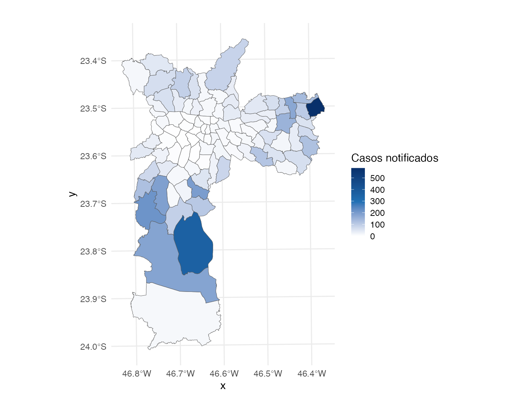
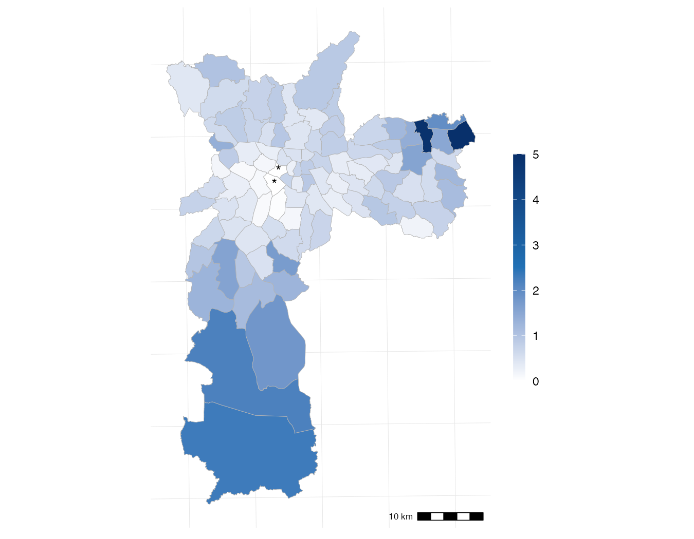
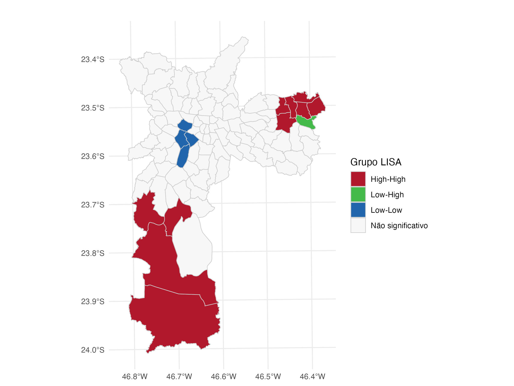
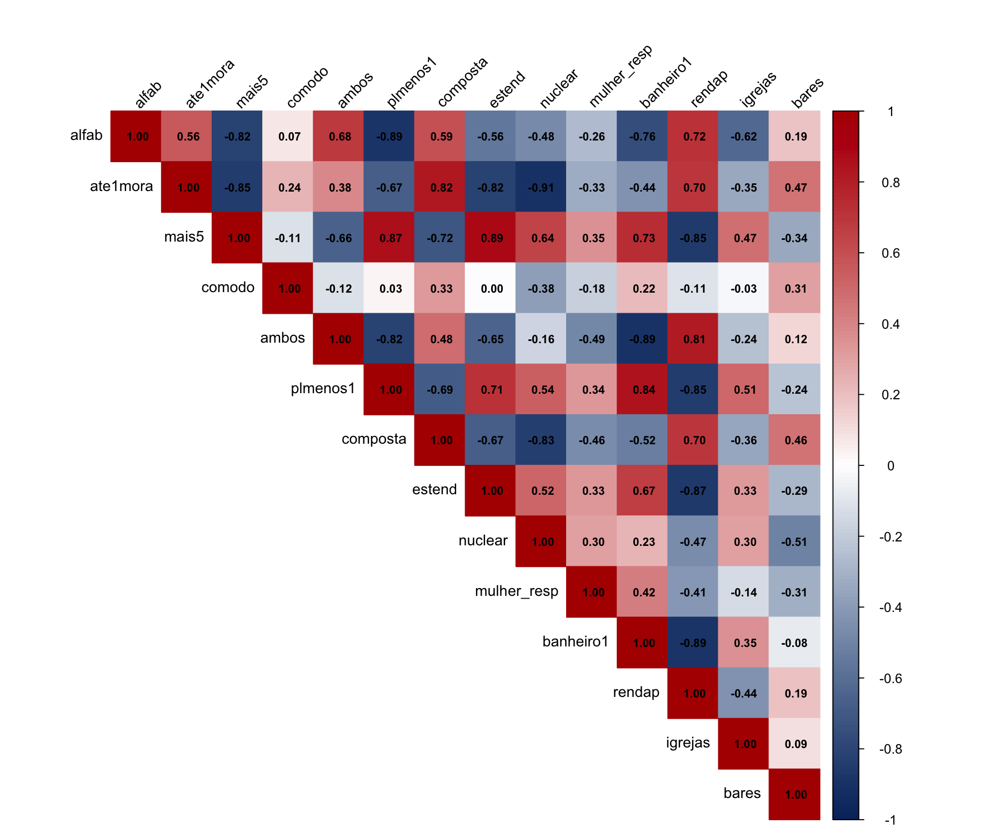
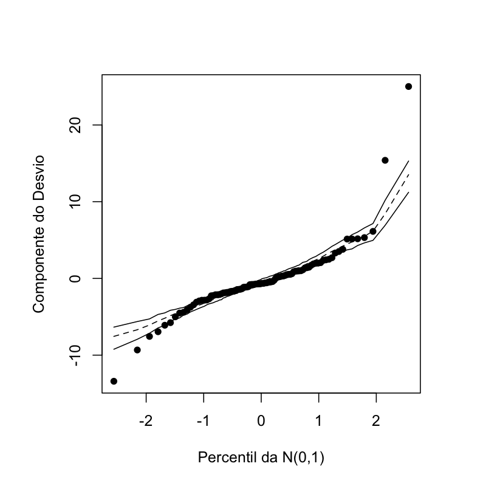
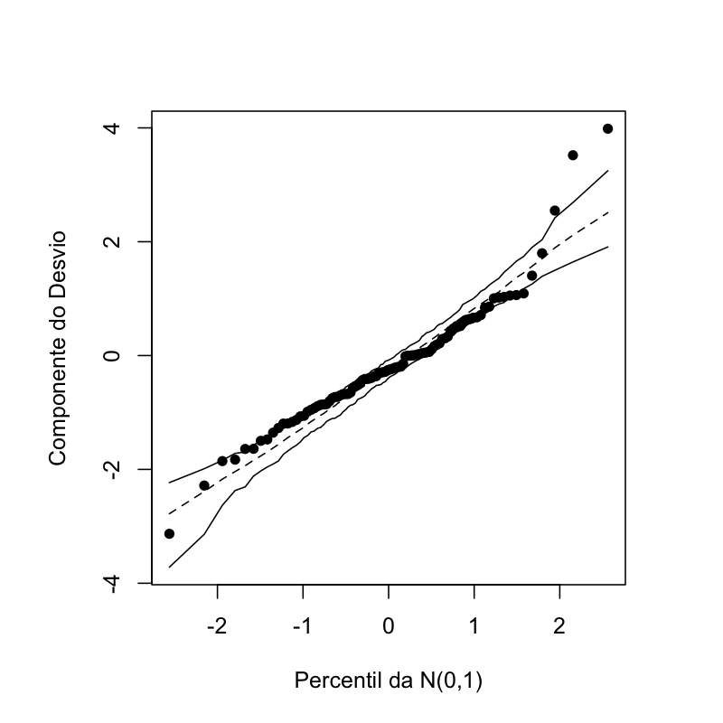

# Análise Espacial de Violência Física contra Crianças em São Paulo (2018–2022)

Código e dados da dissertação de mestrado sobre a distribuição espacial de casos
notificados de violência física contra crianças de 0 a 9 anos nos 96 distritos
administrativos do Município de São Paulo.

A análise combina modelagem de contagens com dependência espacial por meio de
**Regressão Geograficamente Ponderada com resposta Binomial Negativa (GWR-NB)**,
implementada pelo pacote [`gwzinbr`](https://github.com/douglasmesquita/gwzinbr).

---

## Estrutura do repositório

```
aplicacao_vf/
├── index.qmd                ← documento Quarto (site interativo)
├── _quarto.yml              ← configuração do projeto Quarto
├── preparar_dados.R         ← roda uma vez: consolida os dados em .gpkg
├── script_mestrado.R        ← análise completa em R puro
├── _cache/                  ← cache do Quarto (modelos pesados, commitar)
├── docs/                    ← site gerado pelo Quarto (GitHub Pages serve daqui)
├── dados/
│   ├── base_mestrado.gpkg   ← base consolidada (gerada por preparar_dados.R)
│   └── ...                  ← arquivos brutos originais
└── output/
    └── plots_output/        ← figuras geradas pela análise
```

---

## Aplicação interativa (GitHub Pages)

O documento `index.qmd` renderiza um site com todo o código, outputs e figuras
visível em:

```
https://<seu-usuario>.github.io/<nome-do-repo>/
```

### Publicar no GitHub Pages (uma vez)

```bash
# 1. Instale o Quarto: https://quarto.org/docs/get-started/
# 2. No terminal, na pasta do projeto:
quarto render index.qmd

# 3. Commite a pasta docs/ gerada
git add docs/ _cache/
git commit -m "render quarto site"
git push

# 4. No GitHub: Settings → Pages → Source: main branch, /docs folder → Save
```

O site fica disponível em ~1 minuto. Atualizações: repita `quarto render` + commit.

---

## Como reproduzir

### 1. Pré-requisitos

```r
install.packages(c(
  "tidyverse", "sf", "spdep", "GWmodel", "MASS", "robustbase",
  "car", "lmtest", "corrplot", "ggspatial", "readxl", "openxlsx",
  "writexl", "knitr", "kableExtra", "gridExtra"
))

# Pacote gwzinbr (não está no CRAN)
devtools::install_github("douglasmesquita/gwzinbr")
```

### 2. Preparar os dados (uma vez)

```r
setwd("caminho/para/aplicacao_vf")
source("preparar_dados.R")
```

Isso cria `dados/base_mestrado.gpkg` — um único arquivo com geometria e
todas as variáveis. Os arquivos brutos podem ser mantidos ou removidos.

### 3. Rodar a análise

```r
source("script_mestrado.R")
```

---

## Variável resposta

**Taxa de Incidência Padronizada (TIP)** de violência física, calculada pela
padronização indireta usando como referência a distribuição etária e de sexo
da cidade de São Paulo no período 2018–2022.

| | |
|---|---|
|  |  |
| Contagem de casos (2018–2022) | Taxa de Incidência Padronizada (TIP) |

---

## Autocorrelação espacial — LISA

Análise Local de Moran (LISA) aplicada à TIP, identificando clusters
espacialmente significativos de alta e baixa incidência.



---

## Variáveis explicativas

Variáveis socioeconômicas e demográficas do Censo 2022, além de densidade
de estabelecimentos religiosos, construídas ao nível de distrito.



---

## Modelos ajustados

### Modelos globais (referência)

| Modelo | AICc | Pseudo R² |
|--------|------|-----------|
| Poisson | — | — |
| Binomial Negativa | — | — |

> Preencha com os valores gerados pelo `script_mestrado.R`.

Análise de resíduos dos modelos globais:

| | |
|---|---|
|  |  |
| Envelope simulado — Poisson | Envelope simulado — Binomial Negativa |

### GWR — Binomial Negativa (modelo final)

Coeficientes locais estimados para cada distrito, mantendo apenas as
estimativas significativas a 10%:

| | |
|---|---|
|  |  |
| Hab. Coletiva (*comodo*) | Família composta (*composta*) |

| | |
|---|---|
|  |  |
| 5+ Moradores (*mais5*) | Responsável mulher (*mulher_resp*) |


---

## Dados

| Fonte | Descrição |
|-------|-----------|
| SINAN/SVS | Notificações de violência contra crianças 2018–2022 |
| IBGE — Censo 2022 | Variáveis socioeconômicas e demográficas por distrito |
| Prefeitura de SP | Shapefile dos distritos administrativos |
| OSM / SEADE | Pontos de igrejas e bares por distrito |

---

## Referências principais

- Fotheringham, A. S., Brunsdon, C., & Charlton, M. (2002). *Geographically Weighted Regression*. Wiley.
- Mesquita, D., Ferreira, P. H. C., & Demetrio, C. G. B. (2023). *mgwnbr: Multiscale Geographically Weighted Negative Binomial Regression*.
