```{r}
#| label: setup
#| cache: false

library(tidyverse)
library(sf)
library(spdep)
library(MASS)
library(robustbase)
library(car)
library(lmtest)
library(corrplot)
library(ggspatial)
if (requireNamespace("gwzinbr", quietly = TRUE)) library(gwzinbr)
library(knitr)
library(kableExtra)
library(gridExtra)
library(scales)
library(stringr)
library(stringi)
library(purrr)

output_dir <- "output/plots_output"
if (!dir.exists(output_dir)) dir.create(output_dir, recursive = TRUE)
```

## Como reproduzir esta análise

Esta seção orienta qualquer pessoa que queira reproduzir a análise do zero.

### Pré-requisitos

Instale os pacotes necessários antes de rodar qualquer script:

```r
install.packages(c(
  "tidyverse", "sf", "spdep", "MASS", "robustbase",
  "car", "lmtest", "corrplot", "ggspatial",
  "knitr", "kableExtra", "gridExtra", "scales",
  "stringr", "stringi", "purrr", "broom"
))

# gwzinbr — instalar do GitHub
remotes::install_github("julianamrosa/gwzinbr")
```

### Estrutura do projeto

```
aplicacao_vf/
├── dados/
│   ├── brutos/
│   │   ├── sinan_vf_2018_2022.csv      ← notificações SINAN (SMS-SP / TABNET)
│   │   ├── censo2022_distritos.csv     ← variáveis socioeconômicas (IBGE)
│   │   ├── malha_distrital_sp.gpkg     ← geometria dos 96 distritos (Prefeitura SP)
│   │   ├── igrejas_sp.csv              ← contagem de igrejas por distrito (OpenStreetMap)
│   │   └── bares_sp.csv                ← contagem de bares por distrito (SEADE)
│   └── base_mestrado.gpkg              ← gerado por preparar_dados.R
├── arquivos_auxiliares/
│   ├── envel_pois                      ← script de envelope simulado Poisson
│   └── envel_nbin                      ← script de envelope simulado BN
├── output/
│   └── plots_output/                   ← gráficos gerados por script_mestrado.R
├── _cache/
│   └── modelo_negbin_gwr.rds           ← modelo GWR salvo (gerado por script_mestrado.R)
├── preparar_dados.R                    ← passo 1: une os dados brutos em um GeoPackage
├── script_mestrado.R                   ← passo 2: roda modelos pesados e salva gráficos
└── index.qmd                           ← passo 3: renderiza este documento
```

### Ordem de execução

Execute os scripts **nesta ordem** antes de renderizar o documento:

```r
# Passo 1 — prepara e une os dados brutos (~2 min)
source("preparar_dados.R")

# Passo 2 — ajusta modelos computacionalmente intensivos e salva saídas (~2 h)
source("script_mestrado.R")

# Passo 3 — renderiza o documento
quarto::quarto_render("index.qmd")
```

::: {.callout-important}
## Dados brutos disponíveis no repositório
Os arquivos brutos estão na pasta `dados/brutos/`. Os dados do SINAN foram
obtidos via TABNET (SMS-SP) e os do Censo 2022 via IBGE. A malha distrital
foi disponibilizada pela Prefeitura de São Paulo. Igrejas e bares foram
levantados no OpenStreetMap e SEADE, respectivamente.
:::

---

## Introdução

Este documento apresenta a análise espacial de casos notificados de **violência
física contra crianças de 0 a 9 anos** nos 96 distritos administrativos do
Município de São Paulo, utilizando dados do período **2018–2022**.

Os dados foram obtidos a partir das notificações de violência registradas no
**Sistema de Informação de Agravos de Notificação (SINAN)**, disponibilizadas
pela plataforma TABNET da Secretaria Municipal da Saúde de São Paulo.

::: {.callout-important}
## Nota sobre os dados
Para simplificar a nomenclatura, utilizamos o termo "casos de violência física"
para designar os registros disponíveis, que correspondem a **notificações de
suspeita** de violência física. Esses dados **não representam casos confirmados**,
mas sim as notificações registradas na base utilizada para análise.
:::

O objetivo é identificar fatores socioeconômicos e demográficos associados à
incidência de violência e investigar se esses efeitos variam espacialmente —
isto é, se a influência de cada variável é maior em certas regiões da cidade.
Para isso, o modelo permite que os coeficientes de regressão variem entre
os distritos, característica central dos modelos de Regressão Geograficamente
Ponderada (GWR).

**Estratégia analítica — do global ao local:**

| Etapa | Técnica | Objetivo |
|---|---|---|
| 1 | Mapeamento + TIP | Descrever a distribuição espacial da resposta |
| 2 | Moran I global | Confirmar autocorrelação espacial |
| 3 | Poisson global | Linha de base; detectar superdispersão |
| 4 | Binomial Negativa global | Corrigir superdispersão; verificar resíduos |
| 5 | LISA | Identificar clusters locais de risco |
| 6 | GWR-NB (`gwzinbr`) | Modelar efeitos localmente variáveis |

---

## Dados

::: {.callout-note collapse="true"}
## O que faz o `preparar_dados.R`?

O script lê os arquivos brutos da pasta `dados/brutos/`, realiza as uniões
necessárias e salva o resultado em `dados/base_mestrado.gpkg`.

**Principais etapas:**

1. Leitura da malha distrital (96 polígonos)
2. Join com as notificações SINAN agregadas por distrito e período
3. Join com as variáveis socioeconômicas do Censo 2022
4. Adição das contagens de igrejas e bares por distrito
5. Cálculo das coordenadas UTM dos pontos de maior densidade populacional
6. Exportação como GeoPackage (camada `distritos`)

Se algum arquivo bruto estiver ausente, o script interrompe e informa qual
arquivo está faltando.
:::

```{r}
#| label: leitura-dados
#| cache: false

gpkg_path <- "dados/base_mestrado.gpkg"

if (!file.exists(gpkg_path)) {
  message("GeoPackage não encontrado. Gerando a partir dos arquivos brutos...")
  source("preparar_dados.R")
}

dados_completo <- st_read(gpkg_path, layer = "distritos", quiet = TRUE)
dados          <- dados_completo

cat("Distritos carregados:", nrow(dados), "\n")
cat("Variáveis disponíveis:", ncol(dados) - 1, "(+ geometria)\n")
```

::: {.callout-note}
## Fonte dos dados
| Conjunto | Fonte |
|----------|-------|
| Notificações de violência (SINAN) | Secretaria de Vigilância em Saúde / MS |
| Variáveis socioeconômicas | IBGE — Censo Demográfico 2022 |
| Malha distrital | Prefeitura do Município de São Paulo |
| Igrejas e bares | OpenStreetMap / SEADE |
:::

---

## Variável Resposta — Casos de Violência Física

::: {.callout-note}
## Por que analisar espacialmente?
A violência física contra crianças não se distribui aleatoriamente no espaço:
fatores como densidade populacional, composição familiar, acesso a serviços
e renda variam entre os distritos. Uma análise puramente tabular ignoraria
essa estrutura. O mapeamento é o primeiro passo para decidir se modelos com
componente espacial são necessários.
:::

### Distribuição espacial dos casos

```{r}
#| label: mapa-casos
#| fig-cap: "Distribuição dos casos notificados de violência física (2018–2022)."

dados_zero <- dados %>%
  filter(VF_2018_2022 == 0) %>%
  mutate(centroide = st_centroid(st_geometry(.)),
         x = st_coordinates(centroide)[, 1],
         y = st_coordinates(centroide)[, 2])

ggplot(dados) +
  geom_sf(aes(fill = VF_2018_2022)) +
  scale_fill_gradientn(
    colours = c("white", "#2171b5", "#08306b"),
    name    = "Casos notificados",
    oob     = scales::squish
  ) +
  geom_text(data = dados_zero, aes(x = x, y = y),
            label = "0", size = 2.5, color = "gray40") +
  theme_minimal(base_size = 13) +
  theme(axis.text = element_blank(), axis.ticks = element_blank(),
        panel.grid = element_line(color = "grey90"))
```

```{r}
#| label: mapa-circulos
#| fig-cap: "Mapa de círculos proporcionais — casos notificados."

dados_centr <- dados %>%
  mutate(centroide = st_centroid(st_geometry(.)),
         x = st_coordinates(centroide)[, 1],
         y = st_coordinates(centroide)[, 2])

ggplot() +
  geom_sf(data = dados, fill = "gray95", color = "grey50", size = 0.25) +
  geom_point(data = dados_centr,
             aes(x = x, y = y, size = VF_2018_2022),
             color = "#2171b5", alpha = 0.75) +
  scale_size(name = "Casos", range = c(0.5, 10)) +
  annotation_scale(location = "br", width_hint = 0.25) +
  theme_minimal() +
  theme(axis.text = element_blank(), axis.ticks = element_blank(),
        panel.grid = element_line(color = "grey90"))
```

---

## Taxa de Incidência Padronizada (TIP)

::: {.callout-note}
## Por que padronizar os casos?
Distritos com mais crianças vão naturalmente ter mais casos absolutos, mesmo
que o risco per capita seja igual. A taxa bruta (casos/população) não resolve
o problema quando os distritos têm **composições etárias e de sexo diferentes**
— por exemplo, um distrito com muitos meninos de 0 a 4 anos é mais exposto do
que um com a mesma população composta por adolescentes. A padronização indireta
estratificada cria uma taxa comparável que elimina esse efeito demográfico.
:::

A **padronização indireta estratificada** permite comparar a incidência entre
distritos com diferentes composições etárias e de sexo. Em cada um dos 96
distritos, calculamos o número esperado de casos aplicando as taxas específicas
de cada estrato à população correspondente:

$$
E_i = \sum_{j} P_{ij} \times t_j
$$

onde $E_i$ é o total esperado de casos no distrito $i$, $P_{ij}$ é a
população do grupo demográfico $j$ (faixa etária × sexo) no distrito $i$, e
$t_j$ é a taxa específica para o grupo $j$, calculada para a cidade como um todo.
A **TIP** é então calculada como:

$$
\text{TIP}_i = \frac{O_i}{E_i}
$$

onde $O_i$ é o total de casos observados no distrito $i$. Valores acima de 1
indicam incidência maior do que a esperada dada a composição demográfica do
distrito; valores abaixo de 1 indicam incidência menor do que a esperada.

Os quatro estratos considerados são: meninos 0–4 anos, meninos 5–9 anos,
meninas 0–4 anos e meninas 5–9 anos.

### Cálculo

```{r}
#| label: calculo-tip

taxas_ref <- dados_completo %>%
  summarise(
    casos_m0_4 = sum(VF_masc_0_4_anos, na.rm = TRUE),
    casos_m5_9 = sum(VF_masc_5_9_anos, na.rm = TRUE),
    casos_f0_4 = sum(VF_fem_0_4_anos,  na.rm = TRUE),
    casos_f5_9 = sum(VF_fem_5_9_anos,  na.rm = TRUE),
    pop_m0_4   = sum(meninos0a4, na.rm = TRUE),
    pop_m5_9   = sum(meninos5a9, na.rm = TRUE),
    pop_f0_4   = sum(meninas0a4, na.rm = TRUE),
    pop_f5_9   = sum(meninas5a9, na.rm = TRUE)
  ) %>%
  mutate(
    taxa_m0_4 = casos_m0_4 / pop_m0_4,
    taxa_m5_9 = casos_m5_9 / pop_m5_9,
    taxa_f0_4 = casos_f0_4 / pop_f0_4,
    taxa_f5_9 = casos_f5_9 / pop_f5_9
  )

dados <- dados_completo %>%
  mutate(
    casos_esp_vf     = meninos0a4 * taxas_ref$taxa_m0_4 +
                       meninos5a9 * taxas_ref$taxa_m5_9 +
                       meninas0a4 * taxas_ref$taxa_f0_4 +
                       meninas5a9 * taxas_ref$taxa_f5_9,
    taxa_pad_vf      = VF_2018_2022 / casos_esp_vf,
    log_casos_esp_vf = log(casos_esp_vf)
  )
```

### Distribuição espacial

```{r}
#| label: mapa-tip
#| fig-cap: "Taxa de Incidência Padronizada (TIP) por distrito. Distritos com zero casos marcados com asterisco."

dados_proj      <- st_transform(dados, 31983)
dados_zero_proj <- st_transform(dados_zero, 31983)

ggplot(dados_proj) +
  geom_sf(aes(fill = taxa_pad_vf), color = "grey70", size = 0.2) +
  scale_fill_gradientn(
    colours = c("white", "#2171b5", "#08306b"),
    limits  = c(0, 5),
    oob     = scales::squish,
    name    = "TIP"
  ) +
  geom_text(data = dados_zero_proj, aes(x = x, y = y),
            label = "*", size = 5, color = "black") +
  annotation_scale(location = "br", width_hint = 0.25) +
  theme_minimal(base_size = 13) +
  theme(axis.text = element_blank(), axis.ticks = element_blank(),
        legend.key.height = unit(1.5, "cm"))
```

### Medidas resumo

```{r}
#| label: tabela-tip
#| tbl-cap: "Estatísticas descritivas da TIP."

summary_tip <- summary(dados$taxa_pad_vf)
data.frame(
  Estatística = c(names(summary_tip), "Desvio-padrão", "Variância"),
  Valor       = round(c(as.numeric(summary_tip),
                        sd(dados$taxa_pad_vf, na.rm = TRUE),
                        var(dados$taxa_pad_vf, na.rm = TRUE)), 4)
) |>
  kable() |> kable_styling(full_width = FALSE)
```

### Boxplot robusto

O boxplot robusto (`adjbox`) é mais adequado do que o boxplot convencional para
distribuições assimétricas, pois ajusta os limites com base em uma medida robusta
de assimetria (medcouple). Outliers são distritos com incidência especialmente
discrepante do padrão geral.

```{r}
#| label: boxplot-tip
#| fig-cap: "Boxplot robusto (adjbox) da TIP com identificação dos outliers."
#| fig-height: 7

tip_values <- dados$taxa_pad_vf
labels <- str_to_title(stri_trans_general(dados$ds_nome, "Latin-ASCII"))
labels <- gsub("Sao Miguel",     "São Miguel",      labels)
labels <- gsub("Capao Redondo",  "Capão Redondo",   labels)
labels <- gsub("Jardim Angela",  "Jardim Ângela",   labels)
labels <- gsub("Jardim Sao Luis","Jardim São Luís", labels)
labels <- gsub("Consolacao",     "Consolação",      labels)

ajuste_box <- adjbox(
  tip_values, main = "", ylab = "TIP",
  col = "#2171b5", border = "#08306b",
  range = 1.5, doReflect = TRUE
)

outlier_idx <- which(tip_values %in% ajuste_box$out)
if (length(outlier_idx) > 0) {
  y_out    <- tip_values[outlier_idx]
  lado_dir <- seq(1, length(y_out), by = 2)
  lado_esq <- seq(2, length(y_out), by = 2)
  x_dir    <- rep(1.05, length(lado_dir))
  x_esq    <- rep(0.95, length(lado_esq))

  points(rep(1, length(y_out)), y_out, pch = 16, col = "black", cex = 0.6)
  segments(rep(1, length(lado_dir)), y_out[lado_dir], x_dir, y_out[lado_dir], col = "gray30")
  text(x_dir, y_out[lado_dir], labels = labels[outlier_idx[lado_dir]], pos = 4, cex = 0.75)
  segments(rep(1, length(lado_esq)), y_out[lado_esq], x_esq, y_out[lado_esq], col = "gray30")
  text(x_esq, y_out[lado_esq], labels = labels[outlier_idx[lado_esq]], pos = 2, cex = 0.75)
}
```

### Índice de Moran global

::: {.callout-note}
## Por que testar autocorrelação espacial na TIP?
O índice de Moran verifica se distritos próximos têm TIPs semelhantes mais do
que seria esperado ao acaso. Se sim, os dados têm **dependência espacial** —
ignorá-la em um modelo de regressão viola o pressuposto de independência dos
resíduos e produz inferências inválidas. O teste na TIP (antes de qualquer
modelo) é uma verificação exploratória: se houver autocorrelação na resposta,
é muito provável que ela apareça nos resíduos de modelos globais também.
:::

```{r}
#| label: moran-tip
#| tbl-cap: "Teste de Moran (Monte Carlo, 999 simulações) — TIP."
#| cache: true

vizinhos_tip <- poly2nb(dados)
pesos_tip    <- nb2listw(vizinhos_tip, style = "W")
moran_tip    <- moran.mc(dados$taxa_pad_vf, listw = pesos_tip, nsim = 999)

data.frame(
  Estatística = c("Índice de Moran (I)", "Valor-p"),
  Valor       = c(round(moran_tip$statistic, 5), moran_tip$p.value)
) |> kable() |> kable_styling(full_width = FALSE)
```

```{r}
#| label: plot-moran
#| fig-cap: "Distribuição de referência do índice de Moran por Monte Carlo."
#| fig-height: 4

plot(moran_tip, main = "")
```

::: {.callout-important}
## Autocorrelação espacial confirmada
O índice de Moran para a TIP foi de **I = 0,312** (valor-p = 0,001), indicando
que os casos **não se distribuem aleatoriamente** no espaço — distritos com alta
incidência tendem a estar próximos a outros com alta incidência. Esse resultado
justifica o uso de modelos com componente espacial.
:::

---

## Coordenadas Geográficas

Para a análise GWR, adotou-se o **sistema de coordenadas UTM** (unidades em
metros, zona 23S, SIRGAS 2000 — EPSG:31983). As coordenadas de cada distrito
foram definidas como o **ponto de maior densidade populacional** dentro do
polígono, e não o centroide geométrico.

::: {.callout-note}
## Por que usar pontos de densidade populacional em vez do centroide geométrico?
O centroide geométrico minimiza a distância média aos vértices do polígono, mas
pode cair em áreas desabitadas (parques, reservatórios, zonas industriais).
Para um modelo que calcula distâncias entre vizinhanças e pondera observações
por proximidade, o ponto que melhor representa **onde as pessoas vivem** é
mais adequado. Isso é especialmente relevante em distritos grandes e irregulares,
como Marsilac, onde o centroide geométrico fica em área rural.
:::

As colunas `long_utm` e `lat_utm` foram calculadas em `preparar_dados.R` a
partir do raster de densidade populacional do IBGE intersectado com a malha
distrital.

---

## Variáveis Explicativas

As variáveis explicativas foram agrupadas em quatro dimensões temáticas. As
variáveis do Censo 2022 estão expressas em percentuais (0 a 100). Para igrejas
e bares, adotou-se a contagem por mil habitantes. A renda foi padronizada pelo
método mínimo-máximo: $\text{rendap} = 100 \times \frac{x - \min(x)}{\max(x) - \min(x)}$.

### Quadro de variáveis

```{r}
#| label: tabela-variaveis
#| tbl-cap: "Variáveis explicativas organizadas por grupos temáticos."
#| cache: false

data.frame(
  Grupo = c(
    rep("G1 – Socioeconômico e Demográfico", 5),
    rep("G2 – Estrutura Domiciliar", 2),
    rep("G3 – Estrutura Familiar e Urbana", 5),
    rep("G4 – Espaços de Convivência Social", 2)
  ),
  Variável = c(
    "alfab","ate1mora","mais5","mulher_resp","rendap",
    "banheiro1","comodo",
    "ambos","plmenos1","composta","estend","nuclear",
    "igrejas","bares"
  ),
  Descrição = c(
    "% pessoas ≥ 15 anos alfabetizadas",
    "% domicílios com apenas 1 morador",
    "% domicílios com 5 ou mais moradores",
    "% domicílios cujo responsável é do sexo feminino",
    "Renda média distrital padronizada (0–100)",
    "% domicílios com banheiro exclusivo (chuveiro + vaso sanitário)",
    "% domicílios em habitações coletivas informais (cortiços, cômodos)",
    "% domicílios: casal responsável + filhos apenas do casal",
    "% domicílios: casal + ≥ 1 filho só do responsável ou cônjuge",
    "% domicílios do tipo composto (com pessoas sem parentesco)",
    "% domicílios do tipo estendido (inclui outros parentes)",
    "% domicílios do tipo nuclear (responsável, cônjuge e filhos)",
    "Número de igrejas por mil habitantes",
    "Número de bares por mil habitantes"
  )
) |> kable() |> kable_styling(full_width = FALSE, bootstrap_options = "striped") |>
  collapse_rows(columns = 1, valign = "top")
```

### Transformação das variáveis

```{r}
#| label: transformacoes

dados <- dados %>%
  mutate(
    rendap = 100 * (media_renda_dist - min(media_renda_dist, na.rm = TRUE)) /
                   (max(media_renda_dist, na.rm = TRUE) - min(media_renda_dist, na.rm = TRUE)),
    igreja_mil_hab = igrejas / (populacao_total / 1000),
    bares_mil_hab  = bares   / (populacao_total / 1000),
    log_casos_esp_vf = log(casos_esp_vf)
  )
```

### Mapas por grupo temático

::: {.callout-note collapse="true"}
## Como os mapas foram gerados (`script_mestrado.R`)

Todos os mapas de variáveis abaixo foram produzidos com a função auxiliar a seguir,
chamada para cada variável. O código completo está em `script_mestrado.R`.

```r
mapa_variavel <- function(dados, variavel, titulo, legenda, arquivo) {
  ggplot(dados) +
    geom_sf(aes(fill = .data[[variavel]]), color = "grey70", linewidth = 0.2) +
    scale_fill_gradientn(
      colours = c("white", "#2171b5", "#08306b"),
      name    = legenda
    ) +
    theme_minimal(base_size = 12) +
    theme(axis.text = element_blank(), axis.ticks = element_blank(),
          panel.grid = element_line(color = "grey90")) +
    labs(title = titulo)

  ggsave(file.path("output/plots_output", arquivo),
         width = 6, height = 5, dpi = 150)
}

# Exemplos de chamada:
dados_proj <- st_transform(dados, 31983)
mapa_variavel(dados_proj, "alfab",        "Alfabetização",       "%", "mapa_alfab.png")
mapa_variavel(dados_proj, "mais5",        "5+ moradores",        "%", "mapa_mais5.png")
mapa_variavel(dados_proj, "mulher_resp",  "Responsável mulher",  "%", "mapa_mulher_resp.png")
mapa_variavel(dados_proj, "rendap",       "Renda padronizada", "0–100", "mapa_rendap.png")
# ... e assim por diante para todos os grupos
```

Os boxplots robustos por grupo foram gerados com `adjbox()` da mesma forma que
o boxplot da TIP, agrupando as variáveis de cada grupo em um único painel com
`par(mfrow = ...)`.
:::

#### Grupo 1 — Características Socioeconômicas e Demográficas

Maior concentração de renda padronizada e domicílios unifamiliares na região
centro-sudoeste. Distritos periféricos exibem maior proporção de domicílios
com cinco ou mais moradores, enquanto a taxa de alfabetização mantém-se
elevada em praticamente todo o território.

::: {layout-ncol=2}
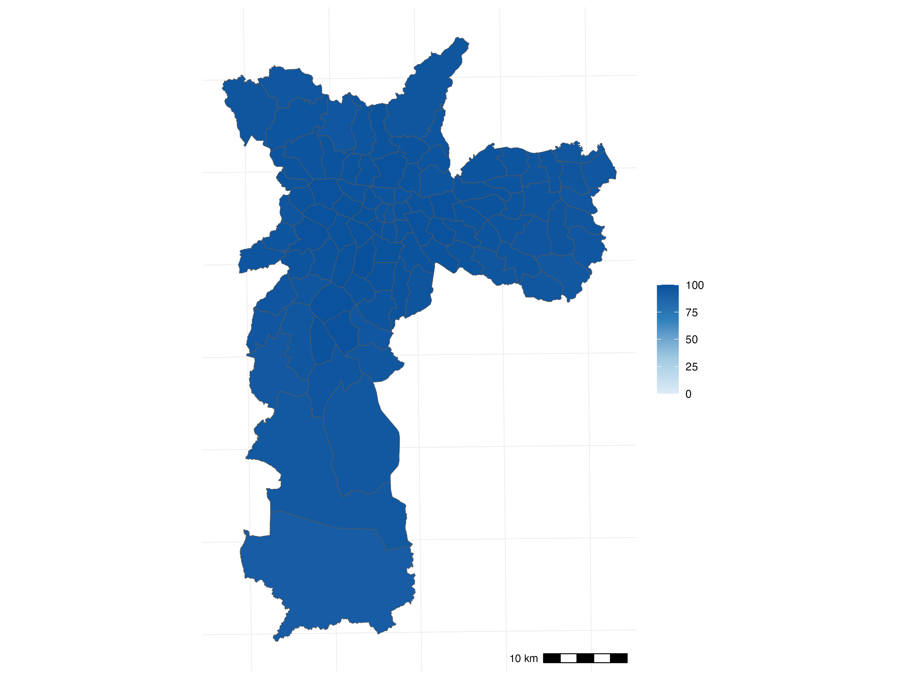{fig-alt="Mapa: alfabetização"}

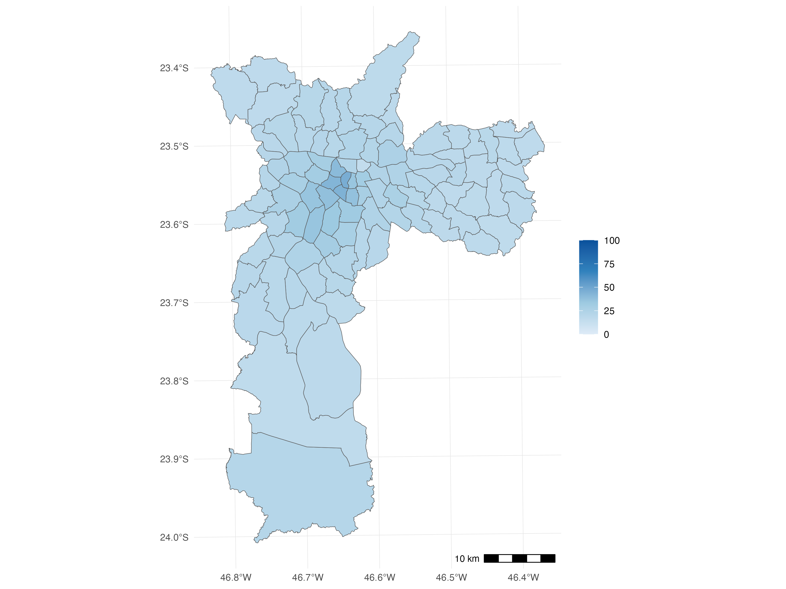{fig-alt="Mapa: 1 morador"}

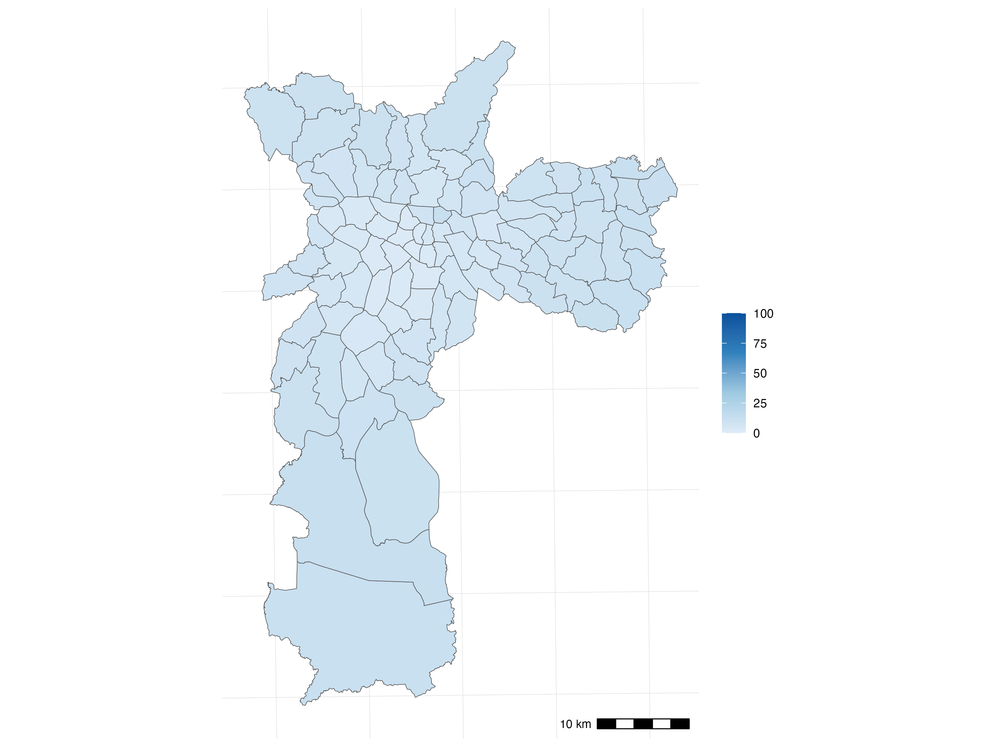{fig-alt="Mapa: 5+ moradores"}

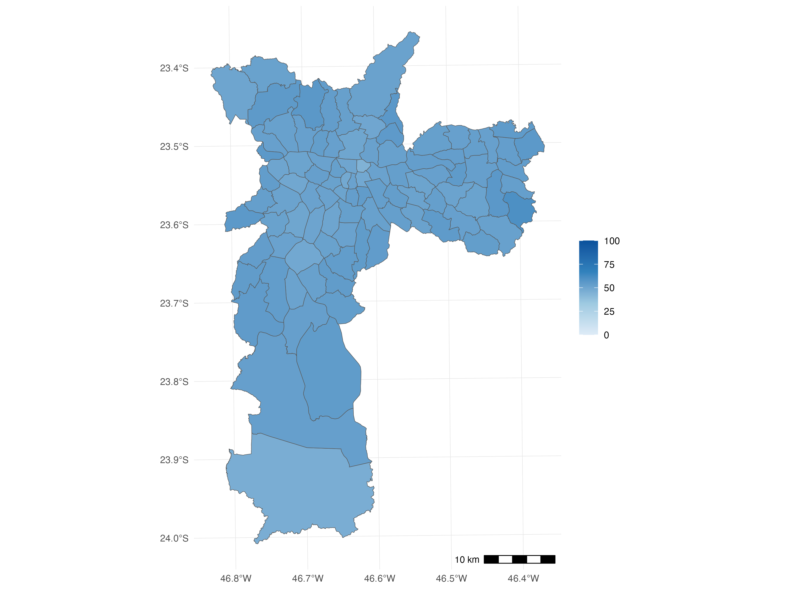{fig-alt="Mapa: resp. mulher"}

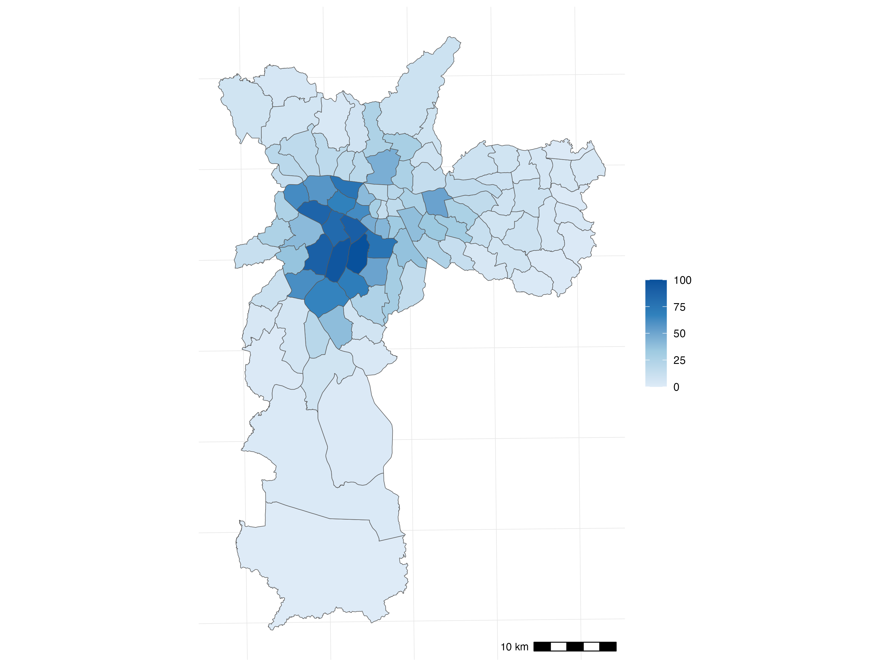{fig-alt="Mapa: renda padronizada"}
:::

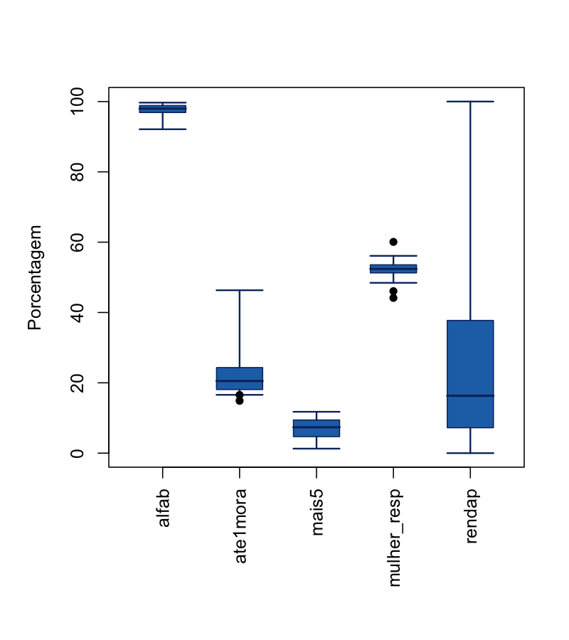

#### Grupo 2 — Estrutura Domiciliar

Maior concentração de domicílios com banheiro exclusivo nos distritos
centrais. Habitações coletivas informais (`comodo`) são raras e com focos
pontuais na periferia.

::: {layout-ncol=2}
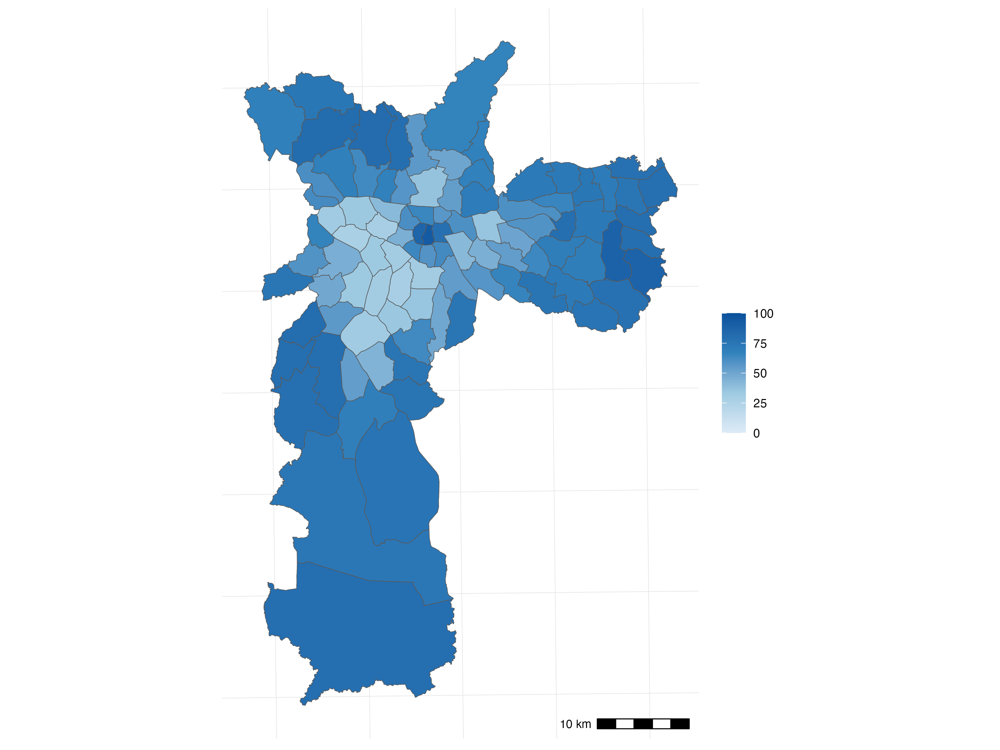{fig-alt="Mapa: banheiro exclusivo"}

{fig-alt="Mapa: habitações coletivas"}
:::

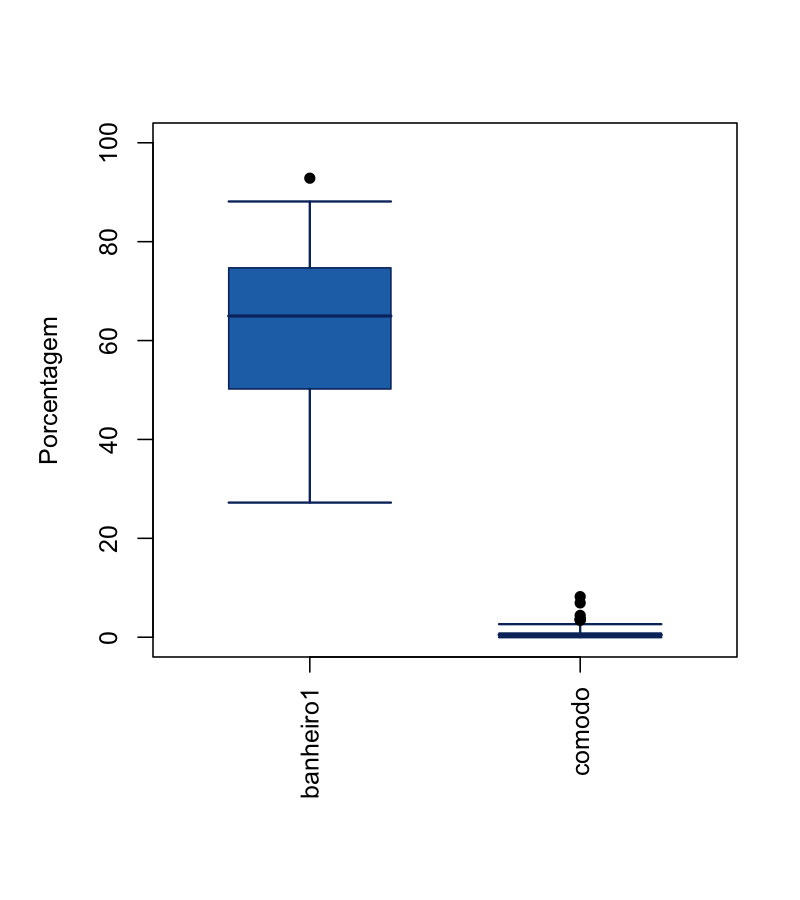

#### Grupo 3 — Estrutura Familiar e Urbana

Predominância de domicílios nucleares em todo o município. Aumento de
unidades do tipo compostas e estendidas em áreas periféricas, sugerindo maior
complexidade familiar nessas regiões.

::: {layout-ncol=2}
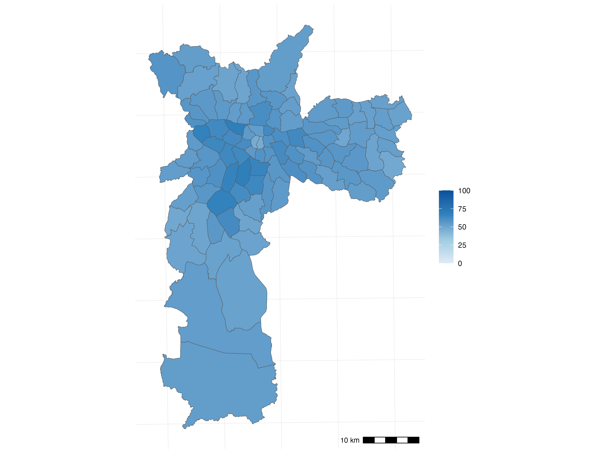{fig-alt="Mapa: ambos"}

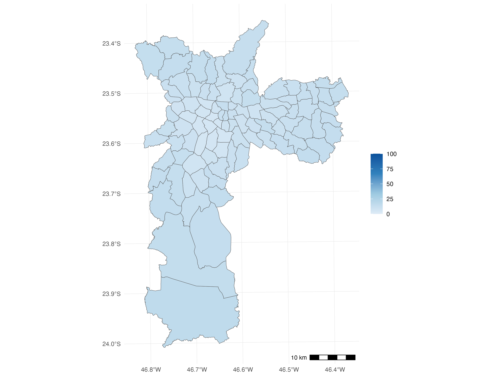{fig-alt="Mapa: plmenos1"}

{fig-alt="Mapa: composta"}

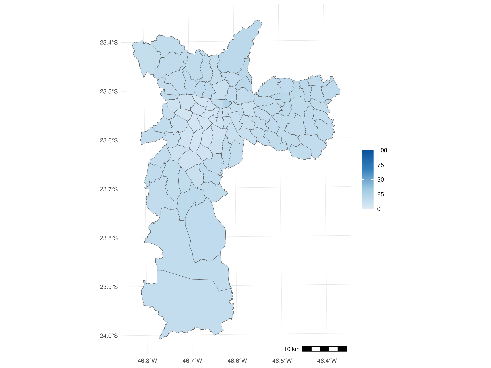{fig-alt="Mapa: estendida"}

{fig-alt="Mapa: nuclear"}
:::

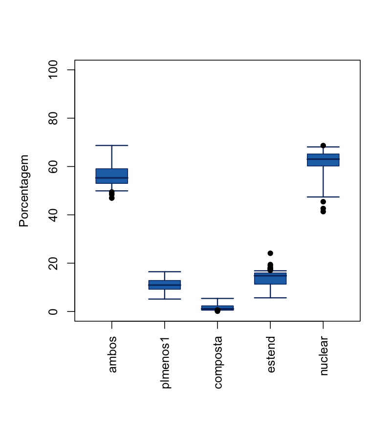

#### Grupo 4 — Espaços de Convivência Social

Maior densidade de igrejas por mil habitantes em Marsilac. Maior concentração
de bares em Pinheiros e República (zonas urbanas centrais), indicando perfis
distintos de sociabilidade espacial.

::: {layout-ncol=2}
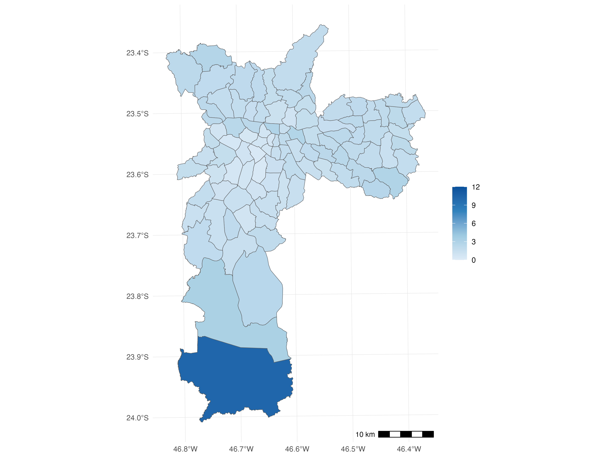{fig-alt="Mapa: igrejas por mil hab"}

{fig-alt="Mapa: bares por mil hab"}
:::

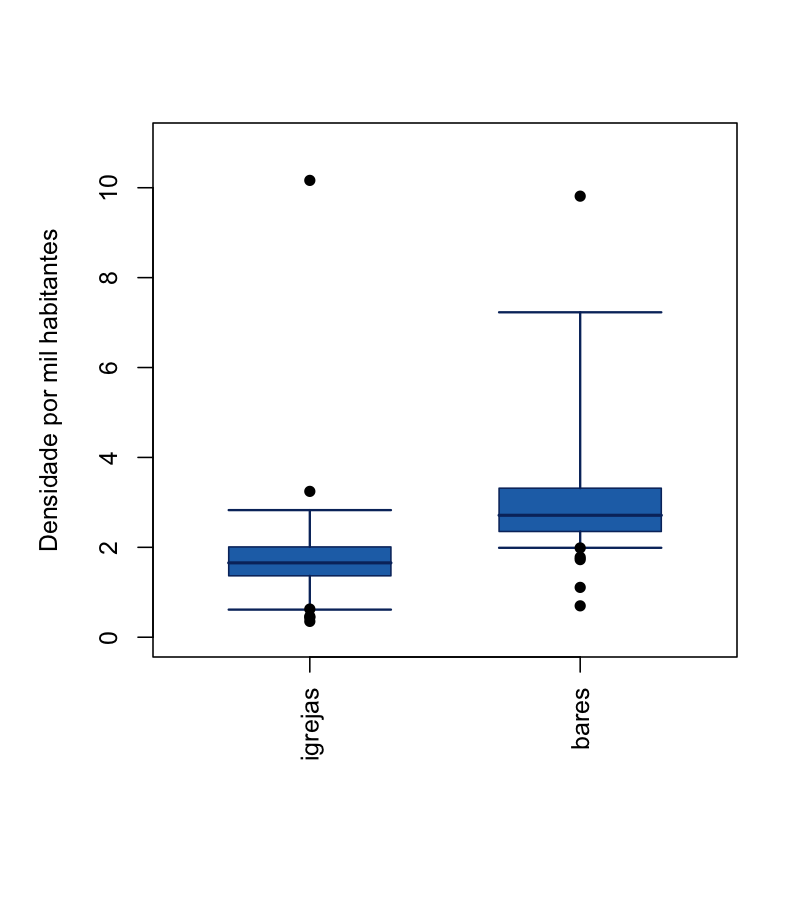

### Medidas resumo

```{r}
#| label: tabela-resumo
#| tbl-cap: "Estatísticas descritivas das variáveis explicativas."

variaveis_descr <- c("alfab","ate1mora","mais5","comodo","ambos","plmenos1",
                     "composta","estend","nuclear","mulher_resp","banheiro1",
                     "rendap","igreja_mil_hab","bares_mil_hab")

st_drop_geometry(dados) %>%
  dplyr::select(all_of(variaveis_descr)) %>%
  pivot_longer(everything(), names_to = "Variável", values_to = "Valor") %>%
  group_by(Variável) %>%
  summarise(
    Média   = round(mean(Valor, na.rm = TRUE), 2),
    DP      = round(sd(Valor,   na.rm = TRUE), 2),
    Mín     = round(min(Valor,  na.rm = TRUE), 2),
    Mediana = round(median(Valor, na.rm = TRUE), 2),
    Máx     = round(max(Valor,  na.rm = TRUE), 2),
    .groups = "drop"
  ) |>
  kable() |>
  kable_styling(full_width = FALSE, bootstrap_options = c("striped", "hover"))
```

### Correlação com a resposta

A análise de correlação com a TIP é exploratória, pois os padrões podem
apresentar variações locais. Ainda assim, ela orienta a pré-seleção de
candidatas para os modelos de regressão.

```{r}
#| label: cor-resposta
#| tbl-cap: "Correlação de Pearson entre a TIP e cada variável explicativa."

# 14 labels — um por variável em variaveis_descr
labels_cor <- c("Alfabetiz.","1 Morador","5+ Moradores","Hab. Coletiva",
                "Casal/Filh.","Casal/Resp.","Composta","Estendida","Nuclear",
                "Resp. Mulher","Banheiro","Renda (%)","Igrejas/1000","Bares/1000")

lapply(seq_along(variaveis_descr), function(i) {
  t <- cor.test(dados$taxa_pad_vf, dados[[variaveis_descr[i]]], method = "pearson")
  data.frame(Variável      = labels_cor[i],
             `r de Pearson` = round(t$estimate, 3),
             `Valor-p`      = formatC(t$p.value, format = "e", digits = 2))
}) |>
  bind_rows() |>
  arrange(desc(abs(`r.de.Pearson`))) |>
  kable() |> kable_styling(full_width = FALSE, bootstrap_options = "striped")
```

::: {.callout-note}
## Critérios de seleção de variáveis para os modelos
Com base nas correlações e no agrupamento hierárquico abaixo, foram
selecionadas como candidatas aos modelos de regressão as variáveis:
**`comodo`**, **`composta`**, **`mais5`**, **`mulher_resp`** e **`igrejas`**.

A variável `comodo` não apresentou correlação significativa com a TIP
(r = −0,025; p = 0,807), mas foi incluída por sua relevância teórica e
por pertencer a um grupo sub-representado nas demais candidatas.

A variável `igrejas` entrou como candidata no processo de seleção e nas
buscas de largura de banda, mas foi **removida do modelo GWR final** por não
apresentar contribuição significativa em nenhum ponto do espaço (ver seção GWR).
:::

### Matriz de correlação entre variáveis explicativas

```{r}
#| label: corrplot
#| fig-cap: "Matriz de correlação de Pearson entre as variáveis explicativas."
#| fig-height: 7

variaveis_corr <- c("alfab","ate1mora","mais5","comodo","ambos","plmenos1",
                    "composta","estend","nuclear","mulher_resp","banheiro1",
                    "rendap","igreja_mil_hab","bares_mil_hab")

mat_cor <- st_drop_geometry(dados) %>%
  dplyr::select(all_of(variaveis_corr)) %>%
  cor(use = "complete.obs")

colnames(mat_cor) <- rownames(mat_cor) <-
  c("alfab","ate1mora","mais5","comodo","ambos","plmenos1","composta",
    "estend","nuclear","mulher_resp","banheiro1","rendap","igrejas","bares")

corrplot(mat_cor, method = "color", type = "upper", addCoef.col = "black",
         tl.col = "black", tl.srt = 45, tl.cex = 0.85, number.cex = 0.65,
         col = colorRampPalette(c("#08306b","white","#b30000"))(200),
         mar = c(0, 0, 0, 0))
```

### Dendrograma de correlação

O método de agrupamento hierárquico de Ward foi aplicado utilizando como
medida de dissimilaridade entre variáveis o valor de $1 - |\rho|$. O
dendrograma sugere a formação de **5 grupos**:

- **Grupo 1**: `igrejas`
- **Grupo 2**: `rendap`, `mais5`, `estend`, `banheiro1`, `ambos`, `alfab`, `plmenos1`
- **Grupo 3**: `composta`, `ate1mora`, `nuclear`
- **Grupo 4**: `comodo`
- **Grupo 5**: `mulher_resp`, `bares`

```{r}
#| label: dendrograma
#| fig-cap: "Agrupamento hierárquico por dissimilaridade de Pearson (método Ward)."

rotulos <- c("alfab","ate1mora","mais5","comodo","ambos","plmenos1","composta",
             "estend","nuclear","mulher_resp","banheiro1","rendap","igrejas","bares")

dissim <- as.dist(1 - abs(mat_cor))
attr(dissim, "Labels") <- rotulos

plot(hclust(dissim, method = "ward.D"), main = "", xlab = "",
     cex.axis = 0.9, cex.lab = 1.1)
```

---

## Modelo de Poisson (global)

::: {.callout-note}
## Por que começar com Poisson?
O modelo de Poisson é o ponto de partida natural para dados de contagem: ele
modela a variável resposta como um inteiro não negativo com função de ligação
logarítmica. Ajustá-lo primeiro serve para **diagnosticar superdispersão** —
se o desvio residual for muito maior que os graus de liberdade, a distribuição
de Poisson não é adequada e precisamos de um modelo que permita variância > média.
:::

Ajustou-se um **modelo de Poisson** com função de ligação logarítmica. A
variável resposta é o número de casos de violência física; o logaritmo dos
casos esperados ($E_i$) é incluído como *offset*, corrigindo diferenças
populacionais entre os distritos.

```{r}
#| label: poisson
#| cache: true

dados_modelo <- st_drop_geometry(dados)

modelo_pois <- glm(
  VF_2018_2022 ~ comodo + composta + mais5 + mulher_resp + igreja_mil_hab +
    offset(log_casos_esp_vf),
  data   = dados_modelo,
  family = poisson()
)
```

### Coeficientes

```{r}
#| label: coef-pois
#| tbl-cap: "Coeficientes do modelo de Poisson."

broom::tidy(modelo_pois) %>%
  mutate(across(where(is.numeric), ~round(., 4)),
         p.value = formatC(p.value, format = "e", digits = 2)) |>
  kable() |> kable_styling(full_width = FALSE, bootstrap_options = "striped")
```

### Métricas de ajuste

```{r}
#| label: metricas-pois
#| tbl-cap: "Indicadores de ajuste — Poisson."

n_p <- nobs(modelo_pois); k_p <- length(coef(modelo_pois))
ll  <- as.numeric(logLik(modelo_pois))
ll0 <- as.numeric(logLik(update(modelo_pois, . ~ 1)))

data.frame(
  Estatística = c("Log-verossimilhança","Pseudo R² (McFadden)",
                  "Desvio Residual","Graus de Liberdade","AICc"),
  Valor = round(c(ll, 1 - ll/ll0, deviance(modelo_pois),
                  df.residual(modelo_pois),
                  AIC(modelo_pois) + 2*k_p*(k_p+1)/(n_p-k_p-1)), 4)
) |> kable() |> kable_styling(full_width = FALSE)
```

### Resíduos — distribuição espacial

```{r}
#| label: mapa-resid-pois
#| fig-cap: "Resíduos de desvio — Modelo de Poisson."

dados$residuos_pois <- residuals(modelo_pois, type = "deviance")

ggplot(dados) +
  geom_sf(aes(fill = residuos_pois)) +
  scale_fill_gradient2(
    midpoint = median(dados$residuos_pois, na.rm = TRUE),
    low = "#2166ac", mid = "white", high = "#b2182b", name = "Resíduo"
  ) +
  theme_minimal() +
  theme(axis.text = element_blank(), axis.ticks = element_blank())
```

::: {.callout-warning}
## Superdispersão detectada
O desvio residual do modelo de Poisson foi de **1.595,07** com 90 graus de
liberdade. A razão desvio/gl ≈ 17,7 é muito superior a 1, indicando forte
**superdispersão** — a variabilidade observada nos dados é muito maior do que
o modelo de Poisson pressupõe. O envelope simulado abaixo confirma essa
inadequação: vários pontos caem fora das bandas de confiança.
:::

### Envelope simulado

O envelope simulado compara os resíduos observados com um intervalo de
confiança construído a partir de 100 amostras simuladas do modelo ajustado.
Pontos fora do envelope indicam que a distribuição assumida pelo modelo não
é compatível com os dados.

```{r}
#| label: envelope-pois
#| fig-cap: "Envelope simulado — Poisson. Pontos fora do envelope indicam inadequação do modelo."
#| cache: true
#| fig-height: 5

fit.model <- modelo_pois
attach(dados_modelo, warn.conflicts = FALSE)
if (file.exists("arquivos_auxiliares/envel_pois")) {
  source("arquivos_auxiliares/envel_pois", local = TRUE)
} else {
  message("Script de envelope não encontrado — exibindo imagem pré-gerada.")
  knitr::include_graphics("output/plots_output/envelope_poisson.png")
}
detach(dados_modelo)
```

---

## Modelo Binomial Negativa (global)

::: {.callout-note}
## Por que Binomial Negativa?
A Binomial Negativa adiciona um parâmetro de superdispersão $\alpha$ que
permite $\text{Var}(Y) = \mu + \alpha\mu^2 > \mu$. Quando $\alpha \to 0$,
ela converge para Poisson. O parâmetro $\alpha$ é estimado diretamente dos
dados — se for significativamente positivo, a BN é preferível ao Poisson.
:::

Ajustou-se um **modelo Binomial Negativa**, que adiciona um parâmetro de
superdispersão $\alpha = 1/\theta$. A estimativa de $\alpha$ foi de
**4,19** (erro padrão = 0,7), confirmando a presença de superdispersão
nos dados.

```{r}
#| label: binomial-negativa
#| cache: true

modelo_nb <- glm.nb(
  VF_2018_2022 ~ comodo + composta + mais5 + mulher_resp + igreja_mil_hab +
    offset(log_casos_esp_vf),
  data = dados_modelo
)
```

### Coeficientes

Os coeficientes estão na escala log. Para obter o efeito multiplicativo sobre
a contagem esperada, calcule $\exp(\hat\beta)$: um coeficiente de 0,3 significa
que um aumento de uma unidade na covariável multiplica a contagem esperada por
$e^{0,3} \approx 1,35$, ou seja, aumenta em ~35%.

```{r}
#| label: coef-nb
#| tbl-cap: "Coeficientes do modelo Binomial Negativa."

broom::tidy(modelo_nb) %>%
  mutate(across(where(is.numeric), ~round(., 4)),
         p.value = formatC(p.value, format = "e", digits = 2)) |>
  kable() |> kable_styling(full_width = FALSE, bootstrap_options = "striped")
```

```{r}
#| label: theta-nb
cat("Theta (1/alpha):", round(modelo_nb$theta, 4), "\n")
cat("Alpha (superdispersão):", round(1/modelo_nb$theta, 4), "\n")
```

### Teste de razão de verossimilhança (Poisson vs BN)

```{r}
#| label: lrt
#| tbl-cap: "Teste LRT — Poisson vs Binomial Negativa."
#| cache: true

resultado_lrt <- lrtest(modelo_pois, modelo_nb)
print(resultado_lrt)
```

::: {.callout-tip}
## Interpretação do LRT
p < 0,05 confirma que a Binomial Negativa é significativamente melhor que
Poisson. O parâmetro adicional $\alpha$ é necessário para explicar a
variabilidade dos dados.
:::

### Métricas de ajuste

```{r}
#| label: metricas-nb
#| tbl-cap: "Indicadores de ajuste — Binomial Negativa."

n_nb <- nobs(modelo_nb); k_nb <- length(coef(modelo_nb))
ll_nb  <- as.numeric(logLik(modelo_nb))
ll0_nb <- as.numeric(logLik(update(modelo_nb, . ~ 1)))

data.frame(
  Estatística = c("Log-verossimilhança","Pseudo R² (McFadden)",
                  "Desvio Residual","AIC","AICc"),
  Valor = round(c(ll_nb, 1 - ll_nb/ll0_nb,
                  sqrt(deviance(modelo_nb)/df.residual(modelo_nb)),
                  AIC(modelo_nb),
                  AIC(modelo_nb) + 2*k_nb*(k_nb+1)/(n_nb-k_nb-1)), 4)
) |> kable() |> kable_styling(full_width = FALSE)
```

### Envelope simulado

```{r}
#| label: envelope-nb
#| fig-cap: "Envelope simulado — Binomial Negativa."
#| cache: true
#| fig-height: 5

fit.model <- modelo_nb
attach(dados_modelo, warn.conflicts = FALSE)
if (file.exists("arquivos_auxiliares/envel_nbin")) {
  source("arquivos_auxiliares/envel_nbin", local = TRUE)
} else {
  message("Script de envelope não encontrado — exibindo imagem pré-gerada.")
  knitr::include_graphics("output/plots_output/envelope_negbin.png")
}
detach(dados_modelo)
```

### Resíduos — distribuição espacial

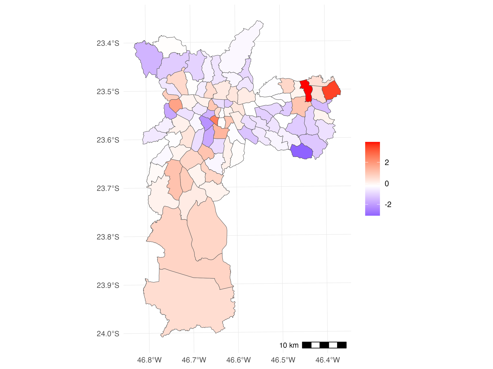

### Autocorrelação espacial dos resíduos

::: {.callout-note}
## Por que testar Moran nos resíduos do modelo global?
Se os resíduos do modelo global apresentarem autocorrelação espacial, significa
que o modelo deixou estrutura espacial não explicada. Isso viola o pressuposto
de independência dos erros e indica que um modelo com componente espacial —
como o GWR — é necessário.
:::

```{r}
#| label: moran-nb
#| tbl-cap: "Índice de Moran dos resíduos — Binomial Negativa."
#| cache: true

dados$residuos <- residuals(modelo_nb, type = "deviance")

coords_nb    <- cbind(dados_modelo$long_utm, dados_modelo$lat_utm)
viz_nb       <- knn2nb(knearneigh(coords_nb, k = 4))
pesos_nb     <- nb2listw(viz_nb, style = "W")
moran_nb_res <- moran.mc(dados$residuos, listw = pesos_nb, nsim = 999)

data.frame(
  Estatística = c("Moran I", "Valor-p"),
  Valor = c(round(moran_nb_res$statistic, 4), round(moran_nb_res$p.value, 4))
) |> kable() |> kable_styling(full_width = FALSE)
```

::: {.callout-warning}
## Autocorrelação residual persistente
O índice de Moran dos resíduos da BN global foi de **I = 0,155** (p = 0,01).
O modelo global **não captura** a estrutura espacial dos dados — o efeito de
cada covariável não é uniforme em todo o município. Isso motiva o uso de GWR,
que estima coeficientes locais para cada distrito.
:::

### Excesso de zeros

Para avaliar a necessidade de um modelo **inflacionado de zeros** (ZINB),
comparamos os zeros esperados pela Binomial Negativa com os observados.

```{r}
#| label: zeros-nb
#| tbl-cap: "Zeros observados vs esperados pelo modelo Binomial Negativa."

mu_hat <- predict(modelo_nb, type = "response")
theta  <- modelo_nb$theta

zeros_obs <- sum(dados_modelo$VF_2018_2022 == 0)
zeros_esp <- round(sum((theta / (theta + mu_hat))^theta), 2)

data.frame(
  Indicador = c("Zeros observados", "Zeros esperados (BN)", "Razão obs/esp"),
  Valor     = c(zeros_obs, zeros_esp, round(zeros_obs / zeros_esp, 3))
) |> kable() |> kable_styling(full_width = FALSE)
```

A proporção esperada foi de **1,51%** e a observada de **2,1%** — valores
próximos (razão ≈ 1), indicando que a Binomial Negativa já acomoda
adequadamente a frequência de zeros. O modelo **ZINB não é necessário**.

---

## Análise de Autocorrelação Local — LISA

::: {.callout-note}
## Por que ir além do Moran global?
O índice de Moran global resume a autocorrelação espacial em um único número,
mas não indica **onde** os clusters estão. O LISA (Local Indicators of Spatial
Association) decompõe esse índice por distrito, identificando quais regiões
contribuem mais para o padrão global e classificando cada distrito em um dos
quatro tipos de cluster.
:::

O **LISA** identifica clusters localmente significativos para cada distrito
e distingue:

- **High-High**: distrito e vizinhos com altos valores — *hot spots* de risco
- **Low-Low**: distrito e vizinhos com baixos valores — *cold spots*
- **High-Low / Low-High**: outliers espaciais — transições abruptas de risco

```{r}
#| label: lisa
#| fig-cap: "Mapa LISA — agrupamentos locais da TIP."

vizinhos_li  <- poly2nb(dados)
pesos_li     <- nb2listw(vizinhos_li, style = "W")
lisa_res     <- localmoran(dados$taxa_pad_vf, pesos_li)

dados$lisa_I      <- lisa_res[, 1]
dados$lisa_pvalue <- lisa_res[, 5]
media_tip         <- mean(dados$taxa_pad_vf, na.rm = TRUE)

classifica_lisa <- function(x, I, pval, media, alpha = 0.1) {
  if (pval > alpha)             return("Não significativo")
  if (x >= media && I > 0)     return("High-High")
  if (x  < media && I > 0)     return("Low-Low")
  if (x >= media && I < 0)     return("High-Low")
  if (x  < media && I < 0)     return("Low-High")
  return("Não classificado")
}

dados$lisa_grupo <- mapply(classifica_lisa, dados$taxa_pad_vf,
                           dados$lisa_I, dados$lisa_pvalue,
                           MoreArgs = list(media = media_tip))

cores_lisa <- c("High-High" = "#b2182b", "Low-Low" = "#2166ac",
                "High-Low"  = "#fddb6d", "Low-High" = "#44ba4a",
                "Não significativo" = "#f7f7f7")

ggplot(dados) +
  geom_sf(aes(fill = lisa_grupo), color = "#cccccc", linewidth = 0.3) +
  scale_fill_manual(values = cores_lisa, name = "Grupo") +
  theme_minimal() +
  theme(axis.text = element_blank(), axis.ticks = element_blank())
```

::: {.callout-note}
## Interpretação do mapa LISA
Os agrupamentos **High-High** se concentram em Itaim Paulista e São Miguel
(Zona Leste), revelando polos de alto risco relativo persistente. As áreas
**Low-Low** indicam regiões com incidência consistentemente abaixo da média.

O aspecto mais relevante é a presença de uma **borda de transição**: um
território High-High adjacente a uma área Low-High — transição espacial pontual
entre zona de risco elevado e região vizinha de menor intensidade. Essa
heterogeneidade local é exatamente o que modelos com efeito global não
conseguem capturar, e motiva diretamente o uso do GWR.
:::

---

## GWR — Regressão Geograficamente Ponderada (Binomial Negativa)

::: {.callout-note}
## Por que GWR?
Os modelos globais (Poisson e BN) assumem que o efeito de cada covariável é
**constante em todo o município**. O mapa LISA e o Moran I dos resíduos da BN
(I = 0,155; p = 0,01) mostram que essa suposição é falsa — as relações variam
no espaço. O GWR estima um coeficiente para cada distrito, permitindo que o
efeito de, por exemplo, `mais5` seja maior na Zona Leste do que no Centro.

O modelo GWR pondera as observações vizinhas de acordo com a distância ao
distrito de interesse: quanto mais próximo, maior o peso. A largura de banda
*h* controla o raio de influência — bandas pequenas capturam mais
heterogeneidade local; bandas grandes aproximam o GWR do modelo global.
:::

A partir das evidências de superdispersão e de autocorrelação espacial nos
resíduos do modelo global, ajustou-se um **modelo GWNBR** utilizando o pacote
[`gwzinbr`](https://github.com/julianamrosa/gwzinbr).

### Preparação dos dados para o GWR

As variáveis foram padronizadas (z-score) para tornar os coeficientes locais
comparáveis entre si, independentemente das unidades originais.

```{r}
#| label: prep-gwr

dados_modelo_bn <- as.data.frame(dados)

for (var in c("comodo","plmenos1","composta","mais5","mulher_resp",
              "degradada","igrejas")) {
  dados_modelo_bn[[var]] <- as.numeric(scale(dados_modelo_bn[[var]]))
}
```

### Seleção da largura de banda

A **largura de banda** (h) controla o grau de localidade do modelo. A função
`Golden()` realiza uma Busca em Seção Áurea para encontrar o h que minimiza
AICc ou validação cruzada (CV).

Foram testadas 4 combinações de critério e tipo de vizinhança. A busca com
`igrejas` foi incluída para confirmar se a variável contribuía localmente —
como não contribuiu, o modelo final a excluiu:

| Método | Critério | Covariáveis | h ótimo |
|--------|----------|------------|---------|
| Adaptativa | CV | com igrejas | 12 |
| **Adaptativa** | **AIC** | **sem igrejas** | **62** |
| Fixa | CV | sem igrejas | 55.277,68 m |
| Fixa | AIC | sem igrejas | 12.573,32 m |

Selecionou-se **adaptativa-AIC (h = 62)**, que equilibra viés e variância
localmente. A convergência foi atingida em AIC ≈ 750.

::: {.callout-note collapse="true"}
## Código: busca da largura de banda ótima (Golden Section Search)

O processo abaixo é computacionalmente intensivo (~1–2 h). O código está em
`script_mestrado.R` e os resultados estão cacheados.

```r
# --- Teste com igrejas (para confirmar exclusão) ---
gss_ad_aic_igr <- Golden(
  data = dados_modelo_bn,
  formula = VF_2018_2022 ~ comodo + composta + mais5 + mulher_resp + igrejas,
  lat = "lat_utm", long = "long_utm", offset = "log_casos_esp_vf",
  model = "negbin", method = "adaptive_bsq", bandwidth = "aic",
  globalmin = TRUE, distancekm = FALSE, force = TRUE
)
# h ótimo = 12 — h pequeno demais, sinal de overfitting local

gss_ad_cv_igr <- Golden(
  data = dados_modelo_bn,
  formula = VF_2018_2022 ~ comodo + composta + mais5 + mulher_resp + igrejas,
  lat = "lat_utm", long = "long_utm", offset = "log_casos_esp_vf",
  model = "negbin", method = "adaptive_bsq", bandwidth = "cv",
  globalmin = TRUE, distancekm = FALSE, force = TRUE
)

# --- Modelo final (sem igrejas) ---
gss_ad_aic <- Golden(
  data = dados_modelo_bn,
  formula = VF_2018_2022 ~ comodo + composta + mais5 + mulher_resp,
  lat = "lat_utm", long = "long_utm", offset = "log_casos_esp_vf",
  model = "negbin", method = "adaptive_bsq", bandwidth = "aic",
  globalmin = TRUE, distancekm = FALSE, force = TRUE
)
# h ótimo = 62 ← selecionado

gss_ad_cv <- Golden(
  data = dados_modelo_bn,
  formula = VF_2018_2022 ~ comodo + composta + mais5 + mulher_resp,
  lat = "lat_utm", long = "long_utm", offset = "log_casos_esp_vf",
  model = "negbin", method = "adaptive_bsq", bandwidth = "cv",
  globalmin = TRUE, distancekm = FALSE, force = TRUE
)
```
:::

Gráficos de convergência das larguras de banda:

::: {layout-ncol=2}
{fig-alt="Convergência CV adaptativo"}

{fig-alt="Convergência AIC adaptativo"}

{fig-alt="Convergência CV fixa"}

{fig-alt="Convergência AIC fixa"}
:::

### Ajuste do modelo GWR-NB

::: {.callout-note collapse="true"}
## Código: ajuste do modelo GWR-NB (computacionalmente intensivo — ~1 h)

```r
modelo_negbin <- gwzinbr(
  data    = dados_modelo_bn,
  formula = VF_2018_2022 ~ comodo + composta + mais5 + mulher_resp,
  lat     = "lat_utm", long = "long_utm",
  offset  = "log_casos_esp_vf",
  method  = "adaptive_bsq",
  model   = "negbin",
  force   = TRUE,
  distancekm = FALSE,
  h       = 62   # selecionado por Golden Section Search (AICc, adaptativo)
)

# Salvar para reutilização sem reprocessamento
saveRDS(modelo_negbin, "_cache/modelo_negbin_gwr.rds")
```
:::

### Métricas de ajuste

```{r}
#| label: metricas-gwr
#| tbl-cap: "Indicadores de ajuste — GWR Binomial Negativa."
#| echo: false

modelo_negbin_path <- "_cache/modelo_negbin_gwr.rds"

if (file.exists(modelo_negbin_path)) {
  modelo_negbin <- readRDS(modelo_negbin_path)
  m <- modelo_negbin$measures
  data.frame(
    Estatística = c("Deviance","AIC","AICc","Pseudo R²","Pseudo R² ajustado"),
    Valor       = round(c(m["deviance"], m["AIC"], m["AICc"],
                          m["pct_ll"],   m["adj_pct_ll"]), 3)
  ) |> kable() |> kable_styling(full_width = FALSE)
} else {
  cat("Execute script_mestrado.R para gerar o modelo e salvar em _cache/.")
}
```

### Parâmetros estimados — mapas

Estimativas locais dos coeficientes para cada distrito.
Regiões em **cinza** = estimativas não significativas a 10%.

::: {.callout-note collapse="true"}
## Como os mapas de coeficientes foram gerados (`script_mestrado.R`)

```r
# Após carregar modelo_negbin e ter dados_sf com geometria:

coefs <- as.data.frame(modelo_negbin$gwr_param_estimates)
pvals <- as.data.frame(modelo_negbin$t_test_gwr_param_estimates)

dados_sf <- bind_cols(dados_sf, coefs, pvals)

mapa_coef_gwr <- function(dados_sf, coef_col, pval_col, titulo, arquivo) {
  dados_sf <- dados_sf %>%
    mutate(coef_sig = ifelse(.data[[pval_col]] < 0.10,
                             .data[[coef_col]], NA_real_))

  ggplot(dados_sf) +
    geom_sf(aes(fill = coef_sig), color = "grey70", linewidth = 0.2) +
    scale_fill_gradient2(
      low = "#2166ac", mid = "white", high = "#b2182b",
      midpoint = 0, na.value = "grey85", name = "β local"
    ) +
    theme_minimal(base_size = 12) +
    theme(axis.text = element_blank(), axis.ticks = element_blank()) +
    labs(title = titulo, subtitle = "Cinza = não significativo a 10%")

  ggsave(file.path("output/plots_output", arquivo),
         width = 7, height = 6, dpi = 150)
}

mapa_coef_gwr(dados_sf, "comodo",     "comodo_pvalue",     "Hab. Coletiva",    "mapa_param_gwr_bn_comodo.png")
mapa_coef_gwr(dados_sf, "composta",   "composta_pvalue",   "Família Composta", "mapa_param_gwr_bn_composta.png")
mapa_coef_gwr(dados_sf, "mais5",      "mais5_pvalue",      "5+ Moradores",     "mapa_param_gwr_bn_mais5.png")
mapa_coef_gwr(dados_sf, "mulher_resp","mulher_resp_pvalue","Resp. Mulher",     "mapa_param_gwr_bn_mulher_resp.png")
```
:::

#### Hab. Coletiva (`comodo`)


O parâmetro `comodo` apresenta **efeito positivo** nas zonas periféricas
(exceto na Zona Leste), indicando que a maior presença de habitações coletivas
informais está associada a maior incidência de violência nessas regiões.
Medidas-resumo das estimativas locais: Média = 0,178; Mediana = 0,184;
Mín = 0,108; Máx = 0,238.

#### Família Composta (`composta`)


O coeficiente de `composta` é **mais negativo na região oeste e noroeste**,
sinalizando efeito protetor mais intenso nesses distritos. Um coeficiente
negativo indica que maior proporção de domicílios compostos está associada
a menor incidência de violência nessa região.
Medidas-resumo: Média = −0,154; Mediana = −0,136; Mín = −0,388; Máx = 0,072.

#### 5 ou mais Moradores (`mais5`)


O efeito positivo de `mais5` é especialmente pronunciado nas **periferias da
Zona Leste**, onde domicílios com muitos moradores coincidem com maior
incidência de violência. A amplitude do coeficiente local (0,143 a 0,830)
mostra que o efeito de adensamento domiciliar varia substancialmente no espaço.
Medidas-resumo: Média = 0,445; Mediana = 0,411; Mín = 0,143; Máx = 0,830.

#### Responsável Mulher (`mulher_resp`)


Embora `mulher_resp` não tenha sido significativa no modelo global, a análise
local revela **coeficientes significativos em uma pequena região**, demonstrando
como o GWR consegue captar variações espaciais que um modelo global simples
não revela. Essa é precisamente a vantagem do método: efeitos que se cancelam
globalmente podem ser importantes localmente.
Medidas-resumo: Média = 0,051; Mediana = 0,032; Mín = −0,077; Máx = 0,259.

#### Parâmetro de Superdispersão ($\alpha$)


Os valores mais elevados de $\alpha$ concentram-se nos distritos da **Zona
Leste**, indicando maior variação não explicada pelo modelo nessas áreas —
possivelmente devido a fatores locais não capturados pelas covariáveis.
Medidas-resumo: Média = 0,128; Mediana = 0,079; Mín = 0,020; Máx = 0,384.

### Resíduos e diagnóstico espacial


::: {.callout-note}
## Destaque: Itaim Paulista
O distrito **Itaim Paulista** (Zona Leste) apresenta o resíduo mais elevado.
Esse padrão pode estar relacionado à presença da *Casa de Isabel*, referência
regional para notificações de violência infantil. Por seu papel como centro de
atendimento, o distrito concentra registros de outros territórios, aumentando
a discrepância entre casos observados e estimados pelo modelo.
:::

```{r}
#| label: moran-gwr
#| tbl-cap: "Índice de Moran dos resíduos — GWR-NB."

if (exists("modelo_negbin")) {
  residuos_gwr <- as.numeric(modelo_negbin$residuals[, 5])
  coords_gwr   <- cbind(dados_modelo$long_utm, dados_modelo$lat_utm)
  viz_gwr      <- knn2nb(knearneigh(coords_gwr, k = 4))
  pesos_gwr    <- nb2listw(viz_gwr, style = "W")
  moran_gwr    <- moran.mc(residuos_gwr, listw = pesos_gwr, nsim = 999)

  data.frame(
    Estatística = c("Moran I", "Valor-p"),
    Valor = c(round(moran_gwr$statistic, 4), round(moran_gwr$p.value, 4))
  ) |> kable() |> kable_styling(full_width = FALSE)
} else {
  cat("Modelo GWR não carregado. Execute script_mestrado.R primeiro.")
}
```

::: {.callout-tip}
## GWR absorveu a estrutura espacial
O índice de Moran dos resíduos do GWR-NB é de **I = −0,039** (p = 0,787),
indicando **ausência de autocorrelação espacial significativa**. Compare com
o modelo BN global (I = 0,155; p = 0,01): o GWR eliminou a dependência
espacial residual, confirmando que modelar os coeficientes localmente foi
a escolha correta.
:::

---

## Síntese dos Resultados

| Etapa | Modelo/Técnica | Principal resultado |
|---|---|---|
| Distribuição espacial | TIP + Moran I | I = 0,312 (p = 0,001) — casos concentrados na Zona Leste |
| Modelo global 1 | Poisson | Superdispersão grave (desvio/gl ≈ 17,7) — modelo inadequado |
| Modelo global 2 | Binomial Negativa | Melhor ajuste; α = 4,19; resíduos ainda autocorrelacionados (I = 0,155) |
| Clusters locais | LISA | Hot spots em Itaim Paulista e São Miguel (Zona Leste) |
| Modelo espacial | GWR-NB (h = 62) | Resíduos aleatórios (I = −0,039); coeficientes variam no espaço |

**Principais achados substantivos:**

- **`mais5`** (domicílios com 5+ moradores): efeito positivo mais intenso nas
  periferias da Zona Leste — adensamento domiciliar é fator de risco
  heterogêneo no espaço.
- **`composta`** (famílias compostas): efeito protetor mais pronunciado no
  oeste e noroeste — estruturas familiares complexas funcionam como rede de
  apoio em regiões específicas.
- **`comodo`** (habitações coletivas informais): efeito positivo nas periferias,
  reforçando vulnerabilidade de moradia como fator de risco.
- **`mulher_resp`**: não significativa globalmente, mas com efeito local
  significativo em uma região — ilustra como a GWR revela associações que
  modelos globais ocultam.

---

## Referências

- Fotheringham, A. S., Brunsdon, C., & Charlton, M. (2002). *Geographically
  Weighted Regression: the analysis of spatially varying relationships*. Wiley.

- Mesquita, D., Ferreira, P. H. C., & Demetrio, C. G. B. (2023).
  *gwzinbr: Geographically Weighted Zero-Inflated Negative Binomial Regression*.
  R package. GitHub: julianamrosa/gwzinbr.

- McCullagh, P., & Nelder, J. A. (1989). *Generalized Linear Models*
  (2nd ed.). Chapman and Hall.

- Comber, A., Brunsdon, C., Charlton, M., et al. (2023). A route map for
  successful applications of Geographically Weighted Regression.
  *Geographical Analysis*, 55(3), 155–178.

- Lambert, D. (1992). Zero-inflated Poisson regression, with an application
  to defects in manufacturing. *Technometrics*, 34(1), 1–14.

- Ward, J. H. (1963). Hierarchical grouping to optimize an objective
  function. *Journal of the American Statistical Association*, 58(301), 236–244.

- IBGE (2023). *Censo Demográfico 2022: resultados do universo*. Instituto
  Brasileiro de Geografia e Estatística.

- Secretaria Municipal da Saúde de São Paulo. *SINAN — Sistema de Informação
  de Agravos de Notificação*. Plataforma TABNET/SMS-SP.
