```{r}
#| label: setup
#| cache: false

library(tidyverse)
library(sf)
library(spdep)
library(MASS)
library(robustbase)
library(car)
library(lmtest)
library(corrplot)
library(ggspatial)
library(gwzinbr)
library(knitr)
library(kableExtra)
library(gridExtra)
library(scales)
library(stringr)
library(stringi)
library(purrr)

output_dir <- "output/plots_output"
if (!dir.exists(output_dir)) dir.create(output_dir, recursive = TRUE)
```

## Introdução

Este documento apresenta a análise espacial de casos notificados de **violência
física contra crianças de 0 a 9 anos** nos 96 distritos administrativos do
Município de São Paulo, utilizando dados do período **2018–2022**.

O objetivo é identificar fatores socioeconômicos e demográficos associados à
incidência de violência e investigar se esses efeitos variam espacialmente —
isto é, se a influência de cada variável é maior em certas regiões da cidade.

**Estratégia analítica:**

1.  Exploração da distribuição espacial da variável resposta
2.  Cálculo da Taxa de Incidência Padronizada (TIP) por padronização indireta
3.  Análise descritiva e de correlação das variáveis explicativas
4.  Ajuste de modelos globais de contagem (Poisson e Binomial Negativa)
5.  Diagnóstico de autocorrelação espacial residual (índice de Moran e LISA)
6.  Regressão Geograficamente Ponderada com resposta Binomial Negativa
    (**GWR-NB**, pacote `gwzinbr`)

---

## Dados

```{r}
#| label: leitura-dados
#| cache: false

# Pré-requisito: rodar preparar_dados.R uma vez para gerar o GeoPackage.
gpkg_path <- "dados/base_mestrado.gpkg"

if (!file.exists(gpkg_path)) {
  message("GeoPackage não encontrado. Gerando a partir dos arquivos brutos...")
  source("preparar_dados.R")
}

dados_completo <- st_read(gpkg_path, layer = "distritos", quiet = TRUE)
dados          <- dados_completo

cat("Distritos carregados:", nrow(dados), "\n")
cat("Variáveis disponíveis:", ncol(dados) - 1, "(+ geometria)\n")
```

::: {.callout-note}
## Fonte dos dados
| Conjunto | Fonte |
|----------|-------|
| Notificações de violência (SINAN) | Secretaria de Vigilância em Saúde / MS |
| Variáveis socioeconômicas | IBGE — Censo Demográfico 2022 |
| Malha distrital | Prefeitura do Município de São Paulo |
| Igrejas e bares | OpenStreetMap / SEADE |
:::

---

## Variável Resposta — Casos de Violência Física

### Distribuição espacial dos casos

```{r}
#| label: mapa-casos
#| fig-cap: "Distribuição dos casos notificados de violência física (2018–2022)."

# Distritos com zero casos (para anotação nos mapas)
dados_zero <- dados %>%
  filter(VF_2018_2022 == 0) %>%
  mutate(centroide = st_centroid(geometry),
         x = st_coordinates(centroide)[, 1],
         y = st_coordinates(centroide)[, 2])

ggplot(dados) +
  geom_sf(aes(fill = VF_2018_2022)) +
  scale_fill_gradientn(
    colours = c("white", "#2171b5", "#08306b"),
    name    = "Casos notificados",
    oob     = scales::squish
  ) +
  geom_text(data = dados_zero, aes(x = x, y = y),
            label = "0", size = 2.5, color = "gray40") +
  theme_minimal(base_size = 13) +
  theme(axis.text = element_blank(), axis.ticks = element_blank(),
        panel.grid = element_line(color = "grey90"))
```

```{r}
#| label: mapa-circulos
#| fig-cap: "Mapa de círculos proporcionais — casos notificados."

dados_centr <- dados %>%
  mutate(centroide = st_centroid(geometry),
         x = st_coordinates(centroide)[, 1],
         y = st_coordinates(centroide)[, 2])

ggplot() +
  geom_sf(data = dados, fill = "gray95", color = "grey50", size = 0.25) +
  geom_point(data = dados_centr,
             aes(x = x, y = y, size = VF_2018_2022),
             color = "#2171b5", alpha = 0.75) +
  scale_size(name = "Casos", range = c(0.5, 10)) +
  annotation_scale(location = "br", width_hint = 0.25) +
  theme_minimal() +
  theme(axis.text = element_blank(), axis.ticks = element_blank(),
        panel.grid = element_line(color = "grey90"))
```

---

## Taxa de Incidência Padronizada (TIP)

A **padronização indireta** permite comparar a incidência entre distritos
com diferentes composições etárias e de sexo. As taxas de referência são
calculadas a partir da cidade como um todo.

$$
\text{TIP}_i = \frac{\text{Casos observados}_i}{\text{Casos esperados}_i}
$$

### Cálculo

```{r}
#| label: calculo-tip

taxas_ref <- dados_completo %>%
  summarise(
    casos_m0_4 = sum(VF_masc_0_4_anos, na.rm = TRUE),
    casos_m5_9 = sum(VF_masc_5_9_anos, na.rm = TRUE),
    casos_f0_4 = sum(VF_fem_0_4_anos,  na.rm = TRUE),
    casos_f5_9 = sum(VF_fem_5_9_anos,  na.rm = TRUE),
    pop_m0_4   = sum(meninos0a4, na.rm = TRUE),
    pop_m5_9   = sum(meninos5a9, na.rm = TRUE),
    pop_f0_4   = sum(meninas0a4, na.rm = TRUE),
    pop_f5_9   = sum(meninas5a9, na.rm = TRUE)
  ) %>%
  mutate(
    taxa_m0_4 = casos_m0_4 / pop_m0_4,
    taxa_m5_9 = casos_m5_9 / pop_m5_9,
    taxa_f0_4 = casos_f0_4 / pop_f0_4,
    taxa_f5_9 = casos_f5_9 / pop_f5_9
  )

dados <- dados_completo %>%
  mutate(
    casos_esp_vf     = meninos0a4 * taxas_ref$taxa_m0_4 +
                       meninos5a9 * taxas_ref$taxa_m5_9 +
                       meninas0a4 * taxas_ref$taxa_f0_4 +
                       meninas5a9 * taxas_ref$taxa_f5_9,
    taxa_pad_vf      = VF_2018_2022 / casos_esp_vf,
    log_casos_esp_vf = log(casos_esp_vf)
  )
```

### Distribuição espacial

```{r}
#| label: mapa-tip
#| fig-cap: "Taxa de Incidência Padronizada (TIP) por distrito. Distritos com zero casos marcados com asterisco."

dados_proj      <- st_transform(dados, 31983)
dados_zero_proj <- st_transform(dados_zero, 31983)

ggplot(dados_proj) +
  geom_sf(aes(fill = taxa_pad_vf), color = "grey70", size = 0.2) +
  scale_fill_gradientn(
    colours = c("white", "#2171b5", "#08306b"),
    limits  = c(0, 5),
    oob     = scales::squish,
    name    = "TIP"
  ) +
  geom_text(data = dados_zero_proj, aes(x = x, y = y),
            label = "*", size = 5, color = "black") +
  annotation_scale(location = "br", width_hint = 0.25) +
  theme_minimal(base_size = 13) +
  theme(axis.text = element_blank(), axis.ticks = element_blank(),
        legend.key.height = unit(1.5, "cm"))
```

### Medidas resumo

```{r}
#| label: tabela-tip
#| tbl-cap: "Estatísticas descritivas da TIP."

summary_tip <- summary(dados$taxa_pad_vf)
data.frame(
  Estatística = c(names(summary_tip), "Desvio-padrão", "Variância"),
  Valor       = round(c(as.numeric(summary_tip),
                        sd(dados$taxa_pad_vf, na.rm = TRUE),
                        var(dados$taxa_pad_vf, na.rm = TRUE)), 4)
) |>
  kable() |> kable_styling(full_width = FALSE)
```

### Boxplot robusto

```{r}
#| label: boxplot-tip
#| fig-cap: "Boxplot robusto (adjbox) da TIP com identificação dos outliers."
#| fig-height: 7

tip_values <- dados$taxa_pad_vf
labels <- str_to_title(stri_trans_general(dados$ds_nome, "Latin-ASCII"))
labels <- gsub("Sao Miguel",     "São Miguel",      labels)
labels <- gsub("Capao Redondo",  "Capão Redondo",   labels)
labels <- gsub("Jardim Angela",  "Jardim Ângela",   labels)
labels <- gsub("Jardim Sao Luis","Jardim São Luís", labels)
labels <- gsub("Consolacao",     "Consolação",      labels)

ajuste_box <- adjbox(
  tip_values, main = "", ylab = "TIP",
  col = "#2171b5", border = "#08306b",
  range = 1.5, doReflect = TRUE
)

outlier_idx <- which(tip_values %in% ajuste_box$out)
if (length(outlier_idx) > 0) {
  y_out       <- tip_values[outlier_idx]
  lado_dir    <- seq(1, length(y_out), by = 2)
  lado_esq    <- seq(2, length(y_out), by = 2)
  x_dir       <- rep(1.05, length(lado_dir))
  x_esq       <- rep(0.95, length(lado_esq))

  points(rep(1, length(y_out)), y_out, pch = 16, col = "black", cex = 0.6)
  segments(rep(1, length(lado_dir)), y_out[lado_dir], x_dir, y_out[lado_dir], col = "gray30")
  text(x_dir, y_out[lado_dir], labels = labels[outlier_idx[lado_dir]], pos = 4, cex = 0.75)
  segments(rep(1, length(lado_esq)), y_out[lado_esq], x_esq, y_out[lado_esq], col = "gray30")
  text(x_esq, y_out[lado_esq], labels = labels[outlier_idx[lado_esq]], pos = 2, cex = 0.75)
}
```

### Índice de Moran global

```{r}
#| label: moran-tip
#| tbl-cap: "Teste de Moran (Monte Carlo, 999 simulações) — TIP."
#| cache: true

vizinhos_tip <- poly2nb(dados)
pesos_tip    <- nb2listw(vizinhos_tip, style = "W")
moran_tip    <- moran.mc(dados$taxa_pad_vf, listw = pesos_tip, nsim = 999)

data.frame(
  Estatística = c("Índice de Moran (I)", "Valor-p"),
  Valor       = c(round(moran_tip$statistic, 5), moran_tip$p.value)
) |> kable() |> kable_styling(full_width = FALSE)
```

```{r}
#| label: plot-moran
#| fig-cap: "Distribuição de referência do índice de Moran por Monte Carlo."
#| fig-height: 4

plot(moran_tip, main = "")
```

::: {.callout-important}
## Autocorrelação espacial confirmada
O índice de Moran significativo indica que os casos **não se distribuem
aleatoriamente** no espaço — distritos com alta incidência tendem a estar
próximos a outros com alta incidência, justificando o uso de modelos
com componente espacial.
:::

---

## Variáveis Explicativas

### Descrição

```{r}
#| label: tabela-variaveis
#| tbl-cap: "Variáveis socioeconômicas e demográficas utilizadas no modelo."
#| cache: false

data.frame(
  Variável = c("alfab","ate1mora","mais5","comodo","degradada","mulher_resp",
               "rede_geral","banheiro1","ambos","plmenos1","nuclear","estend",
               "composta","rendap","igreja_mil_hab","bares_mil_hab"),
  Descrição = c(
    "Proporção de pessoas ≥ 15 anos alfabetizadas",
    "Proporção de domicílios com apenas um morador",
    "Proporção de domicílios com 5+ moradores",
    "Proporção de domicílios em habitações coletivas (cortiços)",
    "Proporção de domicílios com estrutura degradada/inacabada",
    "Proporção de domicílios com responsável do sexo feminino",
    "Proporção de domicílios com acesso à rede geral de água",
    "Proporção de domicílios com banheiro exclusivo (chuveiro + vaso)",
    "Proporção de domicílios: casal + filhos do casal",
    "Proporção de domicílios: casal + ≥ 1 filho só do responsável",
    "Proporção de domicílios do tipo nuclear",
    "Proporção de domicílios do tipo estendido (outros parentes)",
    "Proporção de domicílios do tipo composto (pessoas sem parentesco)",
    "Renda média distrital padronizada (0–100)",
    "Igrejas por mil habitantes",
    "Bares por mil habitantes"
  )
) |> kable() |> kable_styling(full_width = FALSE, bootstrap_options = "striped")
```

### Transformação

```{r}
#| label: transformacoes

dados <- dados %>%
  mutate(
    rendap = 100 * (media_renda_dist - min(media_renda_dist, na.rm = TRUE)) /
                   (max(media_renda_dist, na.rm = TRUE) - min(media_renda_dist, na.rm = TRUE)),
    igreja_mil_hab = igrejas / (populacao_total / 1000),
    bares_mil_hab  = bares   / (populacao_total / 1000),
    igrejap = 100 * (igreja_mil_hab - min(igreja_mil_hab, na.rm = TRUE)) /
                    (max(igreja_mil_hab, na.rm = TRUE) - min(igreja_mil_hab, na.rm = TRUE)),
    baresp  = 100 * (bares_mil_hab  - min(bares_mil_hab,  na.rm = TRUE)) /
                    (max(bares_mil_hab,  na.rm = TRUE) - min(bares_mil_hab, na.rm = TRUE)),
    log_casos_esp_vf = log(casos_esp_vf)
  )
```

### Medidas resumo

```{r}
#| label: tabela-resumo
#| tbl-cap: "Estatísticas descritivas das variáveis explicativas."

variaveis_descr <- c("alfab","ate1mora","mais5","comodo","ambos","plmenos1",
                     "composta","estend","nuclear","mulher_resp","banheiro1",
                     "rendap","igreja_mil_hab","bares_mil_hab")

st_drop_geometry(dados) %>%
  dplyr::select(all_of(variaveis_descr)) %>%
  pivot_longer(everything(), names_to = "Variável", values_to = "Valor") %>%
  group_by(Variável) %>%
  summarise(
    Média    = round(mean(Valor, na.rm = TRUE), 2),
    DP       = round(sd(Valor,   na.rm = TRUE), 2),
    Mín      = round(min(Valor,  na.rm = TRUE), 2),
    Mediana  = round(median(Valor, na.rm = TRUE), 2),
    Máx      = round(max(Valor,  na.rm = TRUE), 2),
    .groups  = "drop"
  ) |>
  kable() |>
  kable_styling(full_width = FALSE, bootstrap_options = c("striped", "hover"))
```

### Correlação com a resposta

```{r}
#| label: cor-resposta
#| tbl-cap: "Correlação de Pearson entre a TIP e cada variável explicativa."

labels_cor <- c("Alfabetiz.","1 Morador","5+ Moradores","Hab. Coletiva",
                "Casal/Filh.","Casal/Resp.","Composta","Estendida","Nuclear",
                "Resp. Mulher","Banheiro","Rede Água","Renda (%)","Igrejas/1000","Bares/1000")

lapply(seq_along(variaveis_descr), function(i) {
  t <- cor.test(dados$taxa_pad_vf, dados[[variaveis_descr[i]]], method = "pearson")
  data.frame(Variável = labels_cor[i],
             `r de Pearson` = round(t$estimate, 3),
             `Valor-p` = formatC(t$p.value, format = "e", digits = 2))
}) |>
  bind_rows() |>
  arrange(desc(abs(`r.de.Pearson`))) |>
  kable() |> kable_styling(full_width = FALSE, bootstrap_options = "striped")
```

### Matriz de correlação entre variáveis explicativas

```{r}
#| label: corrplot
#| fig-cap: "Matriz de correlação de Pearson entre as variáveis explicativas."
#| fig-height: 7

variaveis_corr <- c("alfab","ate1mora","mais5","comodo","ambos","plmenos1",
                    "composta","estend","nuclear","mulher_resp","banheiro1",
                    "rendap","igreja_mil_hab","bares_mil_hab")

mat_cor <- st_drop_geometry(dados) %>%
  dplyr::select(all_of(variaveis_corr)) %>%
  cor(use = "complete.obs")

colnames(mat_cor) <- rownames(mat_cor) <-
  c("alfab","ate1mora","mais5","comodo","ambos","plmenos1","composta",
    "estend","nuclear","mulher_resp","banheiro1","rendap","igrejas","bares")

corrplot(mat_cor, method = "color", type = "upper", addCoef.col = "black",
         tl.col = "black", tl.srt = 45, tl.cex = 0.85, number.cex = 0.65,
         col = colorRampPalette(c("#08306b","white","#b30000"))(200),
         mar = c(0, 0, 0, 0))
```

### Dendrograma de correlação

```{r}
#| label: dendrograma
#| fig-cap: "Agrupamento hierárquico por dissimilaridade de Pearson (método Ward)."

rotulos <- c("alfab","ate1mora","mais5","comodo","ambos","plmenos1","composta",
             "estend","nuclear","mulher_resp","banheiro1","rendap","igrejas","bares")

dissim   <- as.dist(1 - abs(mat_cor))
attr(dissim, "Labels") <- rotulos

plot(hclust(dissim, method = "ward.D"), main = "", xlab = "",
     cex.axis = 0.9, cex.lab = 1.1)
```

---

## Modelo de Poisson (global)

O **Modelo de Poisson** serve como linha de base. Inclui o logaritmo do
número de casos esperados como *offset*, corrigindo diferenças no tamanho
da população em risco entre os distritos.

```{r}
#| label: poisson
#| cache: true

dados_modelo <- st_drop_geometry(dados)

modelo_pois <- glm(
  VF_2018_2022 ~ comodo + composta + mais5 + mulher_resp + igreja_mil_hab +
    offset(log_casos_esp_vf),
  data   = dados_modelo,
  family = poisson()
)
```

### Coeficientes

```{r}
#| label: coef-pois
#| tbl-cap: "Coeficientes do modelo de Poisson."

broom::tidy(modelo_pois) %>%
  mutate(across(where(is.numeric), ~round(., 4)),
         p.value = formatC(p.value, format = "e", digits = 2)) |>
  kable() |> kable_styling(full_width = FALSE, bootstrap_options = "striped")
```

### Métricas de ajuste

```{r}
#| label: metricas-pois
#| tbl-cap: "Indicadores de ajuste — Poisson."

n_p <- nobs(modelo_pois); k_p <- length(coef(modelo_pois))
ll  <- as.numeric(logLik(modelo_pois))
ll0 <- as.numeric(logLik(update(modelo_pois, . ~ 1)))

data.frame(
  Estatística = c("Log-verossimilhança","Pseudo R² (McFadden)",
                  "Desvio Residual","Graus de Liberdade","AICc"),
  Valor = round(c(ll, 1 - ll/ll0, deviance(modelo_pois),
                  df.residual(modelo_pois),
                  AIC(modelo_pois) + 2*k_p*(k_p+1)/(n_p-k_p-1)), 4)
) |> kable() |> kable_styling(full_width = FALSE)
```

### Resíduos — distribuição espacial

```{r}
#| label: mapa-resid-pois
#| fig-cap: "Resíduos de desvio — Modelo de Poisson."

dados$residuos_pois <- residuals(modelo_pois, type = "deviance")

ggplot(dados) +
  geom_sf(aes(fill = residuos_pois)) +
  scale_fill_gradient2(
    midpoint = median(dados$residuos_pois, na.rm = TRUE),
    low = "#2166ac", mid = "white", high = "#b2182b", name = "Resíduo"
  ) +
  theme_minimal() +
  theme(axis.text = element_blank(), axis.ticks = element_blank())
```

### Envelope simulado

```{r}
#| label: envelope-pois
#| fig-cap: "Envelope simulado — Poisson."
#| cache: true
#| fig-height: 5

fit.model <- modelo_pois
attach(dados_modelo, warn.conflicts = FALSE)
source("arquivos_auxiliares/envel_pois", local = TRUE)
detach(dados_modelo)
```

---

## Modelo Binomial Negativa (global)

A **Binomial Negativa** adiciona um parâmetro de superdispersão θ, sendo
mais adequada quando a variância supera a média (superdispersão), comum
em dados de contagem de eventos raros.

```{r}
#| label: binomial-negativa
#| cache: true

modelo_nb <- glm.nb(
  VF_2018_2022 ~ comodo + composta + mais5 + mulher_resp + igreja_mil_hab +
    offset(log_casos_esp_vf),
  data = dados_modelo
)
```

### Coeficientes

```{r}
#| label: coef-nb
#| tbl-cap: "Coeficientes do modelo Binomial Negativa."

broom::tidy(modelo_nb) %>%
  mutate(across(where(is.numeric), ~round(., 4)),
         p.value = formatC(p.value, format = "e", digits = 2)) |>
  kable() |> kable_styling(full_width = FALSE, bootstrap_options = "striped")
```

```{r}
#| label: theta-nb
cat("Theta (superdispersão):", round(modelo_nb$theta, 4), "\n")
```

### Teste de razão de verossimilhança (Poisson vs NB)

```{r}
#| label: lrt
#| tbl-cap: "Teste LRT — Poisson vs Binomial Negativa."
#| cache: true

resultado_lrt <- lrtest(modelo_pois, modelo_nb)
print(resultado_lrt)
```

::: {.callout-tip}
## Interpretação do LRT
Se p < 0,05, a Binomial Negativa é significativamente melhor que Poisson,
confirmando superdispersão nos dados.
:::

### Métricas de ajuste

```{r}
#| label: metricas-nb
#| tbl-cap: "Indicadores de ajuste — Binomial Negativa."

n_nb <- nobs(modelo_nb); k_nb <- length(coef(modelo_nb))
ll_nb  <- as.numeric(logLik(modelo_nb))
ll0_nb <- as.numeric(logLik(update(modelo_nb, . ~ 1)))

data.frame(
  Estatística = c("Log-verossimilhança","Pseudo R² (McFadden)",
                  "Desvio Residual","AIC","AICc"),
  Valor = round(c(ll_nb, 1 - ll_nb/ll0_nb,
                  sqrt(deviance(modelo_nb)/df.residual(modelo_nb)),
                  AIC(modelo_nb),
                  AIC(modelo_nb) + 2*k_nb*(k_nb+1)/(n_nb-k_nb-1)), 4)
) |> kable() |> kable_styling(full_width = FALSE)
```

### Envelope simulado

```{r}
#| label: envelope-nb
#| fig-cap: "Envelope simulado — Binomial Negativa."
#| cache: true
#| fig-height: 5

fit.model <- modelo_nb
attach(dados_modelo, warn.conflicts = FALSE)
source("arquivos_auxiliares/envel_nbin", local = TRUE)
detach(dados_modelo)
```

### Resíduos e autocorrelação espacial

```{r}
#| label: moran-nb
#| tbl-cap: "Índice de Moran dos resíduos — Binomial Negativa."
#| cache: true

dados$residuos <- residuals(modelo_nb, type = "deviance")

coords_nb    <- cbind(dados_modelo$long_utm, dados_modelo$lat_utm)
viz_nb       <- knn2nb(knearneigh(coords_nb, k = 4))
pesos_nb     <- nb2listw(viz_nb, style = "W")
moran_nb_res <- moran.mc(dados$residuos, listw = pesos_nb, nsim = 999)

data.frame(
  Estatística = c("Moran I", "Valor-p"),
  Valor = c(round(moran_nb_res$statistic, 4), round(moran_nb_res$p.value, 4))
) |> kable() |> kable_styling(full_width = FALSE)
```

::: {.callout-warning}
## Autocorrelação residual persistente
Se o índice de Moran dos resíduos ainda for significativo, o modelo global
**não captura** a estrutura espacial dos dados — motivando o uso de GWR.
:::

### Verificação de excesso de zeros

```{r}
#| label: zeros-nb
#| tbl-cap: "Zeros observados vs esperados pelo modelo Binomial Negativa."

mu_hat <- predict(modelo_nb, type = "response")
theta  <- modelo_nb$theta

data.frame(
  Indicador = c("Zeros observados", "Zeros esperados (NB)"),
  Valor     = c(sum(dados_modelo$VF_2018_2022 == 0),
                round(sum((theta / (theta + mu_hat))^theta), 2))
) |> kable() |> kable_styling(full_width = FALSE)
```

---

## Análise de Autocorrelação Local — LISA

O **LISA** (Local Indicators of Spatial Association) identifica clusters
espaciais localmente significativos, distinguindo regiões de alta-alta
(hot spots), baixa-baixa (cold spots) e outliers espaciais.

```{r}
#| label: lisa
#| fig-cap: "Mapa LISA — agrupamentos locais da TIP."

vizinhos_li  <- poly2nb(dados)
pesos_li     <- nb2listw(vizinhos_li, style = "W")
lisa_res     <- localmoran(dados$taxa_pad_vf, pesos_li)

dados$lisa_I      <- lisa_res[, 1]
dados$lisa_pvalue <- lisa_res[, 5]
media_tip         <- mean(dados$taxa_pad_vf, na.rm = TRUE)

classifica_lisa <- function(x, I, pval, media, alpha = 0.1) {
  if (pval > alpha)             return("Não significativo")
  if (x >= media && I > 0)     return("High-High")
  if (x  < media && I > 0)     return("Low-Low")
  if (x >= media && I < 0)     return("High-Low")
  if (x  < media && I < 0)     return("Low-High")
  return("Não classificado")
}

dados$lisa_grupo <- mapply(classifica_lisa, dados$taxa_pad_vf,
                           dados$lisa_I, dados$lisa_pvalue,
                           MoreArgs = list(media = media_tip))

cores_lisa <- c("High-High" = "#b2182b", "Low-Low" = "#2166ac",
                "High-Low"  = "#fddb6d", "Low-High" = "#44ba4a",
                "Não significativo" = "#f7f7f7")

ggplot(dados) +
  geom_sf(aes(fill = lisa_grupo), color = "#cccccc", linewidth = 0.3) +
  scale_fill_manual(values = cores_lisa, name = "Grupo") +
  theme_minimal() +
  theme(axis.text = element_blank(), axis.ticks = element_blank())
```

---

## GWR — Regressão Geograficamente Ponderada (Binomial Negativa)

O modelo **GWR-NB** estima um coeficiente por variável para **cada distrito**,
revelando como a influência de cada fator varia pelo território. Utiliza o
pacote [`gwzinbr`](https://github.com/douglasmesquita/gwzinbr).

### Preparação

```{r}
#| label: prep-gwr

dados_modelo_bn <- as.data.frame(dados)

# Padronização das variáveis (z-score)
for (var in c("comodo","plmenos1","composta","mais5","mulher_resp",
              "degradada","igrejas")) {
  dados_modelo_bn[[var]] <- as.numeric(scale(dados_modelo_bn[[var]]))
}
```

### Seleção da largura de banda

A **largura de banda** (h) controla o grau de localidade do modelo.
Bandas menores capturam mais heterogeneidade; bandas maiores aproximam-se
do modelo global. O critério de seleção é AIC ou validação cruzada (CV).

::: {.callout-note collapse="true"}
## Código: busca da largura de banda ótima (Golden Section Search)

O processo abaixo é computacionalmente intensivo (~1–2 h) e seus resultados
já estão cacheados. O código é exibido para fins de documentação.

```{r}
#| label: gss-largura-banda
#| eval: false

# --- Com igrejas ---
gss_ad_aic_igr <- Golden(
  data = dados_modelo_bn,
  formula = VF_2018_2022 ~ comodo + composta + mais5 + mulher_resp + igrejas,
  lat = "lat_utm", long = "long_utm", offset = "log_casos_esp_vf",
  model = "negbin", method = "adaptive_bsq", bandwidth = "aic",
  globalmin = TRUE, distancekm = FALSE, force = TRUE
)

gss_ad_cv_igr <- Golden(
  data = dados_modelo_bn,
  formula = VF_2018_2022 ~ comodo + composta + mais5 + mulher_resp + igrejas,
  lat = "lat_utm", long = "long_utm", offset = "log_casos_esp_vf",
  model = "negbin", method = "adaptive_bsq", bandwidth = "cv",
  globalmin = TRUE, distancekm = FALSE, force = TRUE
)

# --- Sem igrejas ---
gss_ad_aic <- Golden(
  data = dados_modelo_bn,
  formula = VF_2018_2022 ~ comodo + composta + mais5 + mulher_resp,
  lat = "lat_utm", long = "long_utm", offset = "log_casos_esp_vf",
  model = "negbin", method = "adaptive_bsq", bandwidth = "aic",
  globalmin = TRUE, distancekm = FALSE, force = TRUE
)

gss_ad_cv <- Golden(
  data = dados_modelo_bn,
  formula = VF_2018_2022 ~ comodo + composta + mais5 + mulher_resp,
  lat = "lat_utm", long = "long_utm", offset = "log_casos_esp_vf",
  model = "negbin", method = "adaptive_bsq", bandwidth = "cv",
  globalmin = TRUE, distancekm = FALSE, force = TRUE
)
```
:::

Gráficos de convergência das larguras de banda selecionadas:

::: {layout-ncol=2}
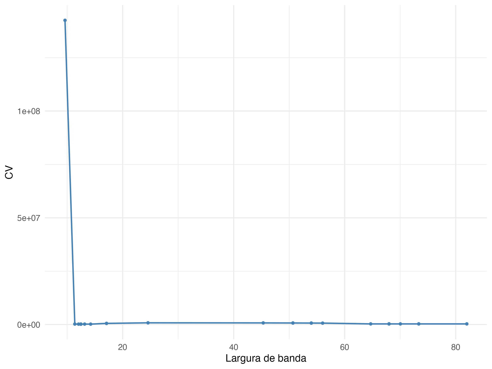{fig-alt="Convergência CV adaptativo"}

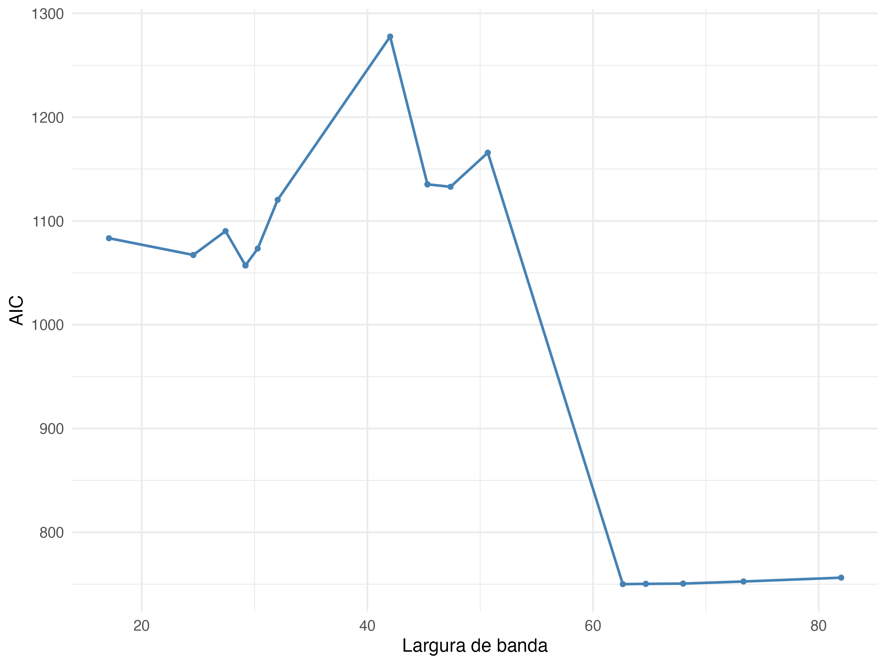{fig-alt="Convergência AIC adaptativo"}

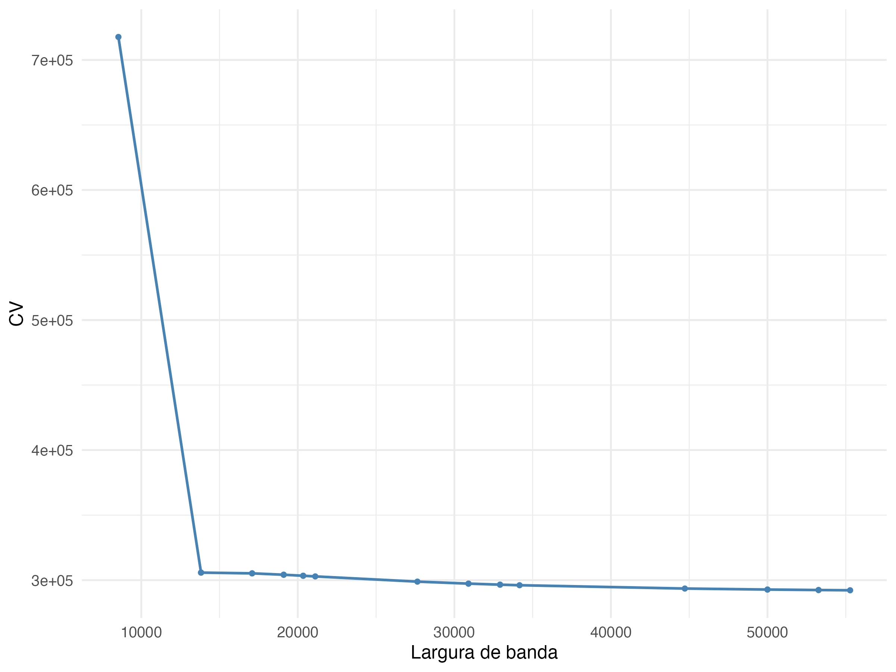{fig-alt="Convergência CV fixa"}

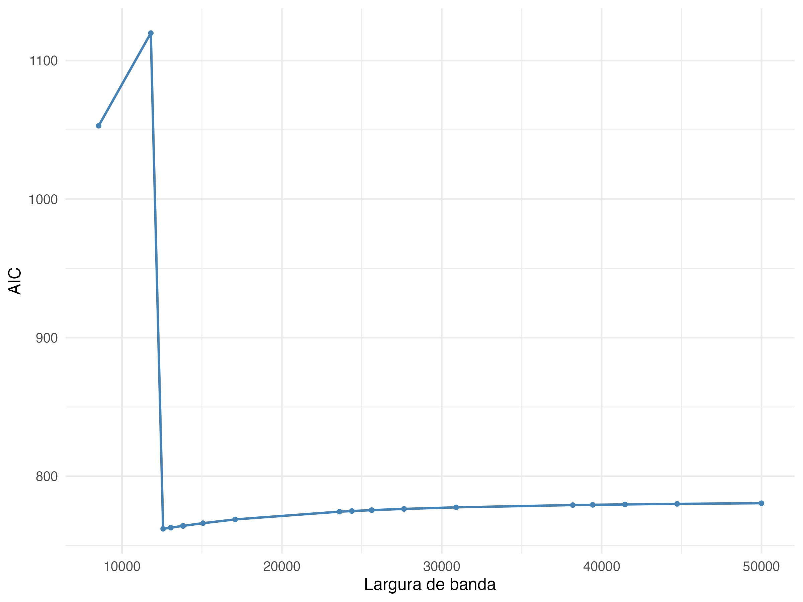{fig-alt="Convergência AIC fixa"}
:::

### Ajuste do modelo GWR-NB

::: {.callout-note collapse="true"}
## Código: ajuste do modelo GWR-NB (computacionalmente intensivo)

```{r}
#| label: modelo-gwr-codigo
#| eval: false

modelo_negbin <- gwzinbr(
  data    = dados_modelo_bn,
  formula = VF_2018_2022 ~ comodo + composta + mais5 + mulher_resp + igreja_mil_hab,
  lat     = "lat_utm", long = "long_utm",
  offset  = "log_casos_esp_vf",
  method  = "adaptive_bsq",
  model   = "negbin",
  force   = TRUE, distancekm = FALSE,
  h       = 12   # largura de banda selecionada por AIC adaptativo
)

# Salvar para reutilização
saveRDS(modelo_negbin, "_cache/modelo_negbin_gwr.rds")
```
:::

### Métricas de ajuste

```{r}
#| label: metricas-gwr
#| tbl-cap: "Indicadores de ajuste — GWR Binomial Negativa."
#| echo: false

# Carrega o modelo cacheado (gerado pelo script_mestrado.R ou CI anterior)
modelo_negbin_path <- "_cache/modelo_negbin_gwr.rds"

if (file.exists(modelo_negbin_path)) {
  modelo_negbin <- readRDS(modelo_negbin_path)
  m <- modelo_negbin$measures
  data.frame(
    Estatística = c("Deviance","AIC","AICc","Pseudo R²","Pseudo R² ajustado"),
    Valor       = round(c(m["deviance"], m["AIC"], m["AICc"],
                          m["pct_ll"],   m["adj_pct_ll"]), 3)
  ) |> kable() |> kable_styling(full_width = FALSE)
} else {
  cat("Execute script_mestrado.R para gerar o modelo e salvar em _cache/.")
}
```

### Parâmetros estimados — mapas

Estimativas locais dos coeficientes. Regiões em **cinza** = não significativas a 10%.

::: {layout-ncol=2}
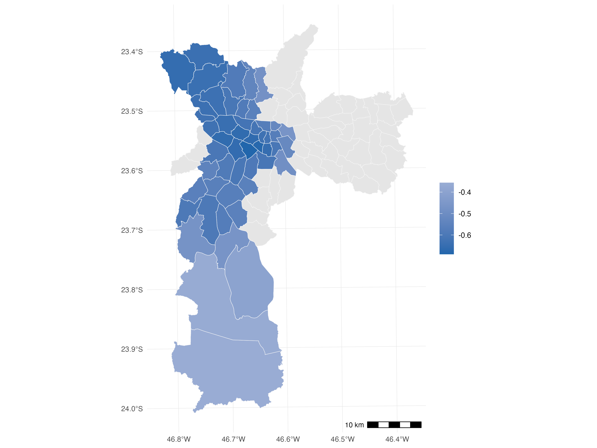

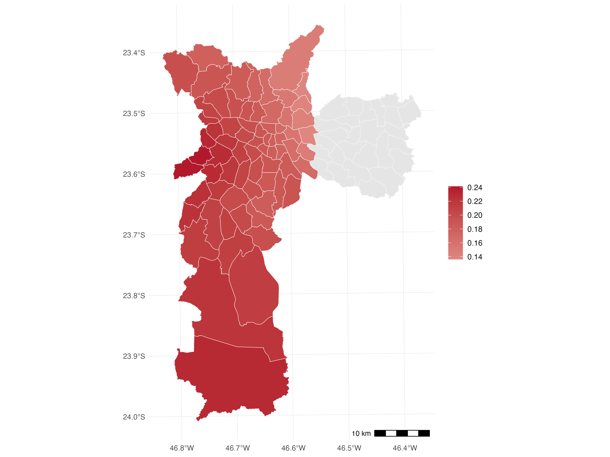

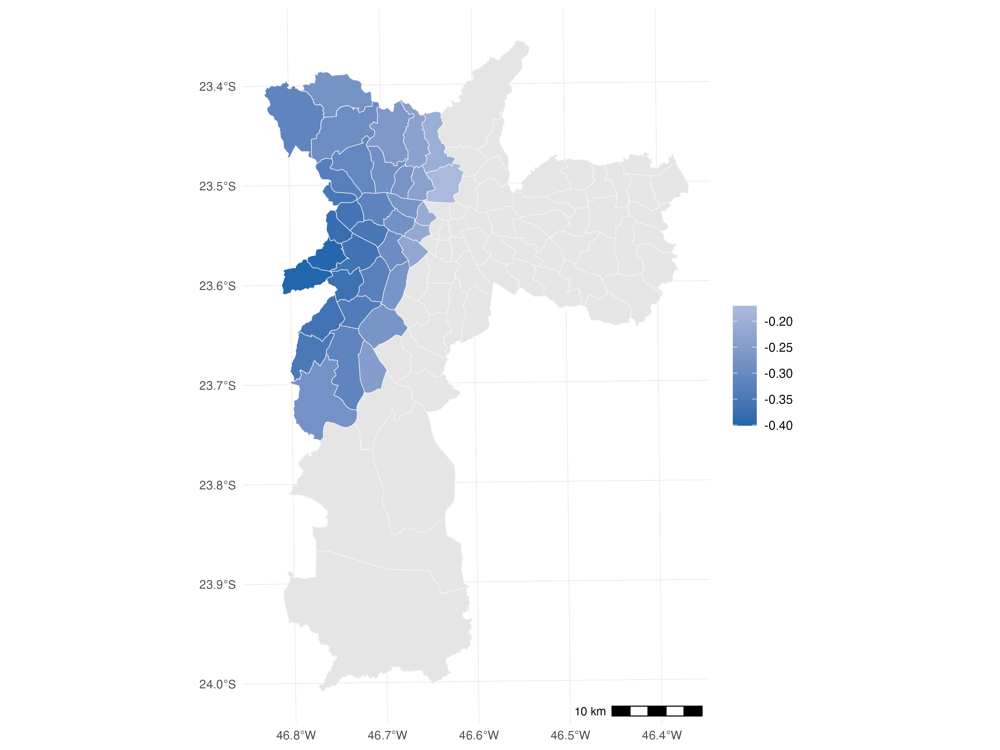

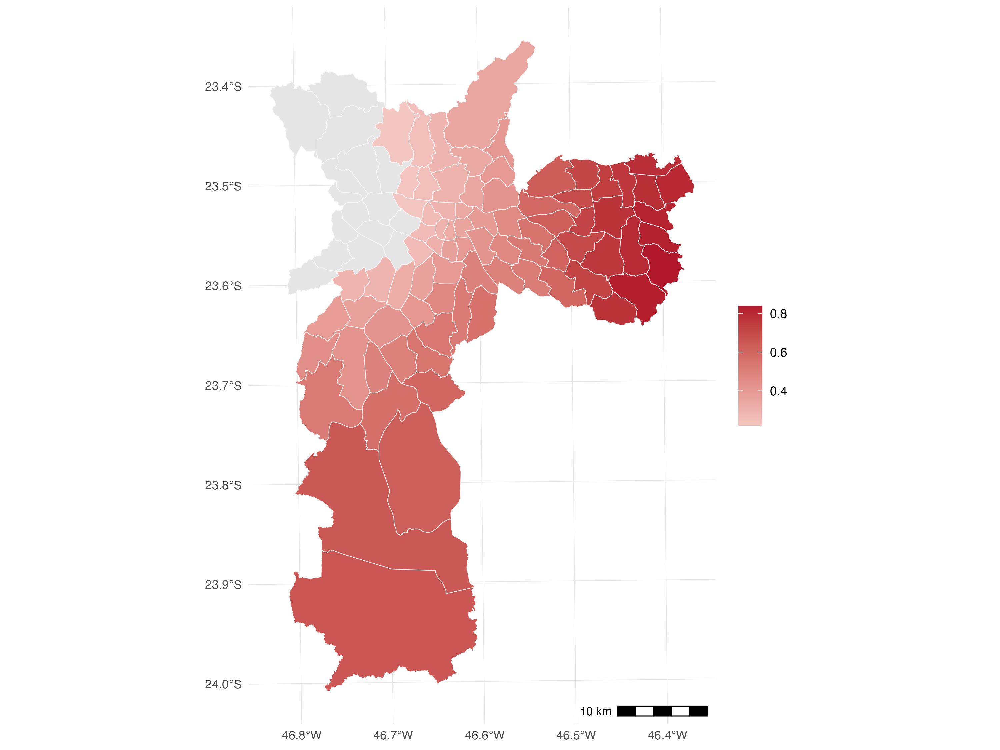

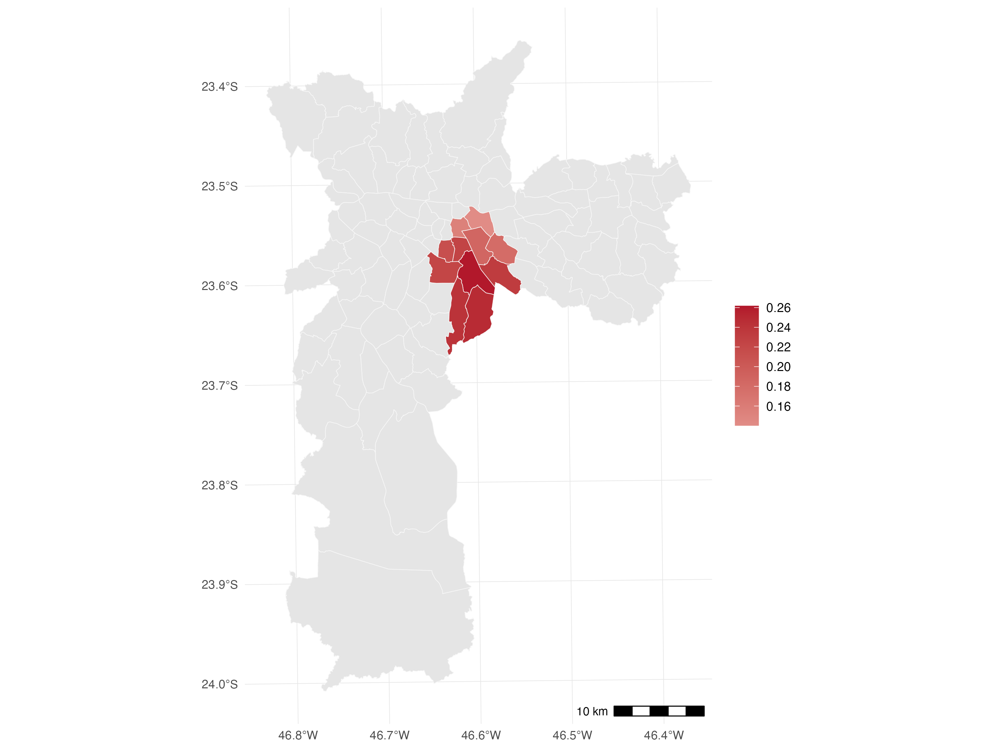

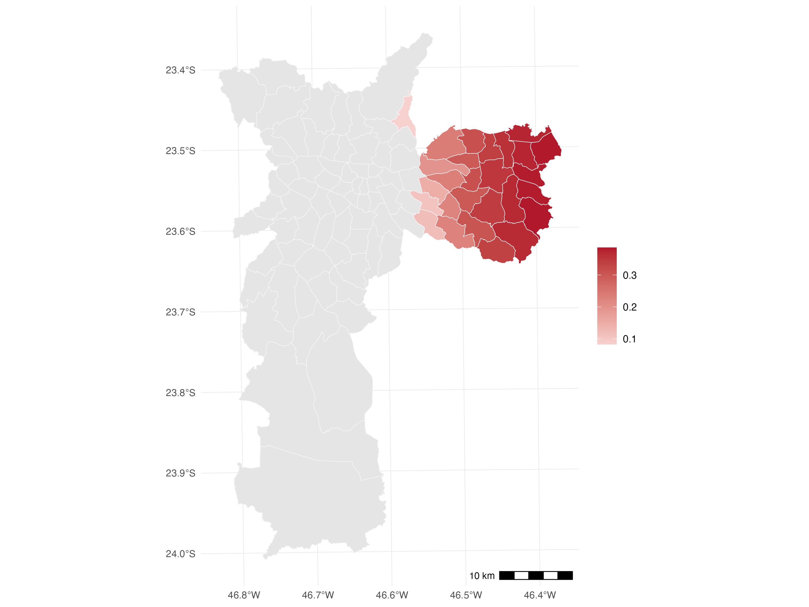
:::

### Resíduos e diagnóstico espacial

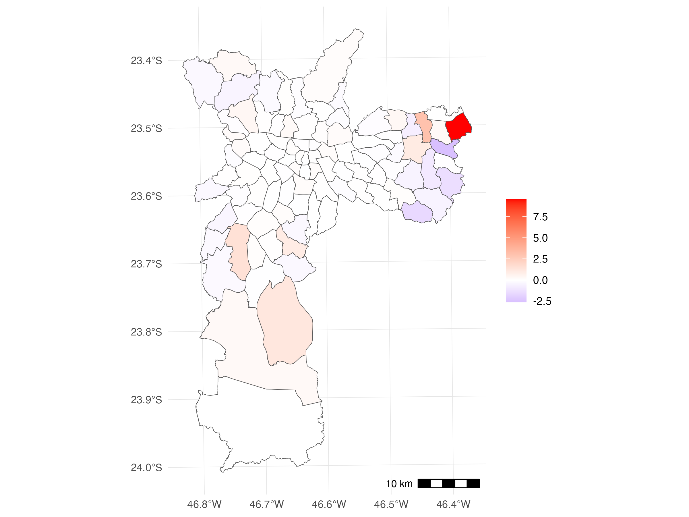

```{r}
#| label: moran-gwr
#| tbl-cap: "Índice de Moran dos resíduos — GWR-NB."

if (exists("modelo_negbin")) {
  residuos_gwr <- as.numeric(modelo_negbin$residuals[, 5])
  coords_gwr   <- cbind(dados_modelo$long_utm, dados_modelo$lat_utm)
  viz_gwr      <- knn2nb(knearneigh(coords_gwr, k = 4))
  pesos_gwr    <- nb2listw(viz_gwr, style = "W")
  moran_gwr    <- moran.mc(residuos_gwr, listw = pesos_gwr, nsim = 999)

  data.frame(
    Estatística = c("Moran I", "Valor-p"),
    Valor = c(round(moran_gwr$statistic, 4), round(moran_gwr$p.value, 4))
  ) |> kable() |> kable_styling(full_width = FALSE)
} else {
  cat("Modelo GWR não carregado. Execute script_mestrado.R primeiro.")
}
```

---

## Referências

- Fotheringham, A. S., Brunsdon, C., & Charlton, M. (2002). *Geographically
  Weighted Regression: the analysis of spatially varying relationships*. Wiley.

- Mesquita, D., Ferreira, P. H. C., & Demetrio, C. G. B. (2023).
  *mgwnbr: Multiscale Geographically Weighted Negative Binomial Regression*.
  R package.

- IBGE (2023). *Censo Demográfico 2022: resultados do universo*.
