```{r}
#| label: setup
#| cache: false

library(tidyverse)
library(sf)
library(spdep)
library(MASS)
library(robustbase)
library(lmtest)
library(corrplot)
library(ggspatial)
library(scales)
library(stringr)
library(stringi)
library(purrr)
library(knitr)
library(kableExtra)
if (requireNamespace("gwzinbr", quietly = TRUE)) library(gwzinbr)

figuras_dir <- "figuras_output"
```

## Introdução

Este documento ilustra o ajuste de um modelo de regressão binomial negativa geograficamente ponderada (RBNGP) aplicado à análise espacial de violência física contra crianças de zero a nove anos nos 96 distritos administrativos do Município de São Paulo, no período de 2018 a 2022.

A variável resposta consiste no número de casos suspeitos e notificados de violência física, obtidos a partir do Sistema de Informação de Agravos de Notificação (SINAN), disponibilizados por meio da plataforma TABNET da Secretaria Municipal da Saúde de São Paulo. O objetivo da análise é identificar variáveis associadas à violência contra crianças, permitindo que seus coeficientes variem espacialmente — característica central dos modelos de Regressão Geograficamente Ponderada (RGP).

Para simplificar a nomenclatura, utiliza-se o termo "casos de violência física" para designar os registros disponíveis, que correspondem a notificações de suspeita de violência física. É importante destacar que esses dados não representam casos confirmados, mas sim as notificações registradas na base utilizada para análise.

## Reprodutibilidade

### Pacotes necessários

```r
install.packages(c(
  "tidyverse", "sf", "spdep", "MASS", "robustbase",
  "lmtest", "corrplot", "ggspatial", "scales",
  "stringr", "stringi", "purrr", "knitr", "kableExtra"
))

# gwzinbr — versão 0.1.0 (CRAN, 2024-06-10)
# Autores: Jéssica Vasconcelos, Juliana Rosa, Alan da Silva
install.packages("gwzinbr")
```

### Estrutura do projeto

```
aplicacao_vf/
├── dados/
│   └── base_mestrado.gpkg          ← geometria + variáveis (96 distritos)
├── arquivos_auxiliares/
│   ├── envel_pois                  ← script de envelope simulado Poisson
│   └── envel_nbin                  ← script de envelope simulado BN
├── Script_aplicacao/figuras_output/ ← todas as figuras geradas por script_mestrado.R
├── _cache/
│   └── mod_gwr.rds                 ← modelo GWR serializado
├── script_mestrado.R               ← script principal de análise
└── index.qmd                       ← este documento
```

### Sequência de execução

```r
# 1. Carregar dados e calcular TIP + Moran I global
# 2. Ajustar modelo de Poisson (linha de base)
# 3. Ajustar modelo Binomial Negativa (global)
# 4. Calcular LISA para a TIP
# 5. Selecionar banda via Golden Section Search (GSS)
# 6. Ajustar modelo RBNGP (gwzinbr)
# 7. Mapear coeficientes locais e resíduos

setwd("caminho/para/aplicacao_vf")
source("script_mestrado.R")
```

## Documentação do script de aplicação

O script `script_mestrado.R` implementa toda a estratégia analítica descrita neste documento. A seguir, apresentam-se seus principais blocos com os respectivos comentários.

### Seção 1 — Pacotes

```r
library(tidyverse)   # dplyr, ggplot2, tidyr, purrr, stringr
library(sf)          # dados vetoriais (geometria dos distritos)
library(spdep)       # poly2nb, nb2listw, moran.mc, localmoran
library(ggspatial)   # barra de escala nos mapas
library(gwzinbr)     # Golden() e gwzinbr() — GWR com BN/ZINB
library(MASS)        # glm.nb() — Binomial Negativa global
library(robustbase)  # adjbox() — boxplot robusto (ajustado ao medcouple)
library(lmtest)      # lrtest() — razão de verossimilhança Poisson vs BN
library(corrplot)    # corrplot() — matriz de correlação visual
library(scales)      # squish() — truncamento de escalas de cor
library(stringi)     # stri_trans_general() — remoção de diacríticos
```

### Seção 2 — Diretórios

```r
dir_dados  <- "dados"
dir_aux    <- "arquivos_auxiliares"   # scripts de envelope simulado
dir_cache  <- "_cache"                # modelo GWR serializado
dir_output <- "Script_aplicacao/figuras_output"
```

### Seção 3 — Dados

```r
# base_mestrado.gpkg reúne em uma única camada: geometria dos 96 distritos,
# notificações SINAN por estrato demográfico, variáveis do Censo 2022,
# densidade de igrejas e bares, e coordenadas UTM do centroide ponderado.

distritos <- st_read(
  file.path("Script_aplicacao/dados/base_mestrado.gpkg"),
  layer = "distritos",
  quiet = TRUE
)
```

### Seção 4 — Variável resposta e Taxa de Incidência Padronizada

```r
# Padronização indireta por faixa etária × sexo (4 estratos):
#   E_i = Σ_j P_ij × t_j  (casos esperados dada a composição demográfica)
#   TIP_i = O_i / E_i      (> 1: incidência acima do esperado)
#
# O offset nos modelos de contagem = log(E_i), de forma que o modelo estima
# log(TIP) como função linear das covariáveis.

taxas_cidade <- st_drop_geometry(distritos) %>%
  summarise(
    taxa_meninos_0_4 = sum(VF_masc_0_4_anos) / sum(meninos0a4),
    taxa_meninos_5_9 = sum(VF_masc_5_9_anos) / sum(meninos5a9),
    taxa_meninas_0_4 = sum(VF_fem_0_4_anos)  / sum(meninas0a4),
    taxa_meninas_5_9 = sum(VF_fem_5_9_anos)  / sum(meninas5a9)
  )

distritos <- distritos %>%
  mutate(
    casos_esperados = meninos0a4 * taxas_cidade$taxa_meninos_0_4 +
                      meninos5a9 * taxas_cidade$taxa_meninos_5_9 +
                      meninas0a4 * taxas_cidade$taxa_meninas_0_4 +
                      meninas5a9 * taxas_cidade$taxa_meninas_5_9,
    tip           = VF_2018_2022 / casos_esperados,
    log_casos_esp = log(casos_esperados)   # offset para os modelos
  )

# Moran I global — TIP
nb_queen  <- poly2nb(distritos)
w_queen   <- nb2listw(nb_queen, style = "W")
moran_tip <- moran.mc(distritos$tip, listw = w_queen, nsim = 999)
```

### Seção 5 — Modelos globais (Poisson e Binomial Negativa)

```r
# Modelo de Poisson
mod_pois <- glm(
  VF_2018_2022 ~ comodo + composta + mais5 + mulher_resp + igrejas,
  family = poisson(link = "log"),
  offset = log_casos_esp,
  data   = tab
)

# Modelo Binomial Negativa
mod_nb <- glm.nb(
  VF_2018_2022 ~ comodo + composta + mais5 + mulher_resp + igrejas +
    offset(log_casos_esp),
  data = tab
)

# Teste de razão de verossimilhança: BN vs Poisson
lrtest(mod_pois, mod_nb)
```

### Seção 6 — LISA

```r
# Análise Local de Indicadores de Associação Espacial (LISA)
# Identifica clusters locais: Alto-Alto, Baixo-Baixo, Alto-Baixo, Baixo-Alto
lisa <- localmoran(distritos$tip, listw = w_queen)
```

### Seção 7 — Seleção de banda (Golden Section Search)

```r
# Golden Section Search minimiza AIC/CV sobre o parâmetro de suavização h.
# Combinações testadas: {AIC, CV} × {adaptativa, fixa}

dados_modelo_bn <- tab %>%
  dplyr::select(VF_2018_2022, comodo, composta, mais5, mulher_resp,
                log_casos_esp_vf, lat_utm, long_utm)

h_adapt_aic <- Golden(
  data    = dados_modelo_bn,
  formula = VF_2018_2022 ~ comodo + composta + mais5 + mulher_resp,
  lat     = "lat_utm", long = "long_utm",
  offset  = "log_casos_esp_vf",
  method  = "adaptive_bsq",
  model   = "negbin",
  crit    = "AIC",
  lower   = 12, upper = 95
)
```

### Seção 8 — Ajuste do modelo RBNGP

```r
# Modelo final: banda adaptativa, h* = 62, critério AIC
mod_gwr <- gwzinbr(
  data       = dados_modelo_bn,
  formula    = VF_2018_2022 ~ comodo + composta + mais5 + mulher_resp,
  lat        = "lat_utm", long = "long_utm",
  offset     = "log_casos_esp_vf",
  method     = "adaptive_bsq",
  model      = "negbin",
  force      = TRUE,
  distancekm = FALSE,
  h          = 62
)

# Serializar o modelo (~2 h de estimação)
saveRDS(mod_gwr, file.path(dir_cache, "mod_gwr.rds"))
```

## Construção da base de dados

### Taxa padronizada de violência física

Para considerar as diferenças na estrutura populacional devidas às faixas etárias e sexo em cada um dos distritos administrativos, utilizou-se a taxa padronizada estratificada. Diferente da taxa padronizada comum, essa abordagem leva em conta as taxas específicas de cada grupo demográfico formado pelas combinações de faixa etária e sexo.

Em cada um dos 96 distritos, o número esperado de casos é calculado pela fórmula:

$$E_i = \sum_{j} P_{ij} \times t_j$$

onde $E_i$ é o total esperado de casos no distrito $i$, $P_{ij}$ é a população do distrito $i$ no grupo demográfico $j$ (faixa etária × sexo), e $t_j$ é a taxa específica para o grupo $j$, calculada para a cidade como um todo. A taxa padronizada estratificada é então:

$$\text{Taxa padronizada} = \frac{O_i}{E_i}$$

A taxa padronizada foi utilizada na análise exploratória para ilustrar a distribuição espacial dos casos considerando a estrutura populacional. Na modelagem, a variável resposta corresponde à contagem bruta de casos, com o total esperado $E_i$ incorporado como *offset* no preditor linear.

### Variáveis explicativas

As variáveis explicativas foram agrupadas em quatro categorias:

**Grupo 1 — Características Socioeconômicas e Demográficas:** retratam o nível de escolaridade, a composição dos domicílios em termos demográficos, a participação de mulheres como responsáveis familiares e a distribuição de renda no território.

**Grupo 2 — Estrutura Domiciliar:** descreve as condições físicas e de infraestrutura das habitações, refletindo o acesso a serviços básicos e a ocorrência de moradias precárias.

**Grupo 3 — Estrutura Familiar e Urbana:** refere-se às formas de organização e arranjos familiares, distinguindo diferentes configurações domésticas.

**Grupo 4 — Espaços de Convivência Social:** engloba locais de encontro, interação e vida comunitária (igrejas e bares por mil habitantes).

As variáveis do Censo 2022 estão expressas em percentuais (0 a 100). A renda média foi padronizada pelo método min-max:

$$\text{Rendap} = 100 \times \frac{\text{Renda Média} - \min(\text{Renda Média})}{\max(\text{Renda Média}) - \min(\text{Renda Média})}$$

| Grupo | Variável | Descrição |
|---|---|---|
| Grupo 1 | alfab | Percentual de pessoas com 15 anos ou mais alfabetizadas |
| Grupo 1 | ate1mora | Percentual de domicílios com apenas um morador |
| Grupo 1 | mais5 | Percentual de domicílios com cinco ou mais moradores |
| Grupo 1 | mulher_resp | Percentual de domicílios cujo responsável é do sexo feminino |
| Grupo 1 | rendap | Padronização min-max da renda média |
| Grupo 2 | banheiro1 | Percentual de domicílios com ao menos um banheiro exclusivo |
| Grupo 2 | comodo | Percentual de domicílios em habitações coletivas informais (cortiços) |
| Grupo 3 | ambos | Percentual de domicílios com casal e filhos apenas desse casal |
| Grupo 3 | plmenos1 | Percentual de domicílios com casal e pelo menos um filho apenas do responsável ou cônjuge |
| Grupo 3 | composta | Percentual de domicílios compostos (com pessoas sem parentesco com o responsável) |
| Grupo 3 | estendida | Percentual de domicílios estendidos (com inclusão de outros parentes) |
| Grupo 3 | nuclear | Percentual de domicílios nucleares |
| Grupo 4 | igrejas | Número de igrejas por mil habitantes |
| Grupo 4 | bares | Número de bares por mil habitantes |

: Descrição das variáveis explicativas organizadas por grupos {tbl-colwidths="[20,15,65]"}

### Coordenadas geográficas

Para a análise, adotou-se o sistema de coordenadas UTM, que utiliza unidades em metros. Considerando que os dados estão agrupados por distrito, normalmente são utilizadas as coordenadas do centroide de cada distrito. No entanto, para aumentar a precisão do estudo — especialmente porque o modelo considera distâncias —, as coordenadas foram deslocadas para os pontos correspondentes às maiores densidades populacionais dentro de cada distrito.

## Análise descritiva

### Distribuição dos casos de violência física (2018–2022)

A figura abaixo apresenta a distribuição espacial dos casos de violência física por meio de um mapa de círculos proporcionais, em que o tamanho de cada círculo é proporcional à quantidade de casos registrados no distrito. Esse tipo de representação cartográfica é útil para ressaltar diferenças absolutas entre áreas, pois círculos maiores chamam a atenção para regiões com maior concentração de ocorrências.

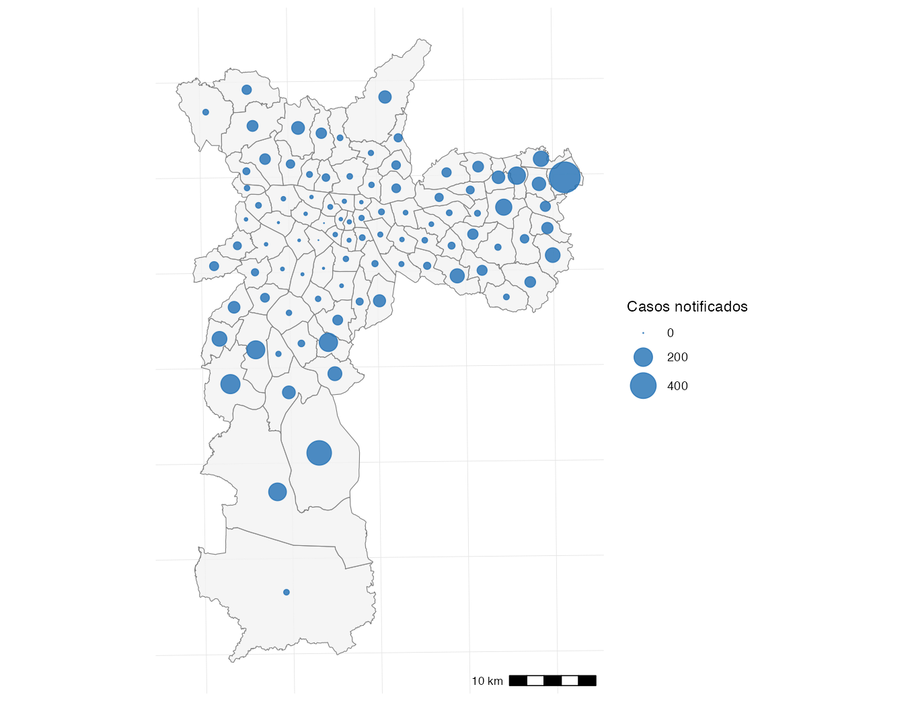

A figura seguinte apresenta a distribuição espacial da taxa padronizada de violência física por distrito. Diferentemente do que se observa na contagem bruta, a análise pela taxa padronizada revela que dois distritos — Itaim Paulista e São Miguel, na Zona Leste — se destacam dos demais, evidenciando a importância de considerar o tamanho da população em risco. Os distritos Consolação e Jardim Paulista não registraram casos no período analisado.

Para avaliar a autocorrelação espacial, utilizou-se o índice de Moran. O teste, via simulação de Monte Carlo, revelou autocorrelação espacial significativa para a taxa padronizada (índice de Moran = 0,312; valor-p = 0,001), indicando que os dados apresentam padrões espaciais.

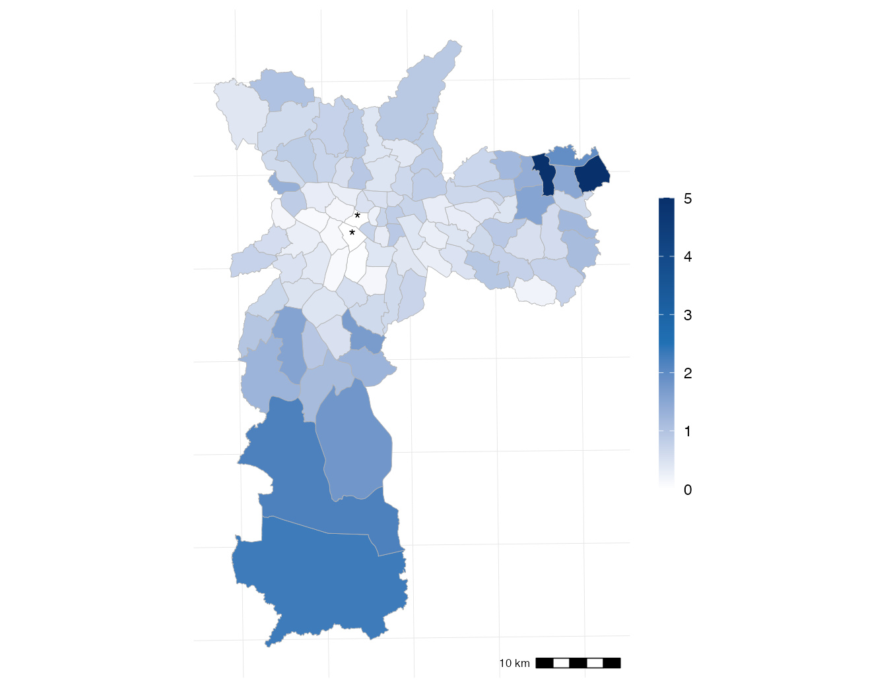

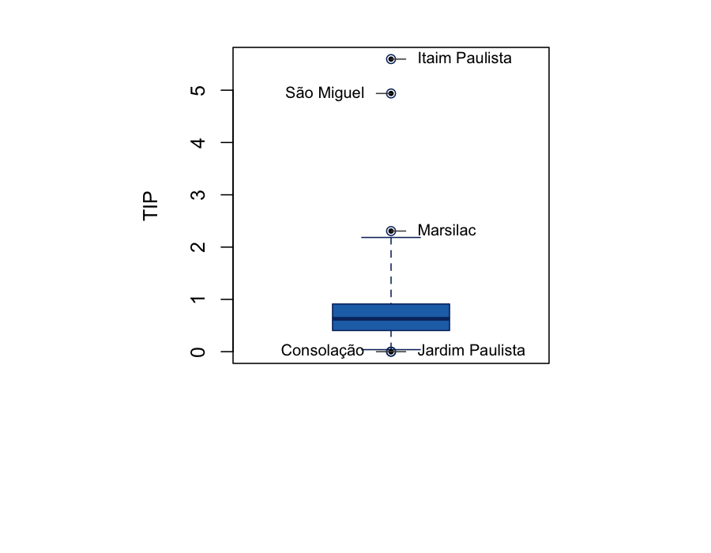

| Medida | Valor |
|---|---|
| Média | 0,800 |
| Desvio-padrão | 0,804 |
| Mínimo | 0,000 |
| 1º Quartil | 0,407 |
| Mediana | 0,629 |
| 3º Quartil | 0,912 |
| Máximo | 5,600 |

: Medidas-resumo da taxa padronizada de violência física

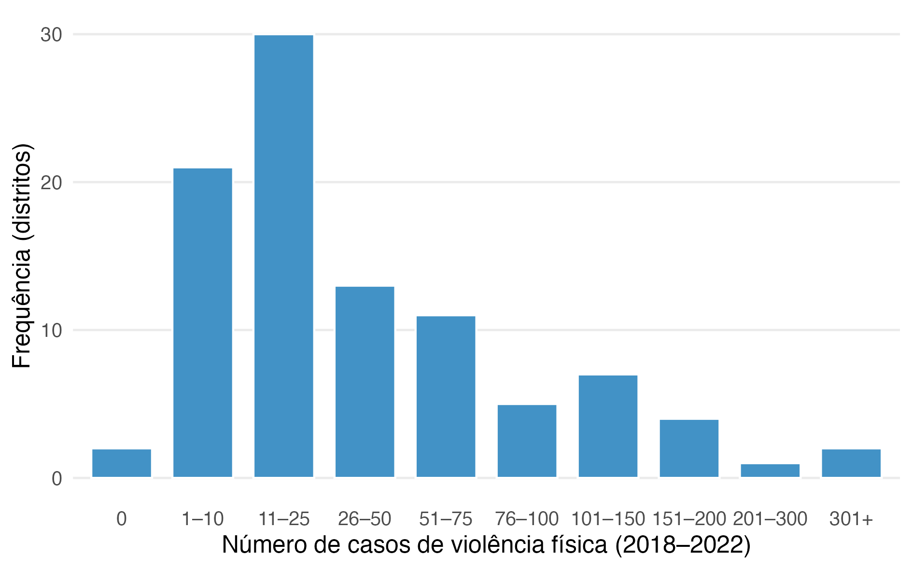

### Variáveis explicativas

Apresentam-se a seguir os principais padrões espaciais e estatísticos das variáveis explicativas.

#### Grupo 1 — Características socioeconômicas e demográficas

::: {layout-ncol=2}


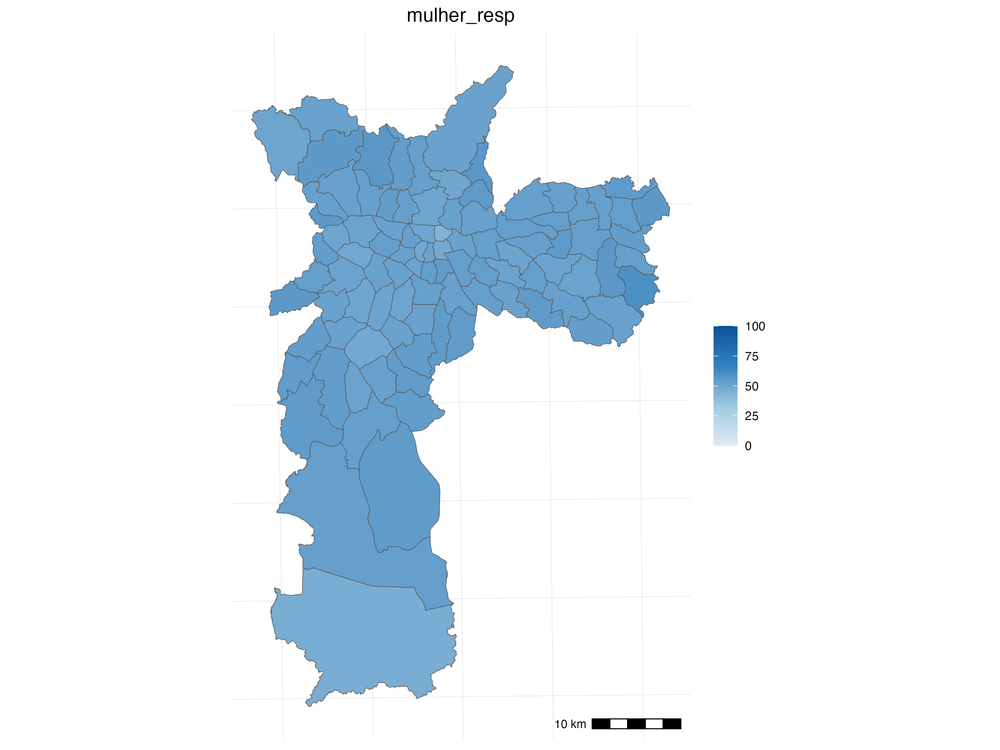
:::

{width=60% fig-align="center"}

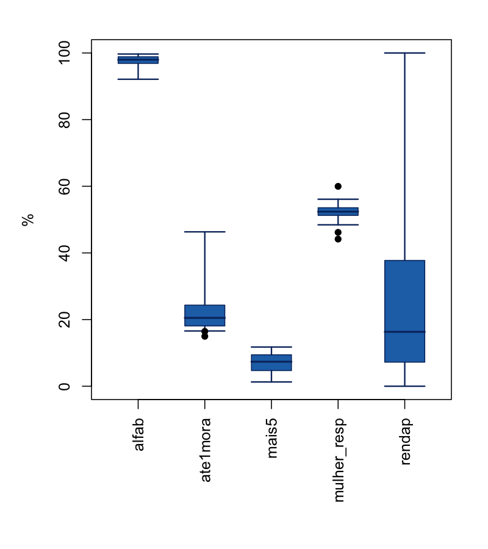

| Medida | alfab | ate1mora | mais5 | mulher_resp | rendap |
|---|---|---|---|---|---|
| Média | 97,740 | 22,870 | 6,970 | 52,380 | 25,960 |
| Desvio-padrão | 1,370 | 6,750 | 3,010 | 2,180 | 25,660 |
| Mínimo | 92,120 | 14,980 | 1,280 | 44,160 | 0,000 |
| 1º Quartil | 96,910 | 18,100 | 4,760 | 51,270 | 7,240 |
| Mediana | 97,980 | 20,510 | 7,360 | 52,390 | 16,320 |
| 3º Quartil | 98,860 | 24,260 | 9,410 | 53,560 | 37,370 |
| Máximo | 99,690 | 46,330 | 11,760 | 59,980 | 100,000 |

: Medidas-resumo das variáveis socioeconômicas e demográficas

A distribuição espacial destaca concentração de maiores valores de renda padronizada na região centro-sudoeste, coincidindo com maiores proporções de domicílios com um morador nessas áreas. Em contraste, distritos periféricos exibem maior porcentagem de domicílios com cinco ou mais moradores, enquanto o percentual de alfabetizados se mantém elevado em praticamente todo o território.

#### Grupo 2 — Estrutura domiciliar

::: {layout-ncol=2}
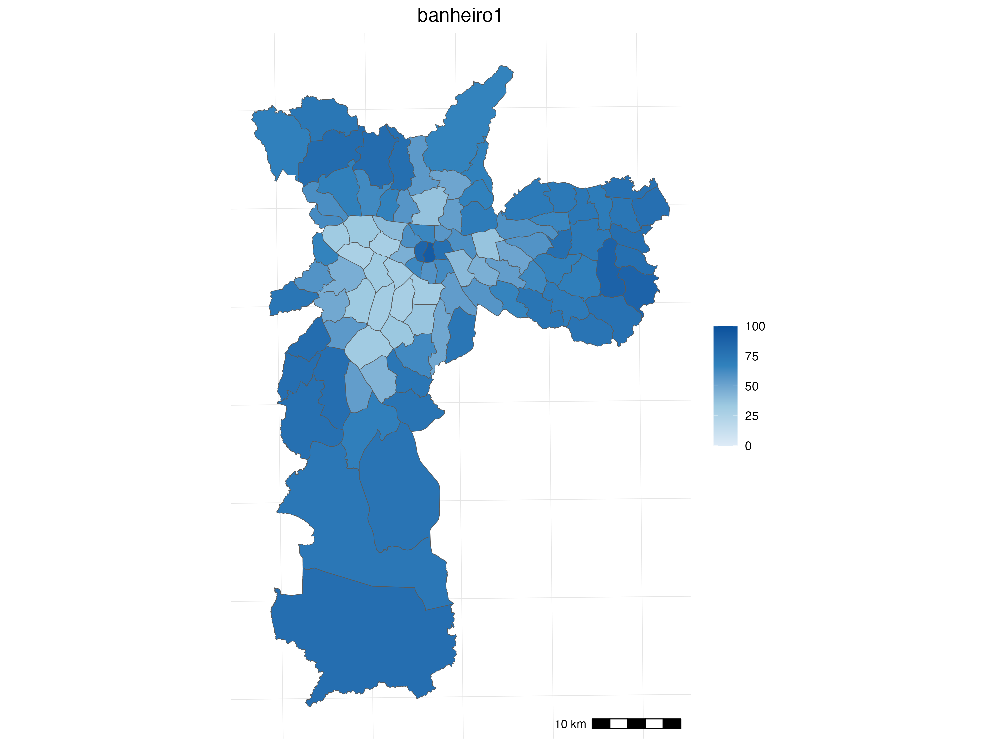


:::

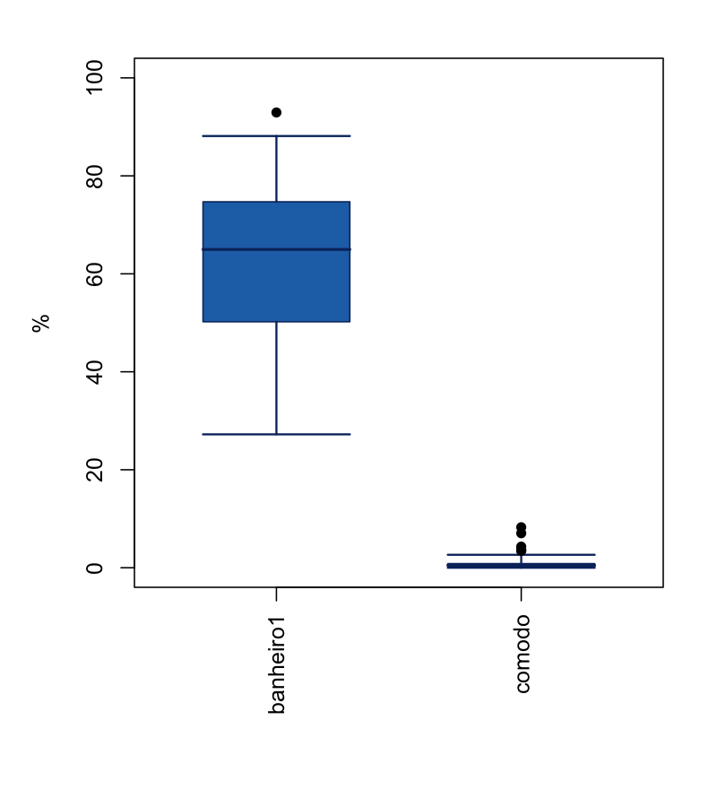

| Medida | banheiro1 | comodo |
|---|---|---|
| Média | 61,650 | 0,850 |
| Desvio-padrão | 16,770 | 1,280 |
| Mínimo | 27,230 | 0,000 |
| 1º Quartil | 50,360 | 0,240 |
| Mediana | 64,970 | 0,490 |
| 3º Quartil | 74,700 | 0,840 |
| Máximo | 92,940 | 8,270 |

: Medidas-resumo das variáveis de estrutura domiciliar

Destaca-se a maior concentração de domicílios com banheiro exclusivo em distritos centrais, enquanto habitações coletivas informais permanecem raras e com focos pontuais na periferia. A tabela confirma alta variabilidade no percentual de banheiro exclusivo, contrastando com a baixa dispersão do percentual de habitações coletivas.

#### Grupo 3 — Estrutura familiar e urbana

::: {layout-ncol=2}


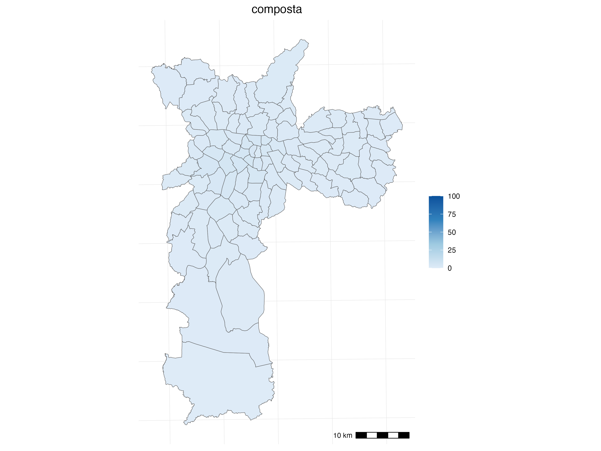


:::

{width=60% fig-align="center"}

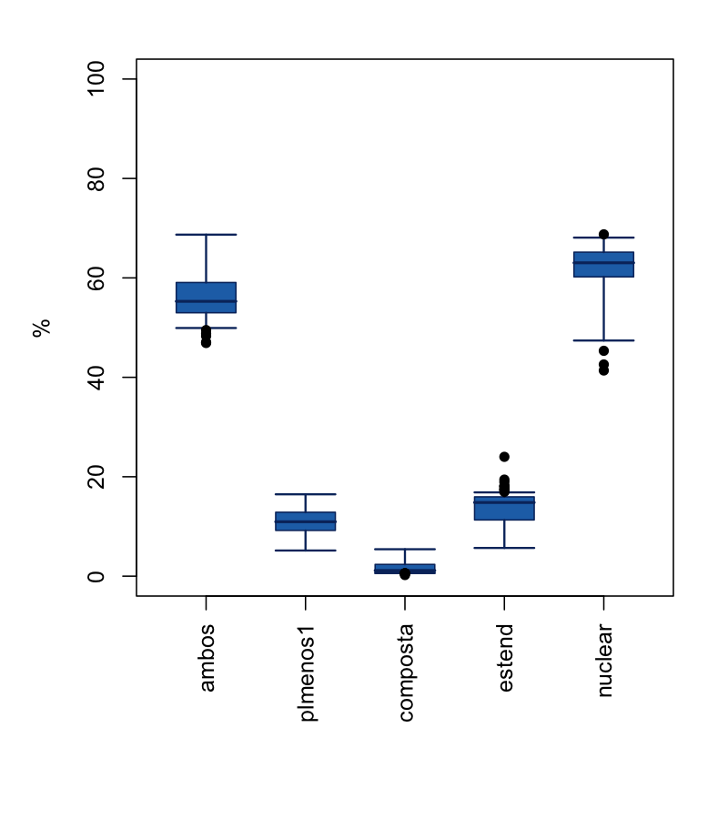

| Medida | ambos | plmenos1 | composta | estendida | nuclear |
|---|---|---|---|---|---|
| Média | 56,280 | 10,680 | 1,770 | 13,560 | 61,700 |
| Desvio-padrão | 4,860 | 2,550 | 1,370 | 3,670 | 5,370 |
| Mínimo | 46,900 | 5,160 | 0,230 | 5,670 | 41,370 |
| 1º Quartil | 53,020 | 9,200 | 0,810 | 11,320 | 60,430 |
| Mediana | 55,280 | 10,950 | 1,140 | 14,820 | 63,040 |
| 3º Quartil | 59,050 | 12,850 | 2,360 | 15,940 | 65,170 |
| Máximo | 68,700 | 16,470 | 5,420 | 24,010 | 68,760 |

: Medidas-resumo das variáveis de estrutura familiar e urbana

Observa-se predominância de domicílios nucleares em todo o município, com aumento de unidades do tipo compostas e estendidas em áreas periféricas, sugerindo maior complexidade familiar nessas regiões. Os *box-plots* e a tabela evidenciam distribuição mais uniforme para nuclear e ambos, mas maior dispersão nas estruturas ampliadas como composta e estendida.

#### Grupo 4 — Espaços de convivência social

As variáveis igrejas e bares expressam, respectivamente, o número de igrejas e de bares por mil habitantes em cada distrito administrativo. Os dados foram obtidos por meio de levantamento manual de pontos de interesse georreferenciados disponíveis no Google Maps, realizado em 2025 por pesquisadores do Laboratório de Violência, Vulnerabilidade e Saúde Humana. Para cada um dos 96 distritos, os estabelecimentos foram identificados e contabilizados individualmente; os totais obtidos foram normalizados pela população residente, resultando em taxas por mil habitantes comparáveis entre os distritos.

::: {layout-ncol=2}
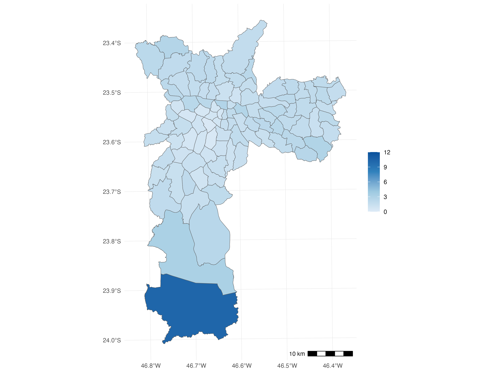

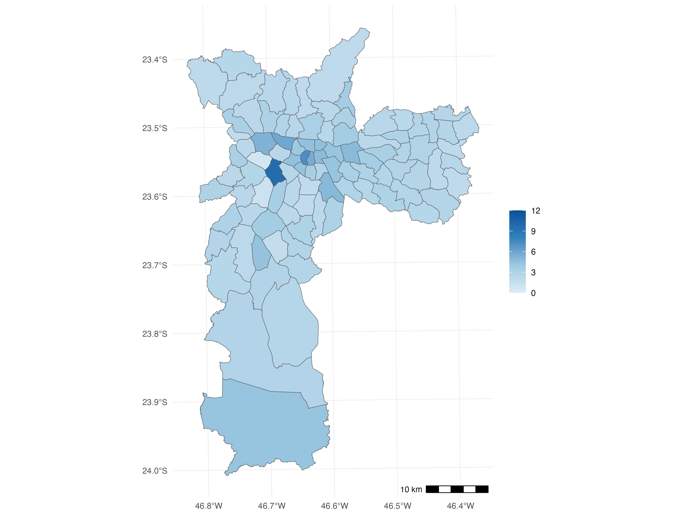
:::


| Medida | igrejas | bares |
|---|---|---|
| Média | 1,740 | 3,050 |
| Desvio-padrão | 1,050 | 1,240 |
| Mínimo | 0,340 | 0,760 |
| 1º Quartil | 1,370 | 2,360 |
| Mediana | 1,650 | 2,710 |
| 3º Quartil | 2,000 | 3,310 |
| Máximo | 10,260 | 9,790 |

: Medidas-resumo das variáveis de espaços de convivência social

O mapa revela maior densidade de igrejas por mil habitantes em Marsilac e de bares em Pinheiros e República, indicando perfis distintos de sociabilidade espacial. Os valores mais altos das duas variáveis se distanciam dos demais, conforme os *box-plots*.

### Correlações entre as variáveis

Avaliou-se a correlação entre as variáveis explicativas selecionadas e a relação dessas variáveis com a taxa padronizada de violência física. A análise de multicolinearidade é particularmente importante, uma vez que sua presença pode afetar significativamente os resultados do ajuste de modelos RGP, comprometendo a interpretação dos coeficientes estimados.

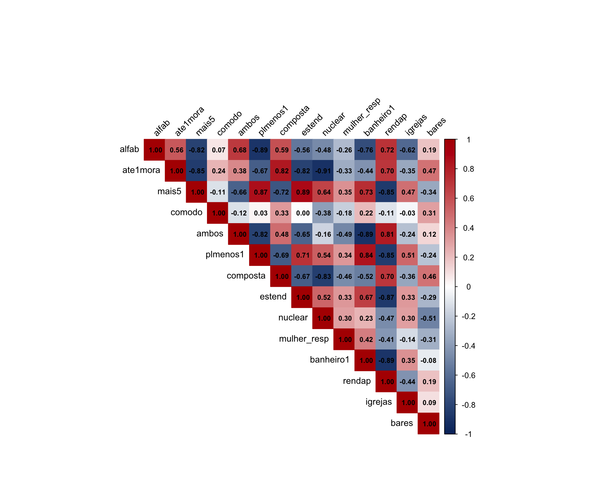

Foram observados valores altos de correlação entre algumas variáveis — por exemplo, mais5, que tem forte correlação com ate1mora, alfab, composta, estendida e nuclear. Para tornar mais clara a estrutura de correlação, realizou-se uma análise de agrupamentos hierárquicos pelo método de Ward, utilizando como medida de dissimilaridade o valor de $1 - |\text{correlação de Pearson}|$.

O dendrograma obtido sugere a formação de 5 grupos de variáveis: (1) igrejas; (2) rendap, mais5, estendida, banheiro1, ambos, alfab, plmenos1; (3) composta, ate1mora, nuclear; (4) comodo; (5) mulher_resp, bares.

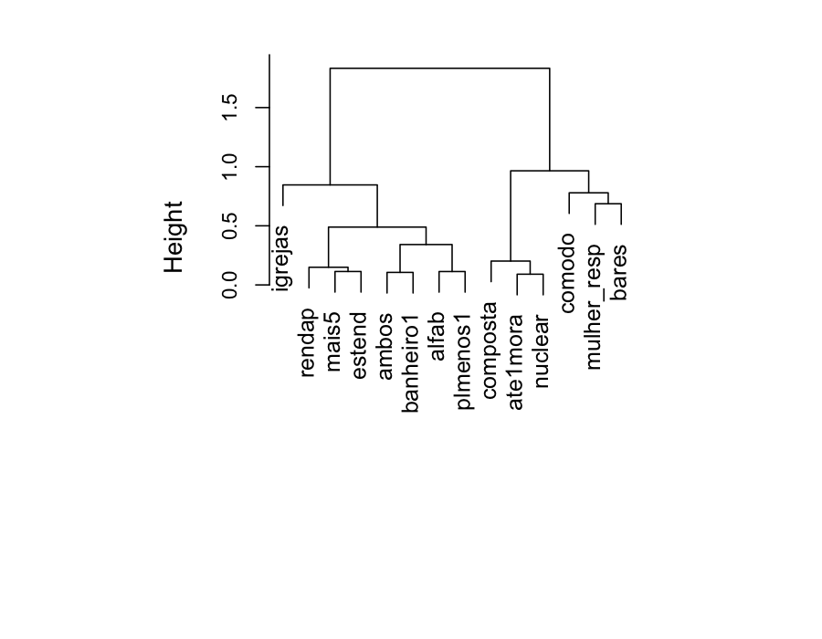

| Variável | Correlação de Pearson | Valor-p |
|---|---|---|
| alfab | -0,524 | < 0,001 |
| ate1mora | -0,354 | < 0,001 |
| mais5 | 0,509 | < 0,001 |
| comodo | -0,025 | 0,807 |
| banheiro1 | 0,431 | < 0,001 |
| ambos | -0,410 | < 0,001 |
| plmenos1 | 0,462 | < 0,001 |
| composta | -0,388 | < 0,001 |
| estendida | 0,427 | < 0,001 |
| nuclear | 0,252 | 0,013 |
| mulher_resp | 0,228 | 0,026 |
| rendap | -0,456 | < 0,001 |
| igrejas | 0,307 | 0,002 |
| bares | -0,165 | 0,107 |

: Correlação de Pearson entre a taxa padronizada de violência física e as variáveis explicativas

Com base nesses resultados, foram selecionadas como candidatas às variáveis explicativas nos modelos de regressão: **comodo**, **composta**, **mais5**, **mulher_resp** e **igrejas**. Vale destacar que esta análise possui caráter exploratório, uma vez que os padrões de correlação entre as variáveis podem apresentar variações locais.

## Ajuste de modelos não espaciais

Conforme proposto para dados de contagem, ajustou-se inicialmente um modelo de regressão de Poisson não espacial com função de ligação logarítmica. A variável resposta foi o número de casos de violência física, as variáveis explicativas foram as selecionadas na seção anterior, e o número de casos esperado em cada distrito foi considerado como *offset*.

| Variável | Coeficiente | Erro Padrão | Estatística | Valor-p |
|---|---|---|---|---|
| (Intercepto) | -1,879 | 0,487 | -3,855 | < 0,001 |
| comodo | 0,198 | 0,021 | 9,268 | < 0,001 |
| composta | -0,157 | 0,033 | -4,697 | < 0,001 |
| mais5 | 0,221 | 0,011 | 20,134 | < 0,001 |
| mulher_resp | 0,004 | 0,009 | 0,467 | 0,641 |
| igrejas | -0,140 | 0,036 | -3,882 | < 0,001 |

: Resumo dos resultados obtidos no ajuste da regressão de Poisson

O valor do desvio residual foi de 1.595,069 com 90 graus de liberdade, indicando superdispersão nos dados e inadequação do modelo de Poisson. O gráfico de envelope dos resíduos reforça essa conclusão.

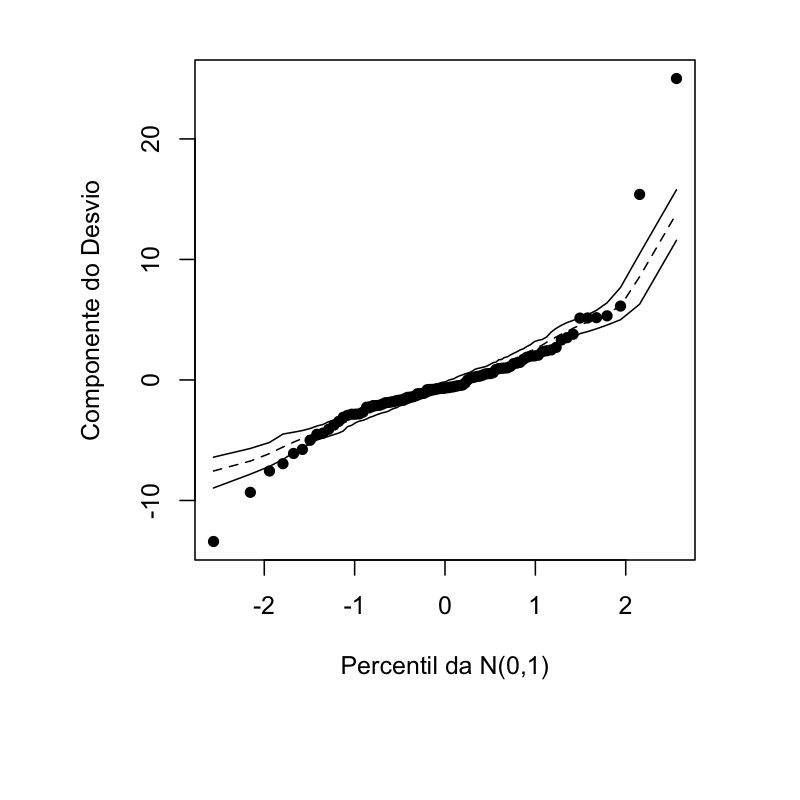

Diante disso, foi ajustado um modelo binomial negativo, mais adequado na presença de superdispersão.

| Variável | Coeficiente | Erro Padrão | Estatística | Valor-p |
|---|---|---|---|---|
| (Intercepto) | -2,815 | 1,759 | -1,600 | 0,110 |
| comodo | 0,134 | 0,051 | 2,604 | 0,009 |
| composta | -0,138 | 0,075 | -1,838 | 0,066 |
| mais5 | 0,154 | 0,030 | 5,135 | < 0,001 |
| mulher_resp | 0,026 | 0,032 | 0,821 | 0,412 |
| igrejas | 0,044 | 0,070 | 0,637 | 0,525 |

: Coeficientes estimados do modelo binomial negativa (global)

| Estatística | Valor |
|---|---|
| Log-verossimilhança | -384,465 |
| Pseudo $R^2$ (McFadden) | 0,185 |
| Desvio residual | 101,057 |
| AIC | 784,929 |
| AICc | 786,202 |

: Medidas de ajuste do modelo binomial negativa

A estimativa do parâmetro de superdispersão $\alpha$ foi de 4,19 (erro padrão = 0,7), confirmando superdispersão nos dados.

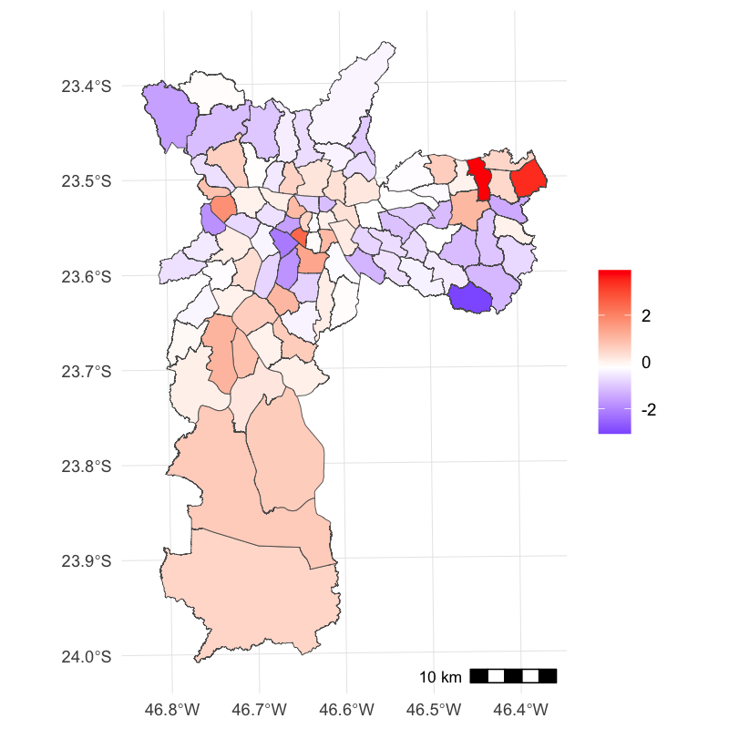

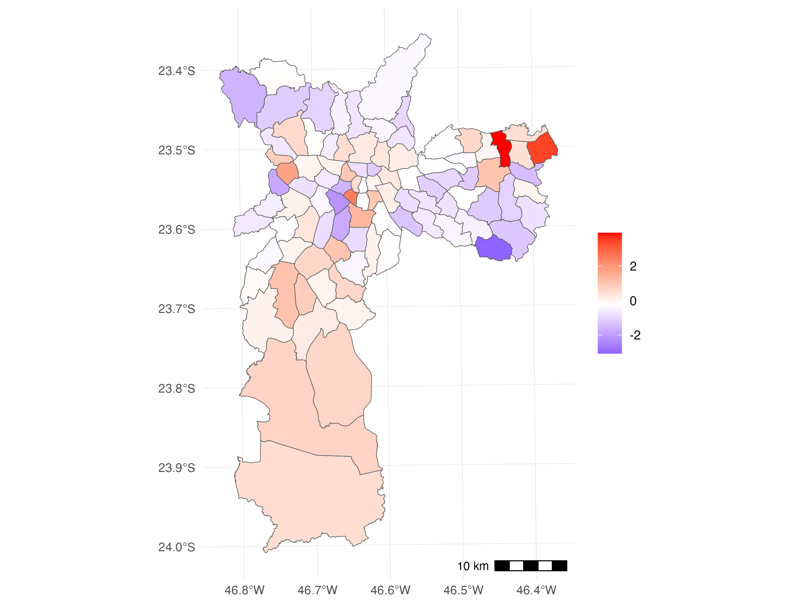

O índice de Moran calculado para os resíduos padronizados do modelo binomial negativo foi de $I = 0,155$, com valor-p = 0,01, indicando presença de autocorrelação espacial significativa nos resíduos e reforçando a necessidade de considerar um modelo que incorpore dependência espacial.

### Autocorrelação espacial local — LISA

A autocorrelação espacial local foi investigada por meio dos indicadores LISA (Local Indicators of Spatial Association), que permitem identificar padrões específicos em cada distrito, indo além do resumo fornecido pelas estatísticas globais.

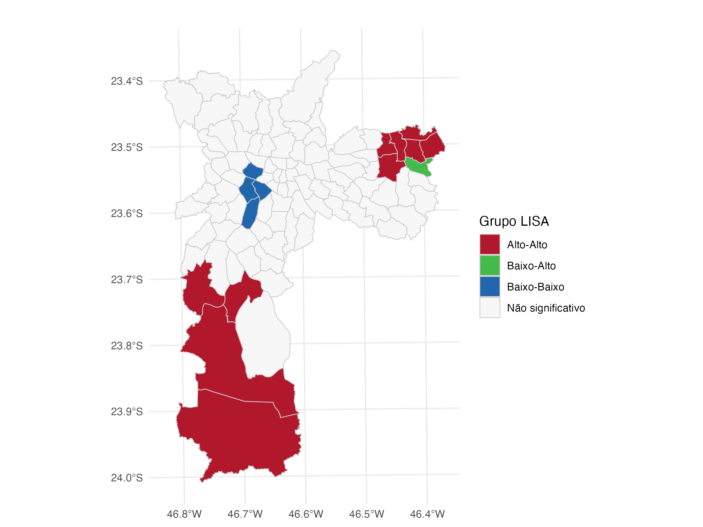

Os agrupamentos *Alto-Alto* indicam zonas onde tanto o distrito quanto seus vizinhos apresentam altos índices, sugerindo polos de concentração e possíveis fatores de risco acumulados. As áreas *Baixo-Baixo* apontam regiões menos vulneráveis. A presença de uma borda marcada, em que um território *Alto-Alto* aparece adjacente a uma área *Baixo-Alto*, indica transição espacial pontual entre zonas de risco elevado e regiões de menor intensidade relativa. Essa heterogeneidade espacial reforça as limitações de modelos que assumem efeitos homogêneos no espaço e motiva a adoção de abordagens locais, como a RGP.

### Excesso de zeros

Para avaliar a necessidade de ajustar um modelo RGP com inflação de zeros, compararam-se os zeros esperados e observados. A proporção esperada de zeros foi de 1,51%, enquanto a observada foi de 2,1%. Embora esses valores sejam próximos, ajustou-se um modelo RBNIZ global com as mesmas covariáveis via função `zeroinfl` do pacote `pscl`. Com apenas 2 zeros na amostra, o modelo não convergiu — o algoritmo de estimação não conseguiu calcular os erros padrão da parte logística. A tentativa de ajustar um RBNIZGP também apresentou problemas de convergência, inviabilizando sua utilização. Optou-se, portanto, por dar continuidade à análise com um RBNGP.

## Ajuste de modelos RBNGP

Partindo das variáveis do modelo global e permitindo que seus coeficientes variassem entre os distritos, verificou-se que **igrejas** não apresentou contribuição significativa em nenhum ponto do espaço e foi excluída. O modelo final foi ajustado com as covariáveis **comodo**, **composta**, **mais5** e **mulher_resp**.

### Critério de seleção da banda

A função Golden Section Search (GSS) foi executada para as quatro combinações de critério (AIC/CV) e tipo de vizinhança (adaptativa/fixa).

| Método | Critério | $h^*$ |
|---|---|---|
| Adaptativa | CV | 12,00 |
| Adaptativa | AIC | 62,00 |
| Fixa | CV | 55.277,68 |
| Fixa | AIC | 12.573,32 |

: Resultado da minimização por Busca por Seção Áurea

::: {layout-ncol=2}
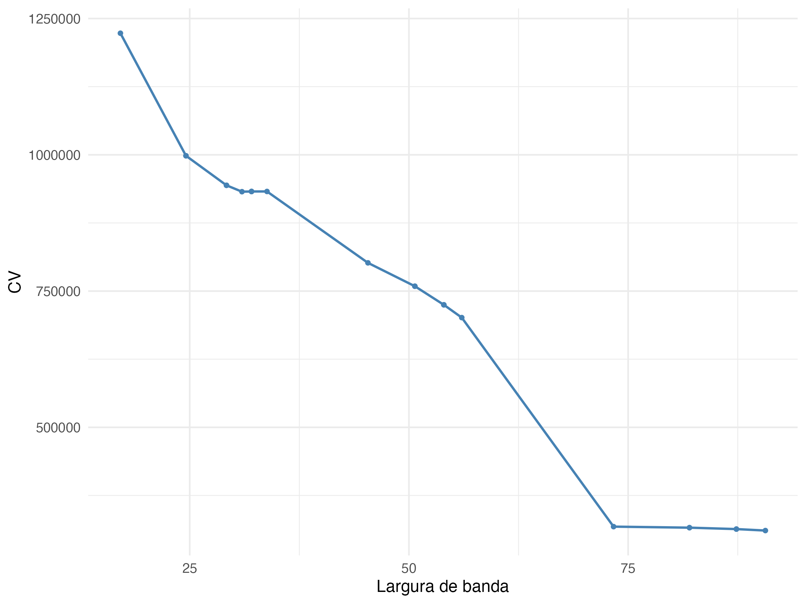

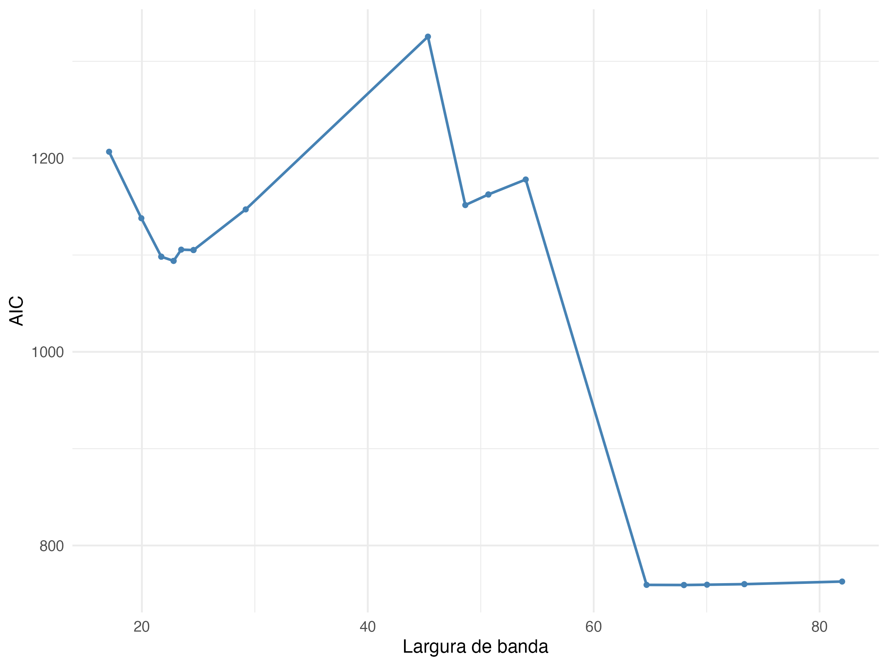

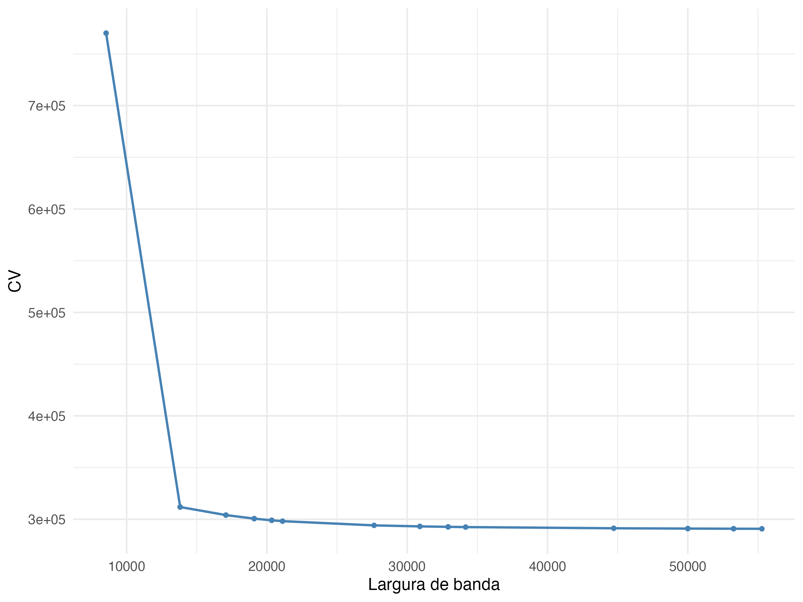

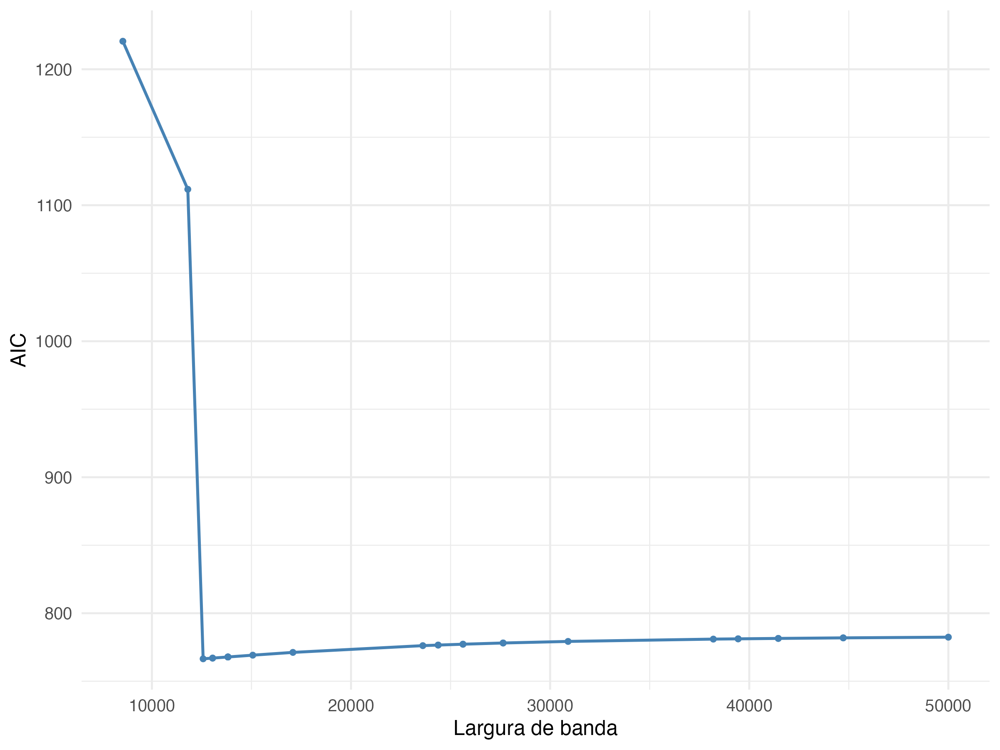
:::

Curvas GSS para RBNGP: (a) Adaptativa-CV, (b) Adaptativa-AIC, (c) Fixa-CV, (d) Fixa-AIC.

| Medida de ajuste | Fixo (AIC) | Adaptável (AIC) | Fixo (CV) | Adaptável (CV) |
|---|---|---|---|---|
| Log-verossimilhança | -366,667 | -352,893 | -383,524 | -300,668 |
| *deviance* | 89,919 | 96,218 | 100,119 | 101,662 |
| AIC | 758,063 | 741,401 | 779,815 | 765,114 |
| AICc | 762,063 | 750,078 | 780,878 | 1800,520 |
| $R^2$ | 0,8908 | 0,9276 | 0,8123 | 0,9834 |
| $R^2$ ajustado | 0,8596 | 0,9001 | 0,7865 | 0,9564 |
| Parâmetro de suavização | 12.573 | 62 | 55.278 | 12 |
| Nº de parâmetros estimados | 10,3 | 14,8 | 5,3 | 68,2 |

: Medidas de ajuste dos modelos RBNGP por combinação de critério e tipo de vizinhança

A configuração **adaptável-AIC** ($h^* = 62$) apresentou o menor AIC (741,401) e AICc (750,078) entre todas as alternativas. A configuração adaptável-CV, embora com $R^2$ mais elevado (0,9834), produziu AICc de 1800,520 e 68,2 parâmetros estimados, indicando sobreajuste. As configurações com vizinhança fixa resultaram em ajuste consistentemente inferior. A configuração adaptável-AIC com $h^* = 62$ foi, portanto, selecionada.

| Iteração | $h_1$ | AIC$_1$ | $h_2$ | AIC$_2$ |
|---|---|---|---|---|
| 1 | 17,10 | 1083,36 | 24,57 | 1067,24 |
| 2 | 24,57 | 1067,24 | 29,19 | 1057,14 |
| 3 | 29,19 | 1057,14 | 32,05 | 1120,37 |
| 4 | 27,43 | 1090,21 | 29,19 | 1057,14 |
| 5 | 29,19 | 1057,14 | 30,28 | 1073,43 |
| 6 | 45,33 | 1135,27 | 50,67 | 1165,77 |
| 7 | 42,02 | 1277,63 | 45,33 | 1135,27 |
| 8 | 45,33 | 1135,27 | 47,37 | 1132,91 |
| 9 | 73,34 | 752,62 | 81,99 | 756,31 |
| 10 | 67,99 | 750,59 | 73,34 | 752,62 |
| 11 | 64,68 | 750,35 | 67,99 | 750,59 |
| 12 | 62,64 | 750,08 | 64,68 | 750,35 |

: Iterações da função `Golden()` para o critério AIC

Nas primeiras iterações, os valores de AIC são elevados, refletindo larguras de banda insuficientes. A partir da iteração 9, o algoritmo localiza a região de mínimo próxima de AIC = 750, e o intervalo de busca estreita-se progressivamente até convergir em $h^* = 62$.

### Ajuste do modelo

Com o parâmetro de suavização selecionado ($h^* = 62$, vizinhança adaptativa, critério AIC), o modelo foi ajustado com a seguinte chamada:

```r
gwzinbr(data = dados_modelo_bn,
        formula = VF_2018_2022 ~ comodo + composta + mais5 + mulher_resp,
        lat = "lat_utm", long = "long_utm",
        offset = "log_casos_esp_vf", method = "adaptive_bsq",
        model = "negbin", force = TRUE, distancekm = FALSE, h = 62)
```

| Medida | Valor |
|---|---|
| *deviance* | 94,833 |
| AIC | 745,260 |
| AICc | 756,757 |
| Pseudo $R^2$ | 0,927 |
| Pseudo $R^2$ ajustado | 0,895 |

: Estatísticas de ajuste do modelo RBNGP (vizinhança adaptativa, $h^* = 62$)

### Estimativas locais dos coeficientes

As figuras a seguir apresentam os mapas das estimativas locais, considerando apenas os coeficientes localmente significativos ao nível de 10%.

#### comodo


| Medida | Valor |
|---|---|
| Média | 0,195 |
| Desvio-padrão | 0,028 |
| Mínimo | 0,130 |
| 1º Quartil | 0,181 |
| Mediana | 0,196 |
| 3º Quartil | 0,214 |
| Máximo | 0,243 |

: Medidas-resumo das estimativas locais dos coeficientes de cômodos (69 de 96 distritos significativos)

#### composta


| Medida | Valor |
|---|---|
| Média | -0,301 |
| Desvio-padrão | 0,055 |
| Mínimo | -0,401 |
| 1º Quartil | -0,348 |
| Mediana | -0,294 |
| 3º Quartil | -0,265 |
| Máximo | -0,200 |

: Medidas-resumo das estimativas locais dos coeficientes de famílias compostas (34 de 96 distritos significativos)

#### mais5


| Medida | Valor |
|---|---|
| Média | 0,463 |
| Desvio-padrão | 0,155 |
| Mínimo | 0,187 |
| 1º Quartil | 0,326 |
| Mediana | 0,464 |
| 3º Quartil | 0,620 |
| Máximo | 0,694 |

: Medidas-resumo das estimativas locais dos coeficientes de domicílios com cinco ou mais moradores (86 de 96 distritos significativos)

#### mulher_resp

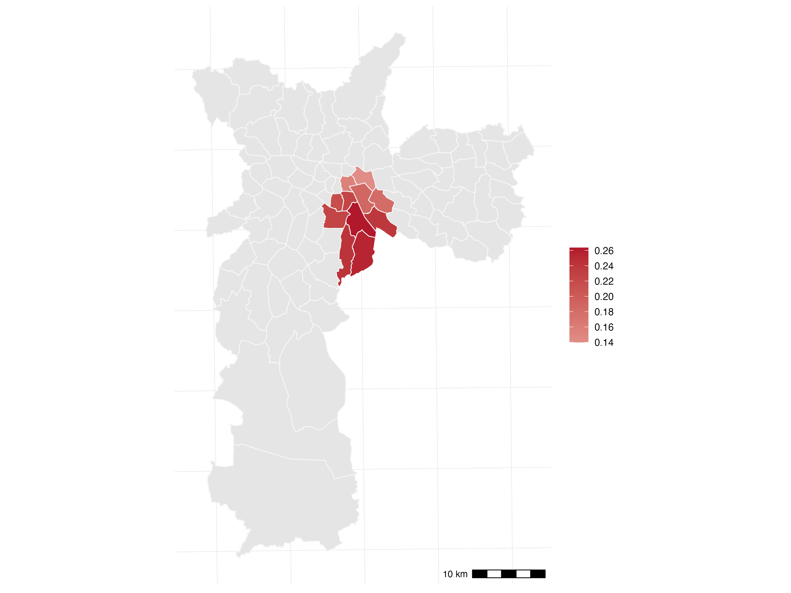

| Medida | Valor |
|---|---|
| Média | 0,212 |
| Desvio-padrão | 0,041 |
| Mínimo | 0,140 |
| 1º Quartil | 0,184 |
| Mediana | 0,225 |
| 3º Quartil | 0,240 |
| Máximo | 0,264 |

: Medidas-resumo das estimativas locais dos coeficientes de mulheres responsáveis (11 de 96 distritos significativos)

A estimação dos parâmetros pela RBNGP revelou forte variação espacial na associação entre as variáveis e os casos de violência infantil em São Paulo. O parâmetro referente ao número de cômodos mostra efeito positivo nas zonas periféricas (exceto na Zona Leste), enquanto o coeficiente de composta é mais negativo na região oeste e noroeste. O efeito positivo de mais5 destaca-se especialmente nas periferias da Zona Leste. Para mulher_resp, embora no modelo global o coeficiente não tenha apresentado significância, na análise local uma pequena região apresenta parâmetros estatisticamente significativos — evidenciando como a RGP consegue captar variações específicas por região que modelos globais não revelam.

### Parâmetro de superdispersão ($\alpha$)

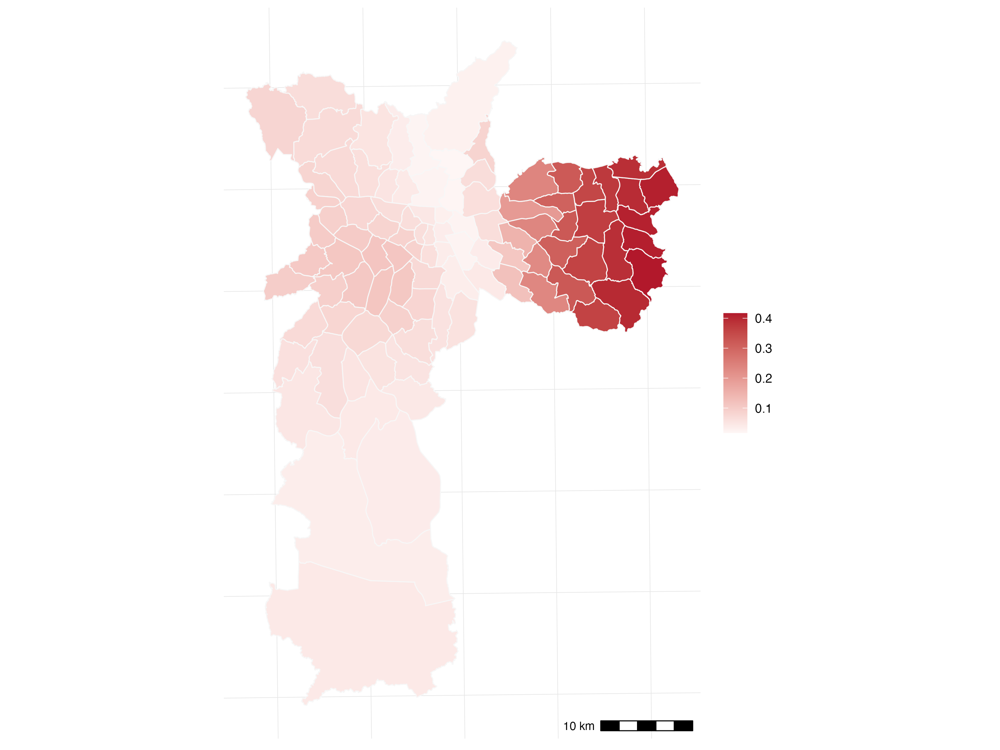

| Medida | Valor |
|---|---|
| Média | 0,131 |
| Desvio-padrão | 0,123 |
| Mínimo | 0,017 |
| 1º Quartil | 0,052 |
| Mediana | 0,079 |
| 3º Quartil | 0,127 |
| Máximo | 0,416 |

: Medidas-resumo das estimativas locais do parâmetro de superdispersão ($\alpha$)

Os valores mais elevados de $\alpha$ concentram-se nos distritos da região leste de São Paulo, indicando maior variação não explicada pelas covariáveis do modelo nessas áreas. Isso sugere influência de fatores locais ou heterogeneidades não capturadas pelo modelo, tornando os casos de violência infantil mais dispersos em relação à média prevista. Nas demais regiões, predominam valores de $\alpha$ mais baixos, indicando ajuste mais homogêneo para esses dados.

### Resíduos e diagnóstico espacial

::: {layout-ncol=2}


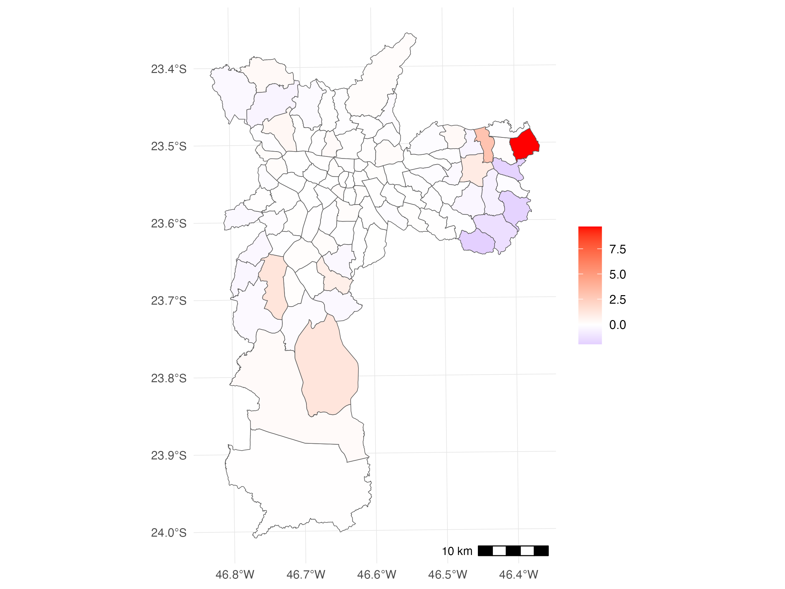
:::

A análise dos resíduos do modelo local destaca o distrito Itaim Paulista, na Zona Leste, com valor significativamente elevado. Esse padrão pode estar fortemente relacionado à presença da Casa de Isabel, referência regional para notificações de violência infantil. Por seu papel como centro de atendimento e suporte às vítimas, o distrito tende a concentrar registros, aumentando a discrepância entre o número de casos observados e o estimado pelo modelo.

O índice de Moran calculado para os resíduos padronizados do modelo RBNGP apresentou valor de $-0,0388$, com valor-p = 0,787, indicando ausência de autocorrelação espacial significativa — os resíduos estão distribuídos de forma espacialmente aleatória.

A comparação entre os dois painéis evidencia o ganho obtido com a modelagem local. No modelo global, observa-se concentração de resíduos elevados em distritos específicos, reflexo de padrões espaciais não capturados por coeficientes únicos. No modelo RBNGP, essa heterogeneidade é reduzida, com os resíduos distribuídos de forma mais homogênea — reforçando a relevância dos modelos geograficamente ponderados para captar a variação espacial dos efeitos das covariáveis.
