```{r}
#| label: setup
#| cache: false

library(tidyverse)
library(sf)
library(spdep)
library(MASS)
library(robustbase)
library(lmtest)
library(corrplot)
library(ggspatial)
library(scales)
library(stringr)
library(stringi)
library(purrr)
library(knitr)
library(kableExtra)
if (requireNamespace("gwzinbr", quietly = TRUE)) library(gwzinbr)

figuras_dir <- "figuras_output"
```

## Reprodutibilidade

Esta seção descreve os requisitos e a sequência de execução necessários para reproduzir integralmente a análise.

### Pacotes necessários

```r
install.packages(c(
  "tidyverse", "sf", "spdep", "MASS", "robustbase",
  "lmtest", "corrplot", "ggspatial", "scales",
  "stringr", "stringi", "purrr", "knitr", "kableExtra"
))

# gwzinbr — versão 0.1.0 (CRAN, 2024-06-10)
# Autores: Jéssica Vasconcelos, Juliana Rosa, Alan da Silva
install.packages("gwzinbr")
```

### Estrutura do projeto

```
aplicacao_vf/
├── dados/
│   └── base_mestrado.gpkg          ← geometria + variáveis (96 distritos)
├── arquivos_auxiliares/
│   ├── envel_pois                  ← script de envelope simulado Poisson
│   └── envel_nbin                  ← script de envelope simulado BN
├── figuras_output/                 ← todas as figuras geradas por script_mestrado.R
├── _cache/
│   └── mod_gwr.rds                 ← modelo GWR serializado
├── script_mestrado.R               ← script principal de análise
└── index.qmd                       ← este documento
```

### Sequência de execução

```r
# Etapa 1 — estimação dos modelos e geração das figuras em figuras_output/ (~2 h)
source("script_mestrado.R")

# Etapa 2 — renderização do documento
quarto::quarto_render("index.qmd")
```

::: {.callout-important}
## Nota sobre os dados de entrada
Os dados utilizados encontram-se consolidados em `Script_aplicacao/dados/base_mestrado.gpkg`.
As fontes originais compreendem: SINAN (SMS-SP / TABNET), Censo Demográfico 2022 (IBGE),
malha distrital (Prefeitura do Município de São Paulo) e contagens de equipamentos
religiosos e estabelecimentos de bebidas (OpenStreetMap / SEADE).
:::

---

## Introdução

Este documento apresenta a análise espacial de casos notificados de **violência
física contra crianças de 0 a 9 anos** nos 96 distritos administrativos do
Município de São Paulo, com base em dados do período **2018–2022**.

Os registros utilizados provêm do **Sistema de Informação de Agravos de
Notificação (SINAN)**, disponibilizados pela plataforma TABNET da Secretaria
Municipal da Saúde de São Paulo.

::: {.callout-important}
## Nota sobre a natureza dos dados
Os registros disponíveis correspondem a **notificações de suspeita** de
violência física, não a casos confirmados. Ao longo deste documento, o termo
"casos de violência física" refere-se exclusivamente às notificações presentes
na base de dados utilizada.
:::

O estudo tem por objetivo identificar fatores socioeconômicos e demográficos
associados à incidência de violência física contra crianças e avaliar se a
magnitude dessas associações varia espacialmente entre os distritos — isto é,
se os efeitos das covariáveis são heterogêneos no espaço.

**Estratégia analítica:**

| Etapa | Técnica | Objetivo |
|---|---|---|
| 1 | Mapeamento + TIP | Caracterizar a distribuição espacial da variável resposta |
| 2 | Índice de Moran global | Avaliar a presença de autocorrelação espacial |
| 3 | Regressão de Poisson | Modelo de referência; diagnóstico de superdispersão |
| 4 | Regressão Binomial Negativa | Correção da superdispersão; análise dos resíduos |
| 5 | LISA | Identificação de agrupamentos locais de risco |
| 6 | GWR-NB (`gwzinbr`) | Estimação de efeitos localmente variáveis |

---

## Dados

```{r}
#| label: leitura-dados
#| cache: false

distritos <- st_read("Script_aplicacao/dados/base_mestrado.gpkg", layer = "distritos", quiet = TRUE)

cat("Distritos carregados:", nrow(distritos), "\n")
cat("Variáveis disponíveis:", ncol(distritos) - 1, "(+ geometria)\n")
```

::: {.callout-note}
## Fonte dos dados
| Conjunto | Fonte |
|----------|-------|
| Notificações de violência (SINAN) | Secretaria de Vigilância em Saúde / MS |
| Variáveis socioeconômicas | IBGE — Censo Demográfico 2022 |
| Malha distrital | Prefeitura do Município de São Paulo |
| Igrejas e bares | OpenStreetMap / SEADE |
:::

---

## Variável Resposta — Casos de Violência Física

A distribuição espacial das notificações constitui o ponto de partida da
análise. A heterogeneidade observada entre os distritos — decorrente de
diferenças na estrutura socioeconômica, composição familiar e acesso a
serviços — justifica a investigação de dependência espacial e a eventual
adoção de modelos com componente geográfico.

### Distribuição espacial dos casos

::: {.callout-note collapse="true"}
## Código (`script_mestrado.R` — Seção 4)

```r
# Distritos sem casos: marcados nos mapas para evidenciar os locais sem notificação no período
distritos_sem_casos <- distritos %>% filter(VF_2018_2022 == 0)
distritos_sem_casos[c("x", "y")] <- st_coordinates(st_centroid(distritos_sem_casos))

# Mapa coroplético — contagem absoluta
p_mapa_vf <- ggplot(distritos) +
  geom_sf(aes(fill = VF_2018_2022)) +
  scale_fill_gradientn(
    colours = c("white", "#2171b5", "#08306b"),
    name    = "Casos notificados",
    oob     = squish
  ) +
  geom_text(data = distritos_sem_casos, aes(x = x, y = y),
            label = "*", size = 5, color = "black") +
  theme_minimal(base_size = 14) +
  labs(title = "", fill = "Casos notificados")
print(p_mapa_vf)
ggsave(file.path(dir_output, "mapa_vf_2018_2022.png"),
       plot = p_mapa_vf, width = 9, height = 7, dpi = 150)
```
:::

```{r}
#| label: mapa-casos
#| fig-cap: "Distribuição dos casos notificados de violência física (2018–2022). Asterisco = distrito com zero casos."
#| echo: false

knitr::include_graphics(file.path(figuras_dir, "mapa_vf_2018_2022.png"))
```

::: {.callout-note collapse="true"}
## Código — mapa de círculos (`script_mestrado.R` — Seção 4)

```r
centroides <- distritos
centroides[c("x", "y")] <- st_coordinates(st_centroid(centroides))

p_mapa_circ <- ggplot() +
  geom_sf(data = distritos, fill = "gray95", color = "grey50",
          linewidth = 0.25, alpha = 0.8) +
  geom_point(data = centroides, aes(x = x, y = y, size = VF_2018_2022),
             color = "#2171b5", alpha = 0.8) +
  scale_size(
    name   = "Casos notificados",
    range  = c(0, 10),
    limits = c(min(centroides$VF_2018_2022, na.rm = TRUE),
               max(centroides$VF_2018_2022, na.rm = TRUE)),
    breaks = pretty(range(centroides$VF_2018_2022, na.rm = TRUE), n = 4)
  ) +
  annotation_scale(location = "br", width_hint = 0.25,
                   pad_x = unit(0.2, "cm"), pad_y = unit(0.2, "cm")) +
  theme_minimal() +
  theme(axis.title = element_blank(), axis.text = element_blank(),
        axis.ticks = element_blank(),
        panel.grid = element_line(color = "grey90", linewidth = 0.2),
        plot.title = element_blank())
print(p_mapa_circ)
ggsave(file.path(dir_output, "mapa_vf_circulos.png"),
       plot = p_mapa_circ, width = 9, height = 7, dpi = 150)
```
:::

```{r}
#| label: mapa-circulos
#| fig-cap: "Mapa de círculos proporcionais — casos notificados de violência física."
#| echo: false

knitr::include_graphics(file.path(figuras_dir, "mapa_vf_circulos.png"))
```

---

## Taxa de Incidência Padronizada (TIP)

A taxa bruta de casos não controla o efeito da composição demográfica dos
distritos, de modo que unidades com maior contingente de crianças apresentariam
mecanicamente contagens mais elevadas. A **padronização indireta** estratificada
por faixa etária e sexo permite comparações válidas ao eliminar esse efeito
estrutural de exposição.

A fórmula da padronização indireta calcula o número esperado de casos aplicando as taxas
específicas de cada estrato ao perfil populacional do distrito:

$$
E_i = \sum_{j} P_{ij} \times t_j
\qquad
\text{TIP}_i = \frac{O_i}{E_i}
$$

Os quatro estratos: meninos 0–4 anos, meninos 5–9 anos, meninas 0–4 anos,
meninas 5–9 anos. TIP > 1 indica incidência acima do esperado.

### Cálculo

```{r}
#| label: calculo-tip

taxas_cidade <- st_drop_geometry(distritos) %>%
  summarise(
    taxa_meninos_0_4 = sum(VF_masc_0_4_anos) / sum(meninos0a4),
    taxa_meninos_5_9 = sum(VF_masc_5_9_anos) / sum(meninos5a9),
    taxa_meninas_0_4 = sum(VF_fem_0_4_anos)  / sum(meninas0a4),
    taxa_meninas_5_9 = sum(VF_fem_5_9_anos)  / sum(meninas5a9)
  )

distritos <- distritos %>%
  mutate(
    casos_esperados = meninos0a4 * taxas_cidade$taxa_meninos_0_4 +
                      meninos5a9 * taxas_cidade$taxa_meninos_5_9 +
                      meninas0a4 * taxas_cidade$taxa_meninas_0_4 +
                      meninas5a9 * taxas_cidade$taxa_meninas_5_9,
    tip           = VF_2018_2022 / casos_esperados,
    log_casos_esp = log(casos_esperados)
  )
```

### Distribuição espacial

::: {.callout-note collapse="true"}
## Código (`script_mestrado.R` — Seção 5)

```r
distritos_utm <- st_transform(distritos, 31983)
sem_casos_utm <- st_transform(distritos_sem_casos, 31983)
sem_casos_utm[c("x", "y")] <- st_coordinates(st_centroid(sem_casos_utm))

p_tip <- ggplot(distritos_utm) +
  geom_sf(aes(fill = tip), color = "grey70", linewidth = 0.2) +
  scale_fill_gradientn(
    colours = c("white", "#2171b5", "#08306b"),
    limits  = c(0, 5), oob = squish, name = NULL
  ) +
  geom_text(data = sem_casos_utm, aes(x = x, y = y),
            label = "*", size = 5, color = "black") +
  annotation_scale(location = "br", width_hint = 0.25) +
  theme_minimal(base_size = 14) +
  theme(axis.title        = element_blank(),
        axis.text         = element_blank(),
        axis.ticks        = element_blank(),
        panel.grid.major  = element_line(color = "grey90", linewidth = 0.2),
        panel.grid.minor  = element_blank(),
        legend.title      = element_blank(),
        legend.key.height = unit(1.5, "cm"),
        legend.key.width  = unit(0.4, "cm"),
        plot.title        = element_blank())
print(p_tip)
ggsave(file.path(dir_output, "mapa_taxa_padronizada_vf_2018_2022.png"),
       plot = p_tip, width = 9, height = 7, dpi = 150)
```
:::

```{r}
#| label: mapa-tip
#| fig-cap: "Taxa de Incidência Padronizada (TIP) por distrito. Asterisco = zero casos."
#| echo: false

knitr::include_graphics(file.path(figuras_dir, "mapa_taxa_padronizada_vf_2018_2022.png"))
```

### Medidas resumo

```{r}
#| label: tabela-tip
#| tbl-cap: "Estatísticas descritivas da TIP."

summary_tip <- summary(distritos$tip)
data.frame(
  Estatística = c(names(summary_tip), "Desvio-padrão", "Variância"),
  Valor       = round(c(as.numeric(summary_tip),
                        sd(distritos$tip,  na.rm = TRUE),
                        var(distritos$tip, na.rm = TRUE)), 4)
) |> kable() |> kable_styling(full_width = FALSE)
```

### Boxplot robusto

O `adjbox()` ajusta os limites pelo medcouple, tornando-o mais adequado para
distribuições assimétricas como a TIP. Outliers são distritos com incidência
especialmente discrepante.

::: {.callout-note collapse="true"}
## Código (`script_mestrado.R` — Seção 5)

```r
nomes_distritos <- str_to_title(stri_trans_general(distritos$ds_nome, "Latin-ASCII")) %>%
  str_replace("Sao Miguel",      "São Miguel")      %>%
  str_replace("Capao Redondo",   "Capão Redondo")   %>%
  str_replace("Jardim Angela",   "Jardim Ângela")   %>%
  str_replace("Jardim Sao Luis", "Jardim São Luís") %>%
  str_replace("Consolacao",      "Consolação")

box <- adjbox(distritos$tip, main = "", ylab = "TIP",
              col = "#2171b5", border = "#08306b",
              range = 1.5, doReflect = TRUE, outline = TRUE)

idx_outliers <- which(distritos$tip %in% box$out)
if (length(idx_outliers) > 0) {
  y_out    <- distritos$tip[idx_outliers]
  direita  <- seq(1, length(y_out), by = 2)
  esquerda <- seq(2, length(y_out), by = 2)
  points(rep(1, length(y_out)), y_out, pch = 16, col = "black", cex = 0.6)
  segments(rep(1, length(direita)), y_out[direita],
           rep(1.05, length(direita)), y_out[direita], col = "gray30")
  text(rep(1.05, length(direita)), y_out[direita],
       labels = nomes_distritos[idx_outliers[direita]], pos = 4, cex = 0.8)
  segments(rep(1, length(esquerda)), y_out[esquerda],
           rep(0.95, length(esquerda)), y_out[esquerda], col = "gray30")
  text(rep(0.95, length(esquerda)), y_out[esquerda],
       labels = nomes_distritos[idx_outliers[esquerda]], pos = 2, cex = 0.8)
}
dev.copy(png, file.path(dir_output, "boxplot_robusto_taxa_padronizada.png"),
         width = 900, height = 700, res = 150)
dev.off()
```
:::

```{r}
#| label: boxplot-tip
#| fig-cap: "Boxplot robusto (adjbox) da TIP com identificação dos outliers."
#| echo: false

knitr::include_graphics(file.path(figuras_dir, "boxplot_robusto_taxa_padronizada.png"))
```

### Índice de Moran global

O índice de Moran global avalia se os valores da TIP nos distritos
contíguos apresentam similaridade superior à esperada sob aleatoriedade espacial.
Um resultado estatisticamente significativo constitui evidência de **dependência
espacial** na distribuição da incidência, condição que fundamenta o uso de
modelos com estrutura geográfica.

```{r}
#| label: moran-tip
#| tbl-cap: "Teste de Moran (Monte Carlo, 999 simulações) — TIP."
#| cache: true

nb_queen  <- poly2nb(distritos)
w_queen   <- nb2listw(nb_queen, style = "W")
moran_tip <- moran.mc(distritos$tip, listw = w_queen, nsim = 999)

data.frame(
  Estatística = c("Índice de Moran (I)", "Valor-p"),
  Valor       = c(round(moran_tip$statistic, 5), moran_tip$p.value)
) |> kable() |> kable_styling(full_width = FALSE)
```

```{r}
#| label: plot-moran
#| fig-cap: "Distribuição de referência do índice de Moran por Monte Carlo."
#| fig-height: 4

plot(moran_tip, main = "")
```

::: {.callout-important}
## Resultado: autocorrelação espacial significativa
O índice de Moran estimado para a TIP foi **I = 0,312** (p = 0,001), rejeitando
a hipótese de aleatoriedade espacial e confirmando a existência de padrão
de agrupamento na distribuição da incidência de violência física entre os distritos.
:::

---

## Coordenadas Geográficas

Para a análise GWR, adotou-se o **sistema de coordenadas UTM** (zona 23S,
SIRGAS 2000 — EPSG:31983), com distâncias expressas em metros. A localização
espacial de cada distrito foi definida pelo **ponto de máxima densidade
populacional** (colunas `long_utm` e `lat_utm`), em substituição ao centroide
geométrico.

::: {.callout-note}
## Justificativa para o uso do ponto de máxima densidade
O centroide geométrico pode situar-se em áreas sem ocupação humana —
parques, corpos d'água ou zonas industriais — sendo representativo da
extensão territorial, mas não da localização da população. No GWR, as
distâncias entre os pontos de referência determinam o peso atribuído a
cada observação; portanto, o ponto que melhor expressa **onde a população
reside** produz ponderações espaciais mais adequadas. Essa consideração
é particularmente relevante para distritos de grande extensão territorial,
como Marsilac.
:::

---

## Variáveis Explicativas

As variáveis provenientes do Censo 2022 encontram-se expressas em proporção
percentual (0–100). Os equipamentos religiosos e estabelecimentos de bebidas
são normalizados pela população residente, sendo expressos por mil habitantes.
A variável de renda foi padronizada pelo método mínimo-máximo no intervalo
[0, 100]: $\text{rendap} = 100 \times (x - \min) / (\max - \min)$.

### Quadro de variáveis

```{r}
#| label: tabela-variaveis
#| tbl-cap: "Variáveis explicativas por grupo temático."
#| cache: false

data.frame(
  Grupo = c(
    rep("G1 – Socioeconômico e Demográfico", 5),
    rep("G2 – Estrutura Domiciliar", 2),
    rep("G3 – Estrutura Familiar", 5),
    rep("G4 – Espaços de Convivência Social", 2)
  ),
  Variável = c(
    "alfab","ate1mora","mais5","mulher_resp","rendap",
    "banheiro1","comodo",
    "ambos","plmenos1","composta","estend","nuclear",
    "igrejas","bares"
  ),
  Descrição = c(
    "% pessoas ≥ 15 anos alfabetizadas",
    "% domicílios com apenas 1 morador",
    "% domicílios com 5 ou mais moradores",
    "% domicílios cujo responsável é do sexo feminino",
    "Renda média distrital padronizada (0–100)",
    "% domicílios com banheiro exclusivo",
    "% domicílios em habitações coletivas informais (cortiços)",
    "% domicílios: casal + filhos apenas do casal",
    "% domicílios: casal + ≥1 filho só do responsável/cônjuge",
    "% domicílios do tipo composto",
    "% domicílios do tipo estendido",
    "% domicílios do tipo nuclear",
    "Igrejas por mil habitantes",
    "Bares por mil habitantes"
  )
) |> kable() |>
  kable_styling(full_width = FALSE, bootstrap_options = "striped") |>
  collapse_rows(columns = 1, valign = "top")
```

### Transformação das variáveis

```{r}
#| label: transformacoes

# Renda: min-max [0, 100]
# Igrejas e bares: por mil habitantes (sobrescreve coluna original)
distritos <- distritos %>%
  mutate(
    rendap  = 100 * (media_renda_dist - min(media_renda_dist, na.rm = TRUE)) /
                    (max(media_renda_dist, na.rm = TRUE) - min(media_renda_dist, na.rm = TRUE)),
    igrejas = igrejas / (populacao_total / 1000),   # por mil habitantes
    bares   = bares   / (populacao_total / 1000)    # por mil habitantes
  )

tab <- st_drop_geometry(distritos)
```

### Mapas por grupo temático

::: {.callout-note collapse="true"}
## Código — mapas de variáveis (`script_mestrado.R` — Seção 6)

```r
vars_descr <- c(
  "alfab", "ate1mora", "mais5", "comodo", "ambos", "plmenos1",
  "composta", "estend", "nuclear", "mulher_resp", "banheiro1",
  "rendap", "igrejas", "bares"
)

walk(vars_descr, function(v) {
  lim <- if (v %in% c("igrejas", "bares")) c(0, 12) else c(0, 100)
  p <- ggplot(distritos) +
    geom_sf(aes(fill = .data[[v]])) +
    scale_fill_gradientn(
      colors = c("#deebf7", "#9ecae1", "#3182bd", "#08519c"),
      limits = lim, oob = squish
    ) +
    annotation_scale(location = "br", width_hint = 0.25) +
    labs(title = v) +
    theme_minimal() +
    theme(panel.grid   = element_line(color = "grey90", linewidth = 0.2),
          legend.title = element_blank(),
          axis.text    = element_blank(),
          axis.ticks   = element_blank(),
          plot.title   = element_text(hjust = 0.5, size = 14))
  print(p)
  ggsave(file.path(dir_output, paste0("mapa_", v, ".png")),
         plot = p, width = 10, height = 7.5, dpi = 300)
})
```
:::

#### Grupo 1 — Socioeconômico e Demográfico

::: {layout-ncol=2}
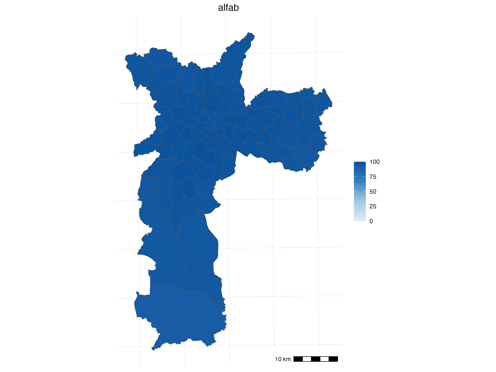{fig-alt="Mapa: alfabetização"}

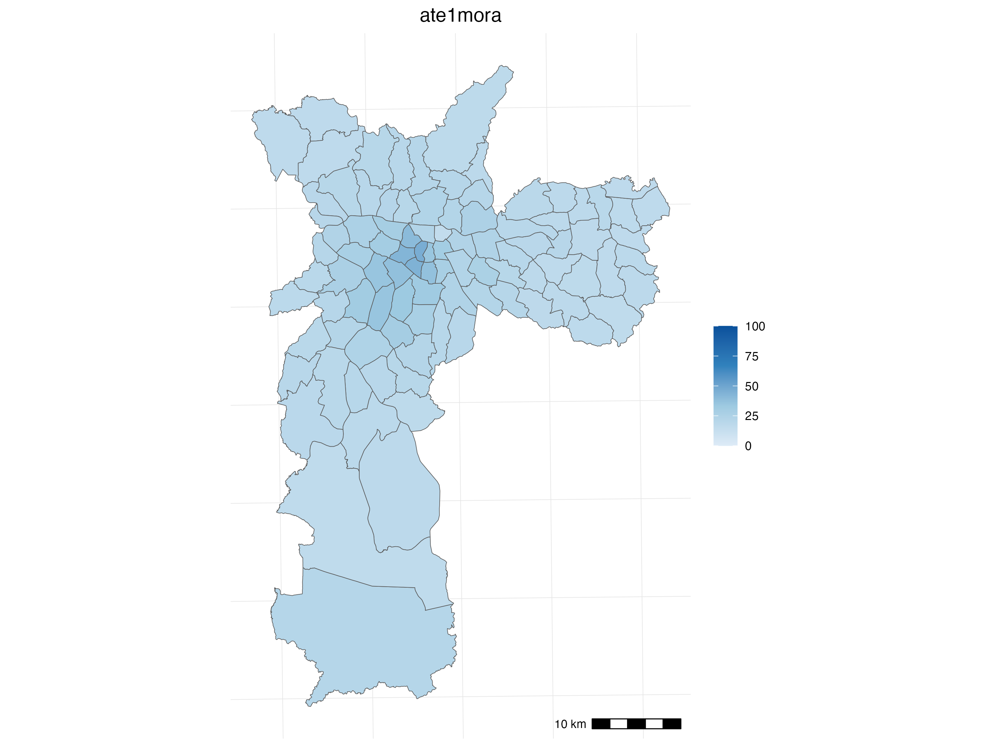{fig-alt="Mapa: 1 morador"}

{fig-alt="Mapa: 5+ moradores"}

{fig-alt="Mapa: resp. mulher"}

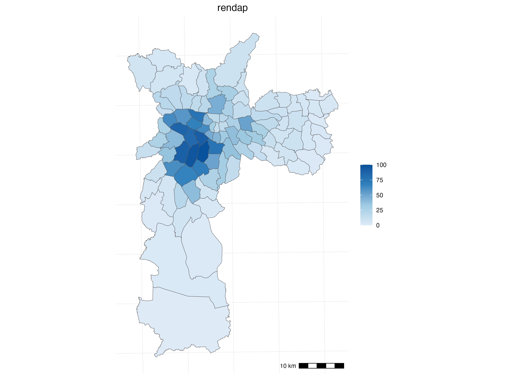{fig-alt="Mapa: renda padronizada"}
:::

::: {.callout-note collapse="true"}
## Código — boxplots robustos (`script_mestrado.R` — Seção 6)

```r
grupos <- list(
  grupo1 = c("alfab", "ate1mora", "mais5", "mulher_resp", "rendap"),
  grupo2 = c("banheiro1", "comodo"),
  grupo3 = c("ambos", "plmenos1", "composta", "estend", "nuclear"),
  grupo4 = c("igrejas", "bares")
)

ylim_pct  <- c(0, ceiling(max(tab[, unlist(grupos[1:3])], na.rm = TRUE)))
ylim_dens <- c(0, ceiling(max(tab[, grupos$grupo4],       na.rm = TRUE)))

boxplot_grupo <- function(vars, rotulos, ylim, ylab = "%") {
  stats <- lapply(vars, function(v) stats_adjbox(tab[[v]]))
  par(mar = c(8, 5, 2, 2))
  plot(NA, xlim = c(0.5, length(vars) + 0.5), ylim = ylim,
       xaxt = "n", xlab = "", ylab = ylab, main = "")
  for (i in seq_along(vars)) {
    s <- stats[[i]]
    rect(i - 0.3, s$q1, i + 0.3, s$q3, col = "#2171b5", border = "#08306b")
    segments(i - 0.3, s$med, i + 0.3, s$med, lwd = 2, col = "#08306b")
    segments(i, s$min, i, s$q1, lwd = 1.5, col = "#08306b")
    segments(i, s$q3,  i, s$max, lwd = 1.5, col = "#08306b")
    if (length(s$out) > 0)
      points(rep(i, length(s$out)), s$out, pch = 16, col = "black")
  }
  axis(1, at = seq_along(vars), labels = rotulos, las = 2)
}

boxplot_grupo(grupos$grupo1, grupos$grupo1, ylim_pct)
dev.copy(png, file.path(dir_output, "boxplot_robusto_grupo1.png"),
         width = 800, height = 900, res = 150); dev.off()
# ... mesmo padrão para grupos 2, 3, 4
```
:::


#### Grupo 2 — Estrutura Domiciliar

::: {layout-ncol=2}
{fig-alt="Mapa: banheiro exclusivo"}

{fig-alt="Mapa: habitações coletivas"}
:::

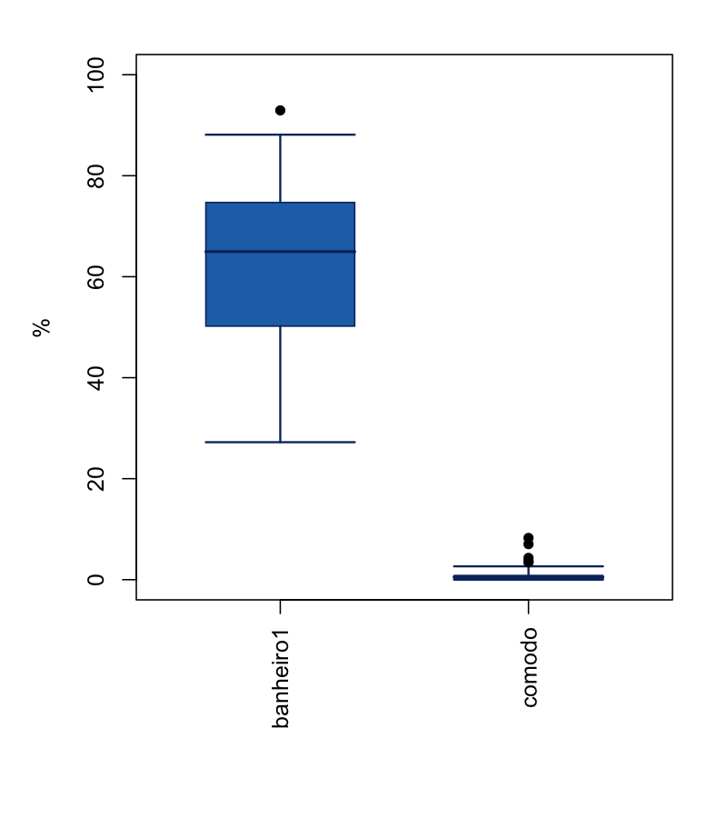

#### Grupo 3 — Estrutura Familiar

::: {layout-ncol=2}
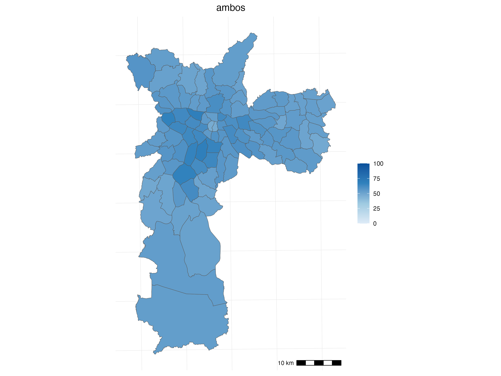{fig-alt="Mapa: ambos"}

{fig-alt="Mapa: plmenos1"}

{fig-alt="Mapa: composta"}

{fig-alt="Mapa: estendida"}

{fig-alt="Mapa: nuclear"}
:::

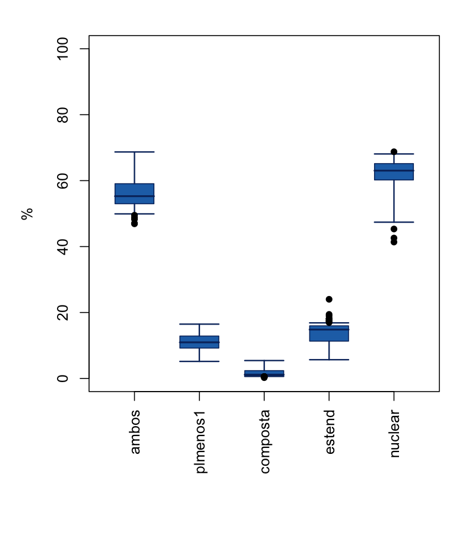

#### Grupo 4 — Espaços de Convivência Social

::: {layout-ncol=2}
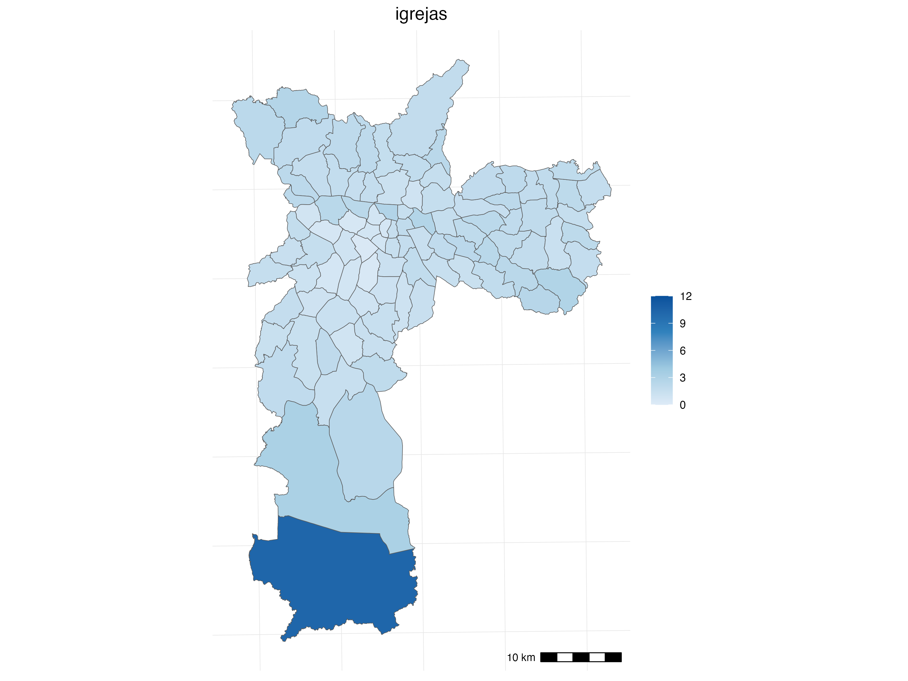{fig-alt="Mapa: igrejas por mil hab"}

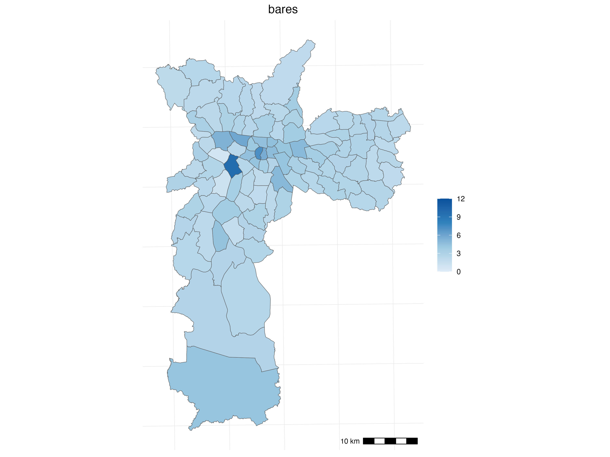{fig-alt="Mapa: bares por mil hab"}
:::

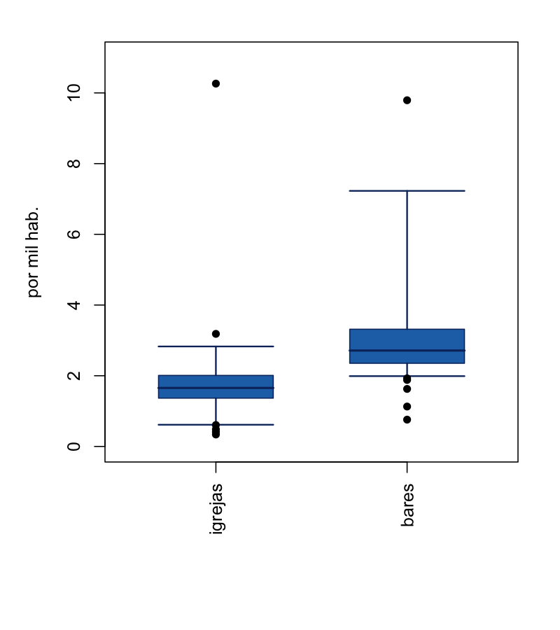

### Medidas resumo

```{r}
#| label: tabela-resumo
#| tbl-cap: "Estatísticas descritivas das variáveis explicativas."

vars_descr <- c("alfab","ate1mora","mais5","comodo","ambos","plmenos1",
                "composta","estend","nuclear","mulher_resp","banheiro1",
                "rendap","igrejas","bares")

tab %>%
  dplyr::select(all_of(vars_descr)) %>%
  pivot_longer(everything(), names_to = "Variável", values_to = "Valor") %>%
  group_by(Variável) %>%
  summarise(
    Média   = round(mean(Valor,   na.rm = TRUE), 2),
    DP      = round(sd(Valor,     na.rm = TRUE), 2),
    Mín     = round(min(Valor,    na.rm = TRUE), 2),
    Mediana = round(median(Valor, na.rm = TRUE), 2),
    Máx     = round(max(Valor,    na.rm = TRUE), 2),
    .groups = "drop"
  ) |>
  kable() |>
  kable_styling(full_width = FALSE, bootstrap_options = c("striped", "hover"))
```

### Correlação com a resposta

```{r}
#| label: cor-resposta
#| tbl-cap: "Correlação de Pearson entre a TIP e cada variável explicativa."

rotulos_descr <- vars_descr   # nomes originais como rótulos

lapply(seq_along(vars_descr), function(i) {
  t <- cor.test(distritos$tip, tab[[vars_descr[i]]], method = "pearson")
  data.frame(
    Variável     = rotulos_descr[i],
    `r de Pearson` = round(t$estimate, 3),
    `Valor-p`    = formatC(t$p.value, format = "e", digits = 2)
  )
}) |>
  bind_rows() |>
  arrange(desc(abs(`r.de.Pearson`))) |>
  kable() |> kable_styling(full_width = FALSE, bootstrap_options = "striped")
```

::: {.callout-note}
## Critérios de seleção de variáveis
Com base nas correlações observadas e na estrutura de agrupamento apresentada
no dendrograma, foram selecionadas para inclusão nos modelos de regressão as
variáveis: **`comodo`**, **`composta`**, **`mais5`**, **`mulher_resp`** e
**`igrejas`**. A variável `igrejas` foi considerada na etapa de seleção da
largura de banda, mas **excluída da especificação final do modelo GWR** diante
da ausência de contribuição estatisticamente significativa em qualquer localização
do espaço de estudo (ver Seção GWR).
:::

### Matriz de correlação entre variáveis explicativas

::: {.callout-note collapse="true"}
## Código (`script_mestrado.R` — Seção 6)

```r
mat_cor <- cor(tab[, vars_descr], use = "complete.obs")
colnames(mat_cor) <- rownames(mat_cor) <- rotulos_descr  # = vars_descr

corrplot(mat_cor, method = "color", type = "upper", addCoef.col = "black",
         tl.col = "black", tl.srt = 45, tl.cex = 0.9, number.cex = 0.7,
         col = colorRampPalette(c("#08306b", "white", "#b30000"))(200),
         mar = c(0, 0, 2, 0))
dev.copy(png, file.path(dir_output, "matriz_correlacao_variaveis.png"),
         width = 1800, height = 1500, res = 180)
dev.off()
```
:::

```{r}
#| label: corrplot
#| fig-cap: "Matriz de correlação de Pearson entre as variáveis explicativas."
#| echo: false

knitr::include_graphics(file.path(figuras_dir, "matriz_correlacao_variaveis.png"))
```

### Dendrograma de correlação

Agrupamento hierárquico de Ward com dissimilaridade $1 - |\rho|$.

::: {.callout-note collapse="true"}
## Código (`script_mestrado.R` — Seção 6)

```r
dissim <- as.dist(1 - abs(mat_cor))
plot(hclust(dissim, method = "ward.D"), main = "", xlab = "", sub = "",
     cex.axis = 0.9, cex.lab = 1.1)
dev.copy(png, file.path(dir_output, "dendrograma_correlação.png"),
         width = 900, height = 700, res = 150)
dev.off()
```
:::

```{r}
#| label: dendrograma
#| fig-cap: "Agrupamento hierárquico por dissimilaridade de Pearson (método Ward)."
#| echo: false

knitr::include_graphics(file.path(figuras_dir, "dendrograma_correlação.png"))
```

---

## Modelo de Poisson (global)

O modelo de Poisson constitui a especificação de referência para dados de
contagem. Sua estimação preliminar tem por finalidade diagnosticar a presença
de **superdispersão** — condição em que a variância empírica excede a média —,
identificada quando a razão entre o desvio residual e os respectivos graus de
liberdade é substancialmente superior à unidade. A confirmação de superdispersão
requer a adoção de uma distribuição mais flexível, como a Binomial Negativa.

```{r}
#| label: poisson
#| cache: true

tab <- st_drop_geometry(distritos)

mod_pois <- glm(
  VF_2018_2022 ~ comodo + composta + mais5 + mulher_resp + igrejas +
    offset(log_casos_esp),
  data   = tab,
  family = poisson()
)

ll_p  <- as.numeric(logLik(mod_pois))
ll0_p <- as.numeric(logLik(update(mod_pois, . ~ 1)))
```

### Coeficientes

```{r}
#| label: coef-pois
#| tbl-cap: "Coeficientes do modelo de Poisson."

coef_p <- summary(mod_pois)$coefficients
data.frame(
  Variável   = rownames(coef_p),
  Coeficiente = round(coef_p[, "Estimate"],    4),
  EP          = round(coef_p[, "Std. Error"],  4),
  z           = round(coef_p[, "z value"],     4),
  `Valor-p`   = formatC(coef_p[, "Pr(>|z|)"], format = "e", digits = 2)
) |> kable() |> kable_styling(full_width = FALSE, bootstrap_options = "striped")
```

### Métricas de ajuste

```{r}
#| label: metricas-pois
#| tbl-cap: "Indicadores de ajuste — Poisson."

n_p <- nobs(mod_pois); k_p <- length(coef(mod_pois))
data.frame(
  Estatística = c("Log-verossimilhança","Pseudo R² (McFadden)",
                  "Desvio Residual","Graus de Liberdade",
                  "Razão Desvio/GL","AICc"),
  Valor = round(c(ll_p, 1 - ll_p / ll0_p,
                  deviance(mod_pois), df.residual(mod_pois),
                  deviance(mod_pois) / df.residual(mod_pois),
                  AIC(mod_pois) + 2 * k_p * (k_p + 1) / (n_p - k_p - 1)), 4)
) |> kable() |> kable_styling(full_width = FALSE)
```

::: {.callout-warning}
## Diagnóstico: superdispersão
A razão entre desvio residual e graus de liberdade é substancialmente superior
à unidade, evidenciando **superdispersão** nos dados. O envelope simulado
corrobora a inadequação da distribuição de Poisson para modelar a variável
resposta, justificando a adoção da regressão Binomial Negativa.
:::

### Resíduos — distribuição espacial

::: {.callout-note collapse="true"}
## Código (`script_mestrado.R` — Seção 7)

```r
distritos$resid_pois <- residuals(mod_pois, type = "deviance")

p_resid_pois <- ggplot(distritos) +
  geom_sf(aes(fill = resid_pois)) +
  scale_fill_gradient2(
    midpoint = median(distritos$resid_pois, na.rm = TRUE),
    low = "blue", mid = "white", high = "red",
    name = "Resíduo"
  ) +
  theme_minimal() +
  labs(title = "Resíduos por Distrito — Modelo de Poisson")
print(p_resid_pois)
ggsave(file.path(dir_output, "mapa_residuos_poisson.png"),
       plot = p_resid_pois, width = 8, height = 6, dpi = 300, bg = "white")
```
:::

```{r}
#| label: mapa-resid-pois
#| fig-cap: "Resíduos de desvio — Modelo de Poisson."
#| echo: false

knitr::include_graphics(file.path(figuras_dir, "mapa_residuos_poisson.png"))
```

### Envelope simulado

::: {.callout-note collapse="true"}
## Código (`script_mestrado.R` — Seção 7)

```r
fit.model <- mod_pois
attach(tab, warn.conflicts = FALSE)
source(file.path(dir_aux, "envel_pois"), local = TRUE)
dev.copy(png, file.path(dir_output, "envelope_poisson.png"),
         width = 800, height = 800, res = 150)
dev.off()
detach(tab)
```
:::

```{r}
#| label: envelope-pois
#| fig-cap: "Envelope simulado — Poisson. Pontos fora do envelope indicam inadequação do modelo."
#| echo: false

knitr::include_graphics(file.path(figuras_dir, "envelope_poisson.png"))
```

---

## Modelo Binomial Negativa (global)

A distribuição Binomial Negativa introduz o parâmetro de superdispersão
$\alpha > 0$, de modo que $\text{Var}(Y) = \mu + \alpha\mu^2 > \mu$.
Quando $\alpha \to 0$, a distribuição converge para Poisson, tornando a
Binomial Negativa uma generalização aninhada que admite teste formal de
adequação por meio do Teste da Razão de Verossimilhanças (TRV).

```{r}
#| label: binomial-negativa
#| cache: true

mod_nb <- glm.nb(
  VF_2018_2022 ~ comodo + composta + mais5 + mulher_resp + igrejas +
    offset(log_casos_esp),
  data = tab
)

ll_nb  <- as.numeric(logLik(mod_nb))
ll0_nb <- as.numeric(logLik(update(mod_nb, . ~ 1)))
k_nb   <- length(coef(mod_nb))
n_nb   <- nobs(mod_nb)
```

### Coeficientes

Os coeficientes são estimados na escala logarítmica; $\exp(\hat\beta)$ representa
o fator multiplicativo sobre a contagem esperada, interpretado como razão de
incidência associada a um incremento unitário na covariável correspondente.

```{r}
#| label: coef-nb
#| tbl-cap: "Coeficientes do modelo Binomial Negativa (com exp(β))."

coef_nb <- summary(mod_nb)$coefficients
data.frame(
  Variável    = rownames(coef_nb),
  Coeficiente = round(coef_nb[, "Estimate"],       4),
  `exp(β)`    = round(exp(coef_nb[, "Estimate"]),  4),
  EP          = round(coef_nb[, "Std. Error"],     4),
  `Valor-p`   = formatC(coef_nb[, "Pr(>|z|)"], format = "e", digits = 3)
) |> kable() |> kable_styling(full_width = FALSE, bootstrap_options = "striped")
```

```{r}
#| label: theta-nb

cat("Theta (1/alpha):", round(mod_nb$theta, 4), "\n")
cat("Alpha (superdispersão = 1/theta):", round(1 / mod_nb$theta, 4), "\n")
```


### Métricas de ajuste

```{r}
#| label: metricas-nb
#| tbl-cap: "Indicadores de ajuste — Binomial Negativa."

aicc_nb <- AIC(mod_nb) + 2 * k_nb * (k_nb + 1) / (n_nb - k_nb - 1)
data.frame(
  Estatística = c("Log-verossimilhança","Pseudo R² (McFadden)",
                  "AIC","AICc","Theta","Alpha"),
  Valor = round(c(ll_nb, 1 - ll_nb / ll0_nb,
                  AIC(mod_nb), aicc_nb,
                  mod_nb$theta, 1 / mod_nb$theta), 4)
) |> kable() |> kable_styling(full_width = FALSE)
```

### Envelope simulado

::: {.callout-note collapse="true"}
## Código (`script_mestrado.R` — Seção 8)

```r
fit.model <- mod_nb
attach(tab, warn.conflicts = FALSE)
source(file.path(dir_aux, "envel_nbin"), local = TRUE)
dev.copy(png, file.path(dir_output, "envelope_negbin.png"),
         width = 800, height = 800, res = 150)
dev.off()
detach(tab)
```
:::

```{r}
#| label: envelope-nb
#| fig-cap: "Envelope simulado — Binomial Negativa."
#| echo: false

knitr::include_graphics(file.path(figuras_dir, "envelope_negbin.png"))
```

### Resíduos — distribuição espacial

::: {.callout-note collapse="true"}
## Código (`script_mestrado.R` — Seção 8)

```r
distritos$resid_nb <- residuals(mod_nb, type = "deviance")

p_resid_nb <- ggplot(distritos) +
  geom_sf(aes(fill = resid_nb)) +
  scale_fill_gradient2(
    midpoint = median(distritos$resid_nb, na.rm = TRUE),
    low = "blue", mid = "white", high = "red", name = NULL
  ) +
  annotation_scale(location = "br", width_hint = 0.25,
                   pad_x = unit(0.2, "cm"), pad_y = unit(0.2, "cm")) +
  theme_minimal() +
  theme(plot.title = element_blank(),
        panel.grid = element_line(color = "grey90", linewidth = 0.2),
        legend.position = "right", legend.title = element_blank(),
        legend.text = element_text(size = 9))
print(p_resid_nb)
ggsave(file.path(dir_output, "mapa_residuos_negbin.png"),
       plot = p_resid_nb, width = 8, height = 6, dpi = 300, bg = "white")
```
:::

```{r}
#| label: mapa-resid-nb
#| fig-cap: "Resíduos de desvio — Binomial Negativa."
#| echo: false

knitr::include_graphics(file.path(figuras_dir, "mapa_residuos_negbin.png"))
```

### Autocorrelação espacial dos resíduos

```{r}
#| label: moran-nb
#| tbl-cap: "Índice de Moran dos resíduos — Binomial Negativa."
#| cache: true

distritos$resid_nb <- residuals(mod_nb, type = "deviance")
coords_nb    <- cbind(tab$long_utm, tab$lat_utm)
nb_knn       <- knn2nb(knearneigh(coords_nb, k = 4))
w_knn        <- nb2listw(nb_knn, style = "W")
moran_nb_res <- moran.mc(distritos$resid_nb, listw = w_knn, nsim = 999)

data.frame(
  Estatística = c("Moran I", "Valor-p"),
  Valor = c(round(moran_nb_res$statistic, 4), round(moran_nb_res$p.value, 4))
) |> kable() |> kable_styling(full_width = FALSE)
```

::: {.callout-warning}
## Autocorrelação residual persistente
O índice de Moran dos resíduos da BN global é significativo, indicando que o modelo global não captura integralmente a estrutura espacial dos dados. A autocorrelação residual sugere que uma abordagem GWR pode ser útil, mas não constitui evidência de que as relações entre resposta e preditores variam espacialmente.
Conforme Comber et al. a decisão pelo uso do GWR deve ser fundamentada em critérios adicionais, como a análise da heterogeneidade espacial dos coeficientes no GWR e a interpretação dos resultados de forma ampla.
:::

### Excesso de zeros

```{r}
#| label: zeros-nb
#| tbl-cap: "Zeros observados vs esperados pelo modelo Binomial Negativa."

mu_hat    <- predict(mod_nb, type = "response")
theta_nb  <- mod_nb$theta
zeros_obs <- sum(tab$VF_2018_2022 == 0)
zeros_esp <- round(sum((theta_nb / (theta_nb + mu_hat))^theta_nb), 2)

data.frame(
  Indicador = c("Zeros observados", "Zeros esperados (BN)", "Razão obs/esp"),
  Valor     = c(zeros_obs, zeros_esp, round(zeros_obs / zeros_esp, 3))
) |> kable() |> kable_styling(full_width = FALSE)
```

A razão observada próxima da unidade indica que a distribuição Binomial Negativa
acomoda adequadamente a frequência de zeros presente nos dados, dispensando a
especificação de um modelo inflacionado de zeros (ZINB).

---

## Análise de Autocorrelação Local — LISA

O índice de Moran global quantifica a dependência espacial de forma agregada,
sem indicar a localização dos agrupamentos. A análise LISA (*Local Indicators
of Spatial Association*) decompõe essa dependência ao nível distrital,
permitindo identificar hot spots (High-High), cold spots (Low-Low) e outliers
espaciais (High-Low, Low-High) com significância estatística individual.

::: {.callout-note collapse="true"}
## Código (`script_mestrado.R` — Seção 9)

```r
classifica_lisa <- function(x, I_local, p_valor, media_global, alfa = 0.1) {
  if (p_valor > alfa)                   return("Não significativo")
  if (x >= media_global && I_local > 0) return("High-High")
  if (x  < media_global && I_local > 0) return("Low-Low")
  if (x >= media_global && I_local < 0) return("High-Low")
  if (x  < media_global && I_local < 0) return("Low-High")
  return("Não classificado")
}

lisa_tip <- localmoran(distritos$tip, w_queen)
distritos$cluster_lisa <- mapply(
  classifica_lisa,
  distritos$tip, lisa_tip[, 1], lisa_tip[, 5],
  MoreArgs = list(media_global = mean(distritos$tip, na.rm = TRUE))
)

p_lisa <- ggplot(distritos) +
  geom_sf(aes(fill = cluster_lisa), color = "#cccccc", linewidth = 0.3) +
  scale_fill_manual(values = cores_lisa, name = "Grupo LISA") +
  theme_minimal() +
  labs(title = "")
print(p_lisa)
ggsave(file.path(dir_output, "mapa_lisa_tx_pad.png"),
       plot = p_lisa, width = 8, height = 6, dpi = 300)
```
:::

```{r}
#| label: lisa
#| fig-cap: "Mapa LISA — agrupamentos locais da TIP (α = 10%)."
#| echo: false

knitr::include_graphics(file.path(figuras_dir, "mapa_lisa_tx_pad.png"))
```

```{r}
#| label: lisa-tabela
#| tbl-cap: "Frequência dos grupos LISA."

lisa_res    <- localmoran(distritos$tip, w_queen)
distritos$lisa_I      <- lisa_res[, 1]
distritos$lisa_pvalue <- lisa_res[, 5]
media_tip   <- mean(distritos$tip, na.rm = TRUE)

classifica_lisa <- function(x, I, pval, media, alpha = 0.1) {
  if (pval > alpha)         return("Não significativo")
  if (x >= media && I > 0) return("High-High")
  if (x  < media && I > 0) return("Low-Low")
  if (x >= media && I < 0) return("High-Low")
  if (x  < media && I < 0) return("Low-High")
  return("Não classificado")
}

distritos$cluster_lisa <- mapply(classifica_lisa, distritos$tip,
                                 distritos$lisa_I, distritos$lisa_pvalue,
                                 MoreArgs = list(media = media_tip))

as.data.frame(table(distritos$cluster_lisa)) |>
  setNames(c("Grupo", "Frequência")) |>
  kable() |> kable_styling(full_width = FALSE)
```

::: {.callout-note}
## Interpretação dos resultados LISA
Os agrupamentos High-High concentram-se na Zona Leste do município, com destaque
para os distritos de Itaim Paulista e São Miguel. A coexistência de hot spots
adjacentes a áreas de baixa incidência evidencia heterogeneidade espacial nas
relações entre as covariáveis e a variável resposta — padrão que modelos de
regressão global, por definição, não são capazes de capturar, fundamentando
metodologicamente a adoção do GWR.
:::

---

## GWR — Regressão Geograficamente Ponderada (Binomial Negativa)

Os modelos de regressão global assumem que o efeito de cada covariável é
espacialmente estacionário — isto é, constante em toda a área de estudo.
Os resultados da análise LISA e a autocorrelação significativa nos resíduos
da Binomial Negativa global contradizem essa premissa, motivando a adoção
da Regressão Geograficamente Ponderada (GWR). No GWR, estima-se um vetor
de coeficientes específico para cada localização $\mathbf{u}_i$:

$$\log(\mu_i) = \mathbf{x}_i^\top \boldsymbol{\beta}(\mathbf{u}_i) + \text{offset}_i$$

As observações são ponderadas por um kernel bisquare adaptativo centrado em
cada distrito:

$$w_{ij} = \left(1 - \left(\frac{d_{ij}}{h_i}\right)^2\right)^2 \cdot \mathbf{1}[d_{ij} \le h_i]$$

A largura de banda $h$ — expressa em número de vizinhos mais próximos —
é determinada pela minimização do AICc mediante o algoritmo de Busca em
Seção Áurea implementado na função `Golden()` do pacote `gwzinbr`.

### Preparação dos dados

As variáveis explicativas foram padronizadas pelo escore-z previamente ao
ajuste do modelo, garantindo que os coeficientes locais estimados pelo GWR
sejam comparáveis em magnitude entre as diferentes covariáveis.

::: {.callout-note collapse="true"}
## Código (`script_mestrado.R` — Seção 10.1)

```r
vars_gwr <- c("comodo", "composta", "mais5", "mulher_resp")

tab_gwr <- tab
for (v in vars_gwr) {
  tab_gwr[[v]] <- as.numeric(scale(tab_gwr[[v]]))
}
```
:::

```{r}
#| label: prep-gwr

vars_gwr <- c("comodo", "composta", "mais5", "mulher_resp")
tab_gwr  <- tab
for (v in vars_gwr) tab_gwr[[v]] <- as.numeric(scale(tab_gwr[[v]]))
```

### Seleção da largura de banda

A função `Golden()` do pacote `gwzinbr` implementa o algoritmo de Busca em
Seção Áurea para identificar o valor ótimo de $h$ segundo o critério AICc ou
validação cruzada. Foram avaliadas seis combinações de fórmula, método de
kernel e critério de seleção:

| Fórmula | Método | Critério | h ótimo |
|---------|--------|----------|---------|
| Sem igrejas | Adaptativa | **AICc** | **62** |
| Sem igrejas | Adaptativa | CV | 12 |
| Sem igrejas | Fixa | AICc | 12573 |
| Sem igrejas | Fixa | CV | 55278 |
| Com igrejas | Adaptativa | AICc | 67  |
| Com igrejas | Adaptativa | CV | 64 |

Selecionou-se a configuração com kernel **adaptativo** e critério **AICc**
(h = 62 vizinhos), por apresentar melhor equilíbrio entre ajuste e parcimônia.

::: {.callout-note collapse="true"}
## Código (`script_mestrado.R` — Seção 10.2)

```r
formula_final   <- VF_2018_2022 ~ comodo + composta + mais5 + mulher_resp
formula_igrejas <- VF_2018_2022 ~ comodo + composta + mais5 + mulher_resp + igrejas

args_golden <- list(
  data       = tab_gwr,
  lat        = "lat_utm",
  long       = "long_utm",
  offset     = "log_casos_esp",
  model      = "negbin",
  globalmin  = TRUE,
  distancekm = FALSE,
  force      = TRUE
)

gss_ad_aic  <- do.call(Golden, c(args_golden,
  list(formula = formula_final, method = "adaptive_bsq", bandwidth = "aic")))
gss_ad_cv   <- do.call(Golden, c(args_golden,
  list(formula = formula_final, method = "adaptive_bsq", bandwidth = "cv")))
gss_fix_aic <- do.call(Golden, c(args_golden,
  list(formula = formula_final, method = "fixed_g", bandwidth = "aic")))
gss_fix_cv  <- do.call(Golden, c(args_golden,
  list(formula = formula_final, method = "fixed_g", bandwidth = "cv")))
gss_igr_aic <- do.call(Golden, c(args_golden,
  list(formula = formula_igrejas, method = "adaptive_bsq", bandwidth = "aic")))
gss_igr_cv  <- do.call(Golden, c(args_golden,
  list(formula = formula_igrejas, method = "adaptive_bsq", bandwidth = "cv")))

# Gráfico de convergência — cenário selecionado
iter    <- gss_ad_aic$iterations
p_banda <- ggplot(
  data.frame(h = c(iter$h1, iter$h2), aic = c(iter$cv1, iter$cv2)),
  aes(x = h, y = aic)
) +
  geom_point() + geom_line() +
  labs(x = "Largura da banda (h)", y = "AIC") +
  theme_minimal()
print(p_banda)
ggsave(file.path(dir_output, "grafico_banda_adaptative_aic.png"),
       plot = p_banda, width = 8, height = 6, dpi = 300)
```
:::

```{r}
#| label: convergencia-gss
#| fig-cap: "Convergência da Seção Áurea — cenário selecionado (adaptativa, AICc, sem igrejas)."
#| echo: false

knitr::include_graphics(file.path(figuras_dir, "grafico_banda_adaptative_aic.png"))
```

### Ajuste do modelo GWR-NB

::: {.callout-note collapse="true"}
## Código (`script_mestrado.R` — Seção 10.3)

```r
mod_gwr <- gwzinbr(
  data       = tab_gwr,
  formula    = VF_2018_2022 ~ comodo + composta + mais5 + mulher_resp,
  lat        = "lat_utm",
  long       = "long_utm",
  offset     = "log_casos_esp",
  method     = "adaptive_bsq",
  model      = "negbin",
  force      = TRUE,
  distancekm = FALSE,
  h          = 62
)

saveRDS(mod_gwr, file.path(dir_cache, "mod_gwr.rds"))
```

::: {.callout-note}
## Interpretação
Em uma primeira análise, foram consideradas as mesmas covariáveis do modelo global, permitindo que seus coeficientes variassem entre os distritos. A variável **igrejas** não teve contribuição significativa para explicar o número de casos de violência em nenhum ponto do espaço. A análise foi então refeita sem incluir essa variável entre as explicativas.
:::

:::

### Métricas de ajuste

```{r}
#| label: metricas-gwr
#| tbl-cap: "Indicadores de ajuste — GWR Binomial Negativa."

mod_gwr_path <- "_cache/mod_gwr.rds"

if (file.exists(mod_gwr_path)) {
  mod_gwr <- readRDS(mod_gwr_path)
  m <- mod_gwr$measures
  data.frame(
    Estatística = c("Deviance","AIC","AICc","Pseudo R²","Pseudo R² ajustado"),
    Valor       = round(c(m["deviance"], m["AIC"], m["AICc"],
                          m["pct_ll"],   m["adj_pct_ll"]), 3)
  ) |> kable() |> kable_styling(full_width = FALSE)
} else {
  cat("Execute script_mestrado.R para gerar o modelo e salvar em _cache/.")
}
```

### Parâmetros estimados — mapas

Os mapas a seguir apresentam as estimativas locais dos coeficientes por
distrito. Regiões em **cinza** correspondem a distritos nos quais o coeficiente
não é estatisticamente significativo ao nível de 10%.

::: {.callout-note collapse="true"}
## Código — extração e mapeamento dos coeficientes (`script_mestrado.R` — Seção 10.4)

```r
# Estrutura de parameter_estimates:
# colunas: x, y | Intercept, <vars> | std_* | tstat_* | probt_* | sig_*
# sig_* contém texto: "not significant at 90%", "significant at 90/95/99%"
# alpha_estimates: id | alpha | std | tstat | probt | sig_alpha

coefs_locais <- as.data.frame(mod_gwr$parameter_estimates)
alpha_df     <- as.data.frame(mod_gwr$alpha_estimates)

for (v in vars_gwr) {
  distritos[[paste0("coef_", v)]] <- as.numeric(coefs_locais[[v]])
  distritos[[paste0("sig_",  v)]] <- coefs_locais[[paste0("sig_", v)]]
}
distritos$coef_alpha <- as.numeric(alpha_df[, "alpha"])
distritos$sig_alpha  <- alpha_df[, "sig_alpha"]

mapa_coef <- function(v, titulo) {
  col_coef <- paste0("coef_", v)
  col_sig  <- paste0("sig_",  v)
  distritos$fill <- if (v == "alpha") {
    distritos[[col_coef]]
  } else {
    ifelse(grepl("not significant", distritos[[col_sig]]),
           NA_real_, distritos[[col_coef]])
  }
  ggplot(distritos) +
    geom_sf(aes(fill = fill), color = "#f7f7f7", linewidth = 0.35) +
    scale_fill_gradient2(low = "#2166ac", mid = "white", high = "#b2182b",
                         midpoint = 0, na.value = "grey90", name = NULL) +
    annotation_scale(location = "br", width_hint = 0.25,
                     pad_x = unit(0.2, "cm"), pad_y = unit(0.2, "cm")) +
    theme_minimal() +
    theme(axis.text = element_blank(), axis.ticks = element_blank(),
          panel.grid = element_line(color = "grey90", linewidth = 0.2),
          legend.position = "right", legend.box = "vertical",
          legend.title = element_blank(), legend.text = element_text(size = 9),
          plot.title = element_blank()) +
    guides(fill = guide_colorbar(order = 1, title.position = "top",
                                 title.hjust = 0.5))
}

walk(
  list(
    list(v = "comodo",      titulo = "Coef. local — comodo"),
    list(v = "composta",    titulo = "Coef. local — composta"),
    list(v = "mais5",       titulo = "Coef. local — mais5"),
    list(v = "mulher_resp", titulo = "Coef. local — mulher_resp"),
    list(v = "alpha",       titulo = "Superdispersão local (alpha)")
  ),
  function(x) {
    p <- mapa_coef(x$v, x$titulo)
    print(p)
    ggsave(file.path(dir_output, paste0("mapa_param_gwr_bn_", x$v, ".png")),
           plot = p, width = 10, height = 7.5, dpi = 300, bg = "white")
  }
)
```
:::

#### Habitações coletivas informais (`comodo`)

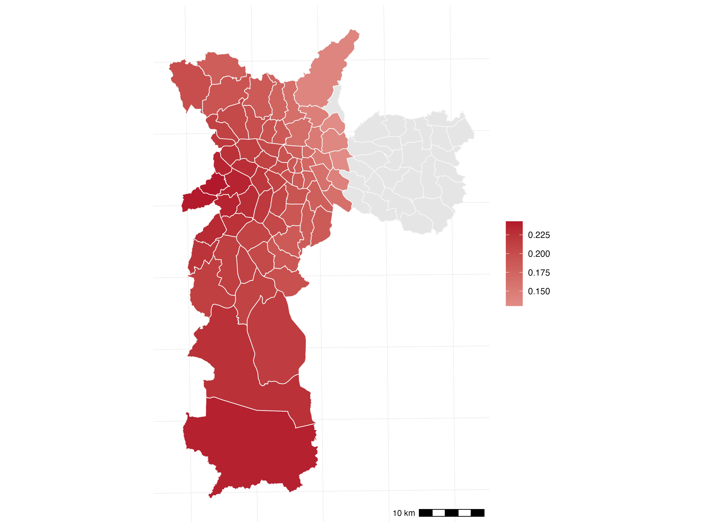

O coeficiente de `comodo` apresenta efeito positivo nos distritos periféricos,
indicando que a maior presença de habitações coletivas informais está associada,
nessas localidades, a maior incidência de violência física notificada.

#### Família composta (`composta`)

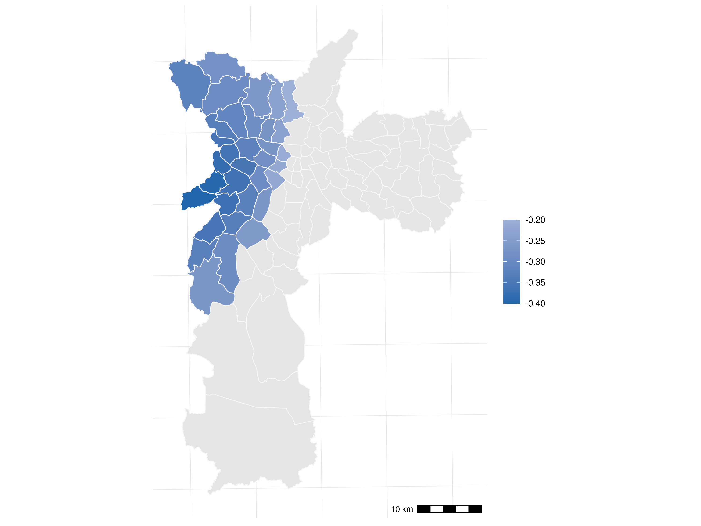

O efeito da variável `composta` é predominantemente negativo nas regiões
oeste e noroeste do município, sugerindo que, nessas áreas, a estrutura
familiar composta está associada a menor incidência de violência — evidência
de um possível papel protetor de arranjos familiares complexos.

#### Domicílios com 5 ou mais moradores (`mais5`)

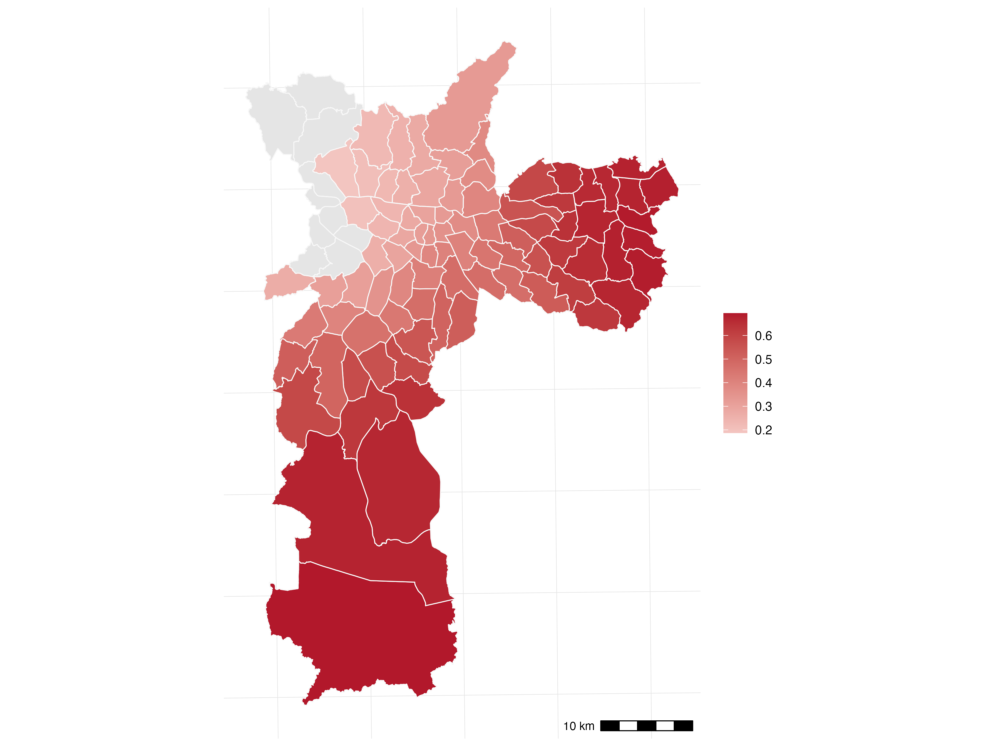

O coeficiente de `mais5` apresenta efeito positivo pronunciado nas periferias
da Zona Leste. A amplitude interquartil dos coeficientes locais evidencia
forte não-estacionariedade espacial desta variável, cujo efeito varia
substancialmente entre os distritos.

#### Domicílios chefiados por mulheres (`mulher_resp`)


Embora estatisticamente não significativa no modelo global, a variável
`mulher_resp` apresenta coeficientes locais significativos em regiões
específicas do município. Esse resultado ilustra a capacidade do GWR de
revelar associações espacialmente heterogêneas que permanecem ocultas sob
a premissa de estacionariedade dos efeitos.

#### Parâmetro de superdispersão local ($\alpha$)


Valores mais elevados de $\hat{\alpha}$ na Zona Leste indicam maior variância
não explicada pelo modelo nessas localidades, sugerindo a presença de
heterogeneidade não observada ou de covariáveis omitidas relevantes para
essa região.

### Resíduos e diagnóstico espacial

::: {.callout-note collapse="true"}
## Código (`script_mestrado.R` — Seção 10.5)

```r
distritos$resid_gwr <- as.numeric(mod_gwr$residuals[, 5])   # resíduos de trabalho

moran_gwr_resid <- moran.mc(distritos$resid_gwr, listw = w_knn, nsim = 999)

p_resid_gwr <- ggplot(distritos) +
  geom_sf(aes(fill = resid_gwr)) +
  scale_fill_gradient2(
    midpoint = median(distritos$resid_gwr, na.rm = TRUE),
    low = "blue", mid = "white", high = "red", name = "Residuos"
  ) +
  annotation_scale(location = "br", width_hint = 0.25,
                   pad_x = unit(0.2, "cm"), pad_y = unit(0.2, "cm")) +
  theme_minimal() +
  theme(plot.title = element_blank(),
        panel.grid = element_line(color = "grey90", linewidth = 0.2),
        legend.position = "right", legend.title = element_blank(),
        legend.text = element_text(size = 9))
print(p_resid_gwr)
ggsave(file.path(dir_output, "mapa_residuos_gwr_negbin.png"),
       plot = p_resid_gwr, width = 8, height = 6, dpi = 300, bg = "white")
```
:::

```{r}
#| label: mapa-resid-gwr
#| fig-cap: "Distribuição espacial dos resíduos de trabalho — GWR-NB."
#| echo: false

knitr::include_graphics(file.path(figuras_dir, "mapa_residuos_gwr_negbin.png"))
```

::: {.callout-note}
## Nota: distrito de Itaim Paulista
O resíduo de maior magnitude concentra-se no distrito de **Itaim Paulista**,
resultado possivelmente associado à presença da *Casa de Isabel*, equipamento
de referência regional para o acolhimento e notificação de casos de violência
contra crianças. A concentração de notificações em um serviço especializado
pode inflar artificialmente os registros do distrito relativamente à incidência
real do fenômeno.
:::

```{r}
#| label: moran-gwr
#| tbl-cap: "Índice de Moran dos resíduos — GWR-NB."

if (exists("mod_gwr")) {
  resid_gwr <- as.numeric(mod_gwr$residuals[, 5])
  moran_gwr <- moran.mc(resid_gwr, listw = w_knn, nsim = 999)
  data.frame(
    Estatística = c("Moran I", "Valor-p"),
    Valor = c(round(moran_gwr$statistic, 4), round(moran_gwr$p.value, 4))
  ) |> kable() |> kable_styling(full_width = FALSE)
} else {
  cat("Modelo GWR não carregado. Execute script_mestrado.R primeiro.")
}
```

::: {.callout-tip}
## GWR absorve a estrutura espacial residual
O índice de Moran estimado para os resíduos do GWR-NB não é estatisticamente
significativo (p > 0,05), em contraste com o valor significativo obtido para
os resíduos do modelo Binomial Negativa global. Esse resultado indica que a
especificação geograficamente ponderada foi capaz de absorver a dependência
espacial remanescente, produzindo resíduos compatíveis com a hipótese de
aleatoriedade espacial.
:::

---

## Síntese dos Resultados

| Etapa | Técnica/Modelo | Principal resultado |
|---|---|---|
| Análise exploratória | TIP + Índice de Moran | I = 0,312 (p = 0,001); padrão de concentração na Zona Leste |
| Modelo de referência | Regressão de Poisson | Superdispersão acentuada (razão desvio/GL ≈ 17,7) |
| Correção da superdispersão | Regressão Binomial Negativa | Melhora substancial do ajuste; autocorrelação residual persiste |
| Análise de agrupamentos | LISA | Hot spots em Itaim Paulista e São Miguel (Zona Leste) |
| Modelo espacial local | GWR-NB (h = 62) | Resíduos não autocorrelacionados; coeficientes espacialmente variáveis |

Os principais resultados substantivos do modelo GWR-NB podem ser assim sumarizados:

- **`mais5`**: associação positiva com a incidência de violência, com efeito
  mais intenso nas periferias da Zona Leste, evidenciando que o adensamento
  domiciliar constitui um fator de risco espacialmente heterogêneo.
- **`composta`**: efeito protetor mais pronunciado nas regiões oeste e noroeste
  do município, sugerindo que arranjos familiares compostos podem funcionar como
  fator de proteção em determinadas áreas.
- **`comodo`**: efeito positivo nas regiões periféricas, reforçando a
  associação entre condições precárias de moradia e maior incidência de violência.
- **`mulher_resp`**: estatisticamente não significativa no modelo global,
  mas com coeficientes locais significativos em regiões específicas —
  ilustrando a capacidade do GWR de revelar associações mascaradas pela premissa
  de estacionariedade espacial dos efeitos.

---

## Referências

- Fotheringham, A. S., Brunsdon, C., & Charlton, M. (2002). *Geographically
  Weighted Regression: the analysis of spatially varying relationships*. Wiley.

- Vasconcelos, J., Rosa, J., & Silva, A. (2024). *gwzinbr: Geographically
  Weighted Zero-Inflated Negative Binomial Regression* (v0.1.0). CRAN.

- McCullagh, P., & Nelder, J. A. (1989). *Generalized Linear Models* (2nd ed.).
  Chapman and Hall.

- Comber, A., Brunsdon, C., Charlton, M., et al. (2023). A route map for
  successful applications of Geographically Weighted Regression.
  *Geographical Analysis*, 55(3), 155–178.

- IBGE (2023). *Censo Demográfico 2022: resultados do universo*.

- Secretaria Municipal da Saúde de São Paulo. *SINAN — Sistema de Informação
  de Agravos de Notificação*. Plataforma TABNET/SMS-SP.
